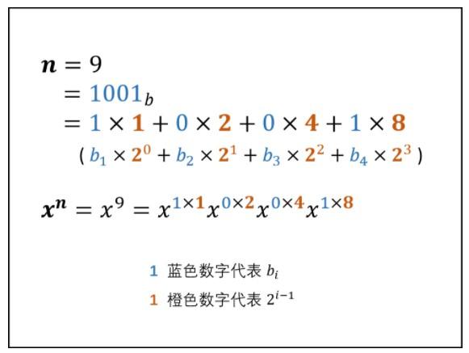

# 剑指 Offer（第 2 版）

#### [剑指 Offer 03. 数组中重复的数字](https://leetcode-cn.com/problems/shu-zu-zhong-zhong-fu-de-shu-zi-lcof/)

找出数组中重复的数字。


在一个长度为 n 的数组 nums 里的所有数字都在 0～n-1 的范围内。数组中某些数字是重复的，但不知道有几个数字重复了，也不知道每个数字重复了几次。请找出数组中任意一个重复的数字。

**示例 1：**

> 输入：
> [2, 3, 1, 0, 2, 5, 3]
> 输出：2 或 3 

**限制：**

* 2 <= n <= 100000

```c
int findRepeatNumber(int* nums, int numsSize){
    int arr[numsSize] ;
    int ans = -1;
    for ( int i = 0 ; i < numsSize ; i++ ) {
        arr[i] = 0;
    }

    for ( int i = 0 ; i < numsSize ; i++ ) {
        arr[nums[i]] += 1;

        if(arr[nums[i]] > 1){
            ans = nums[i];
            break;
        }
    }

    return ans;
}
```

#### [剑指 Offer 04. 二维数组中的查找](https://leetcode-cn.com/problems/er-wei-shu-zu-zhong-de-cha-zhao-lcof/)

在一个 n * m 的二维数组中，每一行都按照从左到右递增的顺序排序，每一列都按照从上到下递增的顺序排序。请完成一个高效的函数，输入这样的一个二维数组和一个整数，判断数组中是否含有该整数。 

**示例:**

现有矩阵 matrix 如下：

> [
>   [1,   4,  7, 11, 15],
>   [2,   5,  8, 12, 19],
>   [3,   6,  9, 16, 22],
>   [10, 13, 14, 17, 24],
>   [18, 21, 23, 26, 30]
> ]


给定 target = 5，返回 true。

给定 target = 20，返回 false。

**限制：**

*  0 <= n <= 1000
* 0 <= m <= 1000

```c
/*
 * 输入 **matrix 是长度为 matrixSize 的数组指针的数组，其中每个元素（也是一个数组）
 * 的长度组成 *matrixColSize 数组作为另一输入，*matrixColSize 数组的长度也为 matrixSize
 */
bool findNumberIn2DArray(int** matrix, int matrixSize, int* matrixColSize, int target){
    int i = matrixSize -1 , j = 0;

    while(i >= 0 && j < *matrixColSize ) {
        if(matrix[i][j] == target ) {
             return 1;
        } else if( matrix[i][j] > target ) {
            i --;
            
        }else {
            j++;
        }
    }

    return 0;
}
```

#### [剑指 Offer 05. 替换空格](https://leetcode-cn.com/problems/ti-huan-kong-ge-lcof/)

请实现一个函数，把字符串 s 中的每个空格替换成"%20"。

**示例 1：**

> 输入：s = "We are happy."
> 输出："We%20are%20happy."

**限制：**

  0 <= s 的长度 <= 10000

```c
char* replaceSpace(char* s){
    int len = strlen(s);
    int count = 0;

    for( int i = 0 ; i < len; i++ ) {
        if(s[i] == ' ') count++;
    }

    int newLen = len + 2 * count;
    char* arr = malloc(sizeof(char) * newLen + 1);

    int a = 0 , b = 0;

    while(a < len ) {
        if(s[a] == ' ') {
            arr[b] = '%';
            arr[b + 1] = '2';
            arr[b + 2] = '0';
            b += 3;
        }else{
            arr[b++] = s[a];
        }

        a++;
    }

    arr[newLen] = '\0';
    return arr;
}
```

#### [剑指 Offer 06. 从尾到头打印链表](https://leetcode-cn.com/problems/cong-wei-dao-tou-da-yin-lian-biao-lcof/)

输入一个链表的头节点，从尾到头反过来返回每个节点的值（用数组返回）。

**示例 1：**

> 输入：head = [1,3,2]
> 输出：[2,3,1]

**限制：**

​      0 <= 链表长度 <= 10000

```c
/**
 * Definition for singly-linked list.
 * struct ListNode {
 *     int val;
 *     struct ListNode *next;
 * };
 */


/**
 * Note: The returned array must be malloced, assume caller calls free().
 */
int* reversePrint(struct ListNode* head, int* returnSize){
    int size = 0;
    struct ListNode *p = head;
    while(p != NULL ) {
        size ++;
         p = p ->next;
    }
   
    (*returnSize) = size;

    int *arr = (int*)malloc(sizeof(int) * (*returnSize)); 
    p = head;
    while(p != NULL ) {
        arr[--size] = p->val;
        p = p ->next;
    }

    return arr;

}
```

#### [剑指 Offer 07. 重建二叉树](https://leetcode-cn.com/problems/zhong-jian-er-cha-shu-lcof/)

输入某二叉树的前序遍历和中序遍历的结果，请重建该二叉树。假设输入的前序遍历和中序遍历的结果中都不含重复的数字。

例如，给出

> 前序遍历 preorder = [3,9,20,15,7]
> 中序遍历 inorder = [9,3,15,20,7]


返回如下的二叉树：

>    3
>   / \
>   9  20
>     /  \
>    15   7

**限制：**

0 <= 节点个数 <= 5000

```c
struct TreeNode *buildTree(int *preorder, int preorderSize, int *inorder, int inorderSize){
    if (preorder == NULL || preorderSize == 0 || inorder == NULL || inorderSize == 0) {
        return NULL;
    }

    //struct TreeNode *root = (struct TreeNode *)malloc(sizeof(struct TreeNode));
    struct TreeNode *root = (struct TreeNode*) malloc(sizeof(struct TreeNode));
    root->val = preorder[0];  
    int mid = 0;
    for ( int i = 0; i < inorderSize; i++) {
        if (inorder[i] == preorder[0]) {  
            mid = i;  
            break;
        }
    }

    root->left = buildTree(&preorder[1], mid, &inorder[0], mid);
    root->right = buildTree(&preorder[mid + 1], preorderSize - mid - 1, &inorder[mid + 1], preorderSize - mid - 1);

    return root;
}
```

#### [剑指 Offer 09. 用两个栈实现队列](https://leetcode-cn.com/problems/yong-liang-ge-zhan-shi-xian-dui-lie-lcof/)

用两个栈实现一个队列。队列的声明如下，请实现它的两个函数 appendTail 和 deleteHead ，分别完成在队列尾部插入整数和在队列头部删除整数的功能。(若队列中没有元素，deleteHead 操作返回 -1 )

**示例 1：**

> 输入：
> ["CQueue","appendTail","deleteHead","deleteHead"]
> [[],[3],[],[]]
> 输出：[null,null,3,-1]

**示例 2：**

> 输入：
> ["CQueue","deleteHead","appendTail","appendTail","deleteHead","deleteHead"]
> [[],[],[5],[2],[],[]]
> 输出：[null,-1,null,null,5,2]

**提示：**

*   1 <= values <= 10000
*   最多会对 appendTail、deleteHead 进行 10000 次调用

```c
typedef struct {
    int* stack1;
    int* stack2;

    int stack1_size; //下一个元素入栈的地址
    int stack2_size;
} CQueue;


CQueue* cQueueCreate() {

    CQueue* cQueue = (CQueue*)malloc(sizeof(CQueue));
    cQueue->stack1 = (int*)malloc(10000 * sizeof(int));
    cQueue->stack2 = (int*)malloc(10000 * sizeof(int));
    cQueue->stack1_size = 0;
    cQueue->stack2_size = 0;

    return cQueue;
}

void cQueueAppendTail(CQueue* obj, int value) {
    obj->stack1[obj->stack1_size] = value;
    obj->stack1_size++;
}

int cQueueDeleteHead(CQueue* obj) {
    if(obj->stack2_size == 0 ) {
       
        while(obj->stack1_size > 0 ){
            obj->stack2[obj->stack2_size] = obj->stack1[obj->stack1_size -1];
            obj->stack2_size++;
            obj->stack1_size--;
        }
        
    }

    if( obj->stack2_size == 0 ){
        return -1;
    }  else {
        int res =  obj->stack2[obj->stack2_size - 1];
        obj->stack2_size--;
        return res;
    }
  
}

void cQueueFree(CQueue* obj) {
    free(obj->stack2);
    free(obj->stack1);
    free(obj);
}

```

#### [剑指 Offer 10- I. 斐波那契数列](https://leetcode-cn.com/problems/fei-bo-na-qi-shu-lie-lcof/)

写一个函数，输入 n ，求斐波那契（Fibonacci）数列的第 n 项（即 F(N)）。斐波那契数列的定义如下：

> F(0) = 0,   F(1) = 1
> F(N) = F(N - 1) + F(N - 2), 其中 N > 1.


斐波那契数列由 0 和 1 开始，之后的斐波那契数就是由之前的两数相加而得出。

答案需要取模 1e9+7（1000000007），如计算初始结果为：1000000008，请返回 1。

**示例 1：**

> 输入：n = 2
> 输出：1

**示例 2：**

> 输入：n = 5
> 输出：5

**提示：**

* 0 <= n <= 100

```c
int fib(int n){
    int n_sub2 = 0; 
    int n_sub1 = 1;

    if(n == 0) return n_sub2;
    if(n == 1) return n_sub1;

    int tmp = 0;
    for( int i = 2; i <= n; i++ ) {
        tmp = n_sub1;
        n_sub1 = (n_sub1 + n_sub2) % 1000000007;
        n_sub2 = tmp;
    }

    return n_sub1;
}
```

#### [剑指 Offer 10- II. 青蛙跳台阶问题](https://leetcode-cn.com/problems/qing-wa-tiao-tai-jie-wen-ti-lcof/)

一只青蛙一次可以跳上1级台阶，也可以跳上2级台阶。求该青蛙跳上一个 n 级的台阶总共有多少种跳法。

答案需要取模 1e9+7（1000000007），如计算初始结果为：1000000008，请返回 1。

**示例 1：**

> 输入：n = 2
> 输出：2

**示例 2：**

> 输入：n = 7
> 输出：21

**示例 3：**

> 输入：n = 0
> 输出：1

**提示：**

* 0 <= n <= 100

```c
int numWays(int n){
    int n_sub2 = 1; 
    int n_sub1 = 1;

    if(n == 0) return n_sub2;
    if(n == 1) return n_sub1;

    int tmp = 0;
    for( int i = 2; i <= n; i++ ) {
        tmp = n_sub1;
        n_sub1 = (n_sub1 + n_sub2) % 1000000007;
        n_sub2 = tmp;
    }

    return n_sub1;
}
```

#### [剑指 Offer 11. 旋转数组的最小数字](https://leetcode-cn.com/problems/xuan-zhuan-shu-zu-de-zui-xiao-shu-zi-lcof/)

把一个数组最开始的若干个元素搬到数组的末尾，我们称之为数组的旋转。输入一个递增排序的数组的一个旋转，输出旋转数组的最小元素。例如，数组 [3,4,5,1,2] 为 [1,2,3,4,5] 的一个旋转，该数组的最小值为1。  

**示例 1：**

> 输入：[3,4,5,1,2]
> 输出：1

**示例 2：**

> 输入：[2,2,2,0,1]
> 输出：0

```c
int minArray(int* numbers, int numbersSize){
   
    int l = 0 , r = numbersSize -1;
    
    while(l < r){
        int mid = l + (r -l)/2;

        if(numbers[mid] > numbers[r] ){           
            l = mid + 1;             
        }else if(numbers[mid] < numbers[r]){
            r = mid;
        }else{
            r--;
        }   
    }

    return numbers[r];
}
```

#### [剑指 Offer 12. 矩阵中的路径](https://leetcode-cn.com/problems/ju-zhen-zhong-de-lu-jing-lcof/)

请设计一个函数，用来判断在一个矩阵中是否存在一条包含某字符串所有字符的路径。路径可以从矩阵中的任意一格开始，每一步可以在矩阵中向左、右、上、下移动一格。如果一条路径经过了矩阵的某一格，那么该路径不能再次进入该格子。例如，在下面的3×4的矩阵中包含一条字符串“bfce”的路径（路径中的字母用加粗标出）。

[["a","**b**","c","e"],
["s","**f**","**c**","s"],
["a","d","**e**","e"]]

但矩阵中不包含字符串“abfb”的路径，因为字符串的第一个字符b占据了矩阵中的第一行第二个格子之后，路径不能再次进入这个格子。

**示例 1：**

> 输入：board = [["A","B","C","E"],["S","F","C","S"],["A","D","E","E"]], word = "ABCCED"
> 输出：true

**示例 2：**

> 输入：board = [["a","b"],["c","d"]], word = "abcd"
> 输出：false

**提示：**

* 1 <= board.length <= 200
* 1 <= board[i].length <= 200

```c
bool dfs(char** board,int boardSize,int* boardColSize,char*word,int i,int j,int k){
    
    if(i < 0 || i >= boardSize || j < 0|| j >= *boardColSize || board[i][j] != word[k])
        return 0;
    if( k == strlen(word) - 1) return 1;

    board[i][j] = '\\';
    bool res = dfs(board,boardSize,boardColSize,word,i - 1,j,k+1) || dfs(board,boardSize,boardColSize,word,i,j - 1 ,k+1) || dfs(board,boardSize,boardColSize,word,i,j + 1 ,k+1) || dfs(board,boardSize,boardColSize,word,i + 1,j,k+1);
    board[i][j] = word[k];

    return res;
}

bool exist(char** board, int boardSize, int* boardColSize, char* word){

    for(int i = 0 ; i < boardSize; i++ ) {
        for( int j = 0; j < *boardColSize; j++ ) {
            if(dfs(board,boardSize,boardColSize,word,i,j,0))
                return 1;
        }
    }

    return 0;
}

```

#### [剑指 Offer 13. 机器人的运动范围](https://leetcode-cn.com/problems/ji-qi-ren-de-yun-dong-fan-wei-lcof/)

地上有一个m行n列的方格，从坐标 [0,0] 到坐标 [m-1,n-1] 。一个机器人从坐标 [0, 0] 的格子开始移动，它每次可以向左、右、上、下移动一格（不能移动到方格外），也不能进入行坐标和列坐标的数位之和大于k的格子。例如，当k为18时，机器人能够进入方格 [35, 37] ，因为3+5+3+7=18。但它不能进入方格 [35, 38]，因为3+5+3+8=19。请问该机器人能够到达多少个格子？

**示例 1：**

> 输入：m = 2, n = 3, k = 1
> 输出：3

**示例 2：**

> 输入：m = 3, n = 1, k = 0
> 输出：1

**提示：**

*  1 <= n,m <= 100
* 0 <= k <= 20

```c
int countNum(int i){
    int res = 0;
    while( i > 0){
        res += i % 10;
        i /= 10;
    }
    return res;
}

int dfs(bool** visited,int m, int n, int k,int i,int j){
    if(i < 0 || i >= m || j < 0 || j >= n ||  countNum(i) + countNum(j) > k || visited[i][j] == true )
         return 0;

    visited[i][j] = true;
    return 1 + dfs(visited,m,n,k,i + 1,j) + dfs(visited,m,n,k,i,j + 1);
}

int movingCount(int m, int n, int k){
    bool **visited = (bool **)malloc(sizeof(bool *) * m);
   
    for (int i = 0; i < m; i++){
        visited[i] = (bool *)calloc(n, sizeof(bool));
    }

    return dfs(visited,m,n,k,0,0);
}
```

#### [剑指 Offer 14- I. 剪绳子](https://leetcode-cn.com/problems/jian-sheng-zi-lcof/)

给你一根长度为 n 的绳子，请把绳子剪成整数长度的 m 段（m、n都是整数，n>1并且m>1），每段绳子的长度记为 k[0],k[1]...k[m-1] 。请问 k[0]* k[1]  * . ..  *  k[m-1] 可能的最大乘积是多少？例如，当绳子的长度是8时，我们把它剪成长度分别为2、3、3的三段，此时得到的最大乘积是18。

**示例 1：**

> 输入: 2
> 输出: 1
> 解释: 2 = 1 + 1, 1 × 1 = 1

**示例 2:**

> 输入: 10
> 输出: 36
> 解释: 10 = 3 + 3 + 4, 3 × 3 × 4 = 36

**提示：**

*  2 <= n <= 58

```c
#define MAX(a, b) (((a) > (b)) ? (a) : (b))

int cuttingRope(int n){

    int *dp = (int*) malloc((n+ 1) * sizeof(int));
    dp[0] = 0;
    dp[1] = 0;
    dp[2] = 1;
    for( int i = 3 ; i <= n; i++ ) {
        for(int j = 2; j < i; j++ ) {
            dp[i] = MAX(dp[i],MAX(j*(i-j),j*dp[i-j]));
        }
    }

    return dp[n];
}
```

#### [剑指 Offer 14- II. 剪绳子 II](https://leetcode-cn.com/problems/jian-sheng-zi-ii-lcof/)

给你一根长度为 n 的绳子，请把绳子剪成整数长度的 m 段（m、n都是整数，n>1并且m>1），每段绳子的长度记为 k[0],k[1]...k[m - 1] 。请问 k[0] * k[1] * ...* k[m - 1] 可能的最大乘积是多少？例如，当绳子的长度是8时，我们把它剪成长度分别为2、3、3的三段，此时得到的最大乘积是18。

答案需要取模 1e9+7（1000000007），如计算初始结果为：1000000008，请返回 1。

**示例 1：**

> 输入: 2
> 输出: 1
> 解释: 2 = 1 + 1, 1 × 1 = 1

**示例 2:**

> 输入: 10
> 输出: 36
> 解释: 10 = 3 + 3 + 4, 3 × 3 × 4 = 36

**提示：**

*  2 <= n <= 1000

这题再用动态规划的话惨不忍睹，还是要看贪心
核心思路是：**尽可能把绳子分成长度为3的小段，这样乘积最大**

证明链接：https://leetcode-cn.com/problems/jian-sheng-zi-lcof/solution/mian-shi-ti-14-i-jian-sheng-zi-tan-xin-si-xiang-by/

步骤如下：

1. 如果 n == 2，返回1，如果 n == 3，返回2，两个可以合并成n小于4的时候返回n - 1
2. 如果 n == 4，返回4
3. 如果 n > 4，分成尽可能多的长度为3的小段，每次循环长度n减去3，乘积res乘以3；最后返回时乘以小于等于4的最后一小段；每次乘法操作后记得取余就行
4. 以上2和3可以合并

```c
int cuttingRope(int n){
    if(n == 2 ) return 1;
    if(n == 3 ) return 2;
    if(n == 4 ) return 4;

    long count = 1 ;

    while(n > 4){
        count = count * 3 % 1000000007;
        n -= 3;
    }

    return count*n % 1000000007;
    
}
```

#### [剑指 Offer 15. 二进制中1的个数](https://leetcode-cn.com/problems/er-jin-zhi-zhong-1de-ge-shu-lcof/)

请实现一个函数，输入一个整数（以二进制串形式），输出该数二进制表示中 1 的个数。例如，把 9 表示成二进制是 1001，有 2 位是 1。因此，如果输入 9，则该函数输出 2。

**示例 1：**

> 输入：00000000000000000000000000001011
> 输出：3
> 解释：输入的二进制串 00000000000000000000000000001011 中，共有三位为 '1'。

**示例 2：**

> 输入：00000000000000000000000010000000
> 输出：1
> 解释：输入的二进制串 00000000000000000000000010000000 中，共有一位为 '1'。

**示例 3：**

> 输入：11111111111111111111111111111101
> 输出：31
> 解释：输入的二进制串 11111111111111111111111111111101 中，共有 31 位为 '1'。

**提示：**

* 输入必须是长度为 32 的 二进制串 。

```c
int hammingWeight(uint32_t n) {
    int count = 0;

    while(n > 0) {
        if(n & 1) count++;
        n = n>>1;
    }  

    return count;

}
```

#### [剑指 Offer 16. 数值的整数次方](https://leetcode-cn.com/problems/shu-zhi-de-zheng-shu-ci-fang-lcof/)

实现 pow(x, n) ，即计算 x 的 n 次幂函数（即，xn）。不得使用库函数，同时不需要考虑大数问题。

**示例 1：**

> 输入：x = 2.00000, n = 10
> 输出：1024.00000

**示例 2：**

> 输入：x = 2.10000, n = 3
> 输出：9.26100

**示例 3：**

> 输入：x = 2.00000, n = -2
> 输出：0.25000
> 解释：2-2 = 1/22 = 1/4 = 0.25

**提示：**

*   -100.0 < x < 100.0
* -2^31^ <= n <= 2^31^-1
* -10^4^ <= x^n^ <= 10^4^

**算法流程：**

1. 当 x = 0x=0 时：直接返回 00 （避免后续 x = 1 / xx=1/x 操作报错）。
2. 初始化 res = 1res=1 ；
3. 当 n < 0n<0 时：把问题转化至 n \geq 0n≥0 的范围内，即执行 x = 1/xx=1/x ，n = - nn=−n ；
4. 循环计算：当 n = 0n=0 时跳出；
   1. 当 n \& 1 = 1n&1=1 时：将当前 xx 乘入 resres （即 res *= xres∗=x ）；
   2. 执行 x = x^2x=x (即 x *= xx∗=x ）；
   3. 执行 nn 右移一位（即 n >>= 1n>>=1）。

5. 返回 resres 。

**复杂度分析：**
      时间复杂度 O($log_2n$)： 二分的时间复杂度为对数级别。
      空间复杂度 O(1) ： res, b 等变量占用常数大小额外空间。



```c
double myPow(double x, int n){
    if(n == 0 ) return 1;
    if(n == 1) return x;
    if(n == -1 ) return 1/x;

    double half = myPow(x,n/2);
    double mod = myPow(x,n%2);
    
    return half * half * mod;
}
```


#### [剑指 Offer 17. 打印从1到最大的n位数](https://leetcode-cn.com/problems/da-yin-cong-1dao-zui-da-de-nwei-shu-lcof/)

输入数字 n，按顺序打印出从 1 到最大的 n 位十进制数。比如输入 3，则打印出 1、2、3 一直到最大的 3 位数 999。

**示例 1:**

```
输入: n = 1
输出: [1,2,3,4,5,6,7,8,9]
```


说明：

*  用返回一个整数列表来代替打印
* n 为正整数

```c
int* printNumbers(int n, int* returnSize){
    *returnSize = (int)pow(10,n) - 1;
    int* res = (int*)malloc((*returnSize)* sizeof(int));
   
    for( int i = 1 ; i <= (*returnSize); i++ ) {
        res[i-1] = i;
    }

    return res;
}
```

这道题如果考虑大数，就会比较麻烦，所以可以采用递归的方式来做

```c
int g_count = 0;
void dfs(int* res, int index, char* num, int digit){
    if(index == digit){
        res[g_count++] = atoi(num);
        return ;
    }

    for( int i = '0' ; i <= '9'; i++ ) {
        num[index] = i;
        dfs(res,index+1,num,digit);
    }
}

int* printNumbers(int n, int* returnSize){
	*returnSize = (int)pow(10,n) - 1 ;
	
    int* res = (int*)malloc((*returnSize)* sizeof(int));
   
    char num[n];
	for( int i = 1 ; i <= n; i++ ) { //表示有n位数
		for(int j = '1' ; j <= '9'; j++){  //最高位不能为0，所以要从1开始
			num[0] = j;
			dfs(res,1,num,i);
		}
	}

    return res;
}

```

#### [剑指 Offer 18. 删除链表的节点](https://leetcode-cn.com/problems/shan-chu-lian-biao-de-jie-dian-lcof/)

给定单向链表的头指针和一个要删除的节点的值，定义一个函数删除该节点。

返回删除后的链表的头节点。

**注意：**此题对比原题有改动

**示例 1:**

> 输入: head = [4,5,1,9], val = 5
> 输出: [4,1,9]
> 解释: 给定你链表中值为 5 的第二个节点，那么在调用了你的函数之后，该链表应变为 4 -> 1 -> 9.


**示例 2:**

> 输入: head = [4,5,1,9], val = 1
> 输出: [4,5,9]
> 解释: 给定你链表中值为 1 的第三个节点，那么在调用了你的函数之后，该链表应变为 4 -> 5 -> 9.

**说明：**

* 题目保证链表中节点的值互不相同
* 若使用 C 或 C++ 语言，你不需要 free 或 delete 被删除的节点

```c
struct ListNode* deleteNode(struct ListNode* head, int val){
    if(head == NULL) return head;
    if(head->val == val) return head->next;
    
    struct ListNode*tmp = head;
    struct ListNode*pre = head;

    while(tmp != NULL ) {
        if(tmp->val == val){
            pre->next = tmp->next;
        }
        pre = tmp;
        tmp = tmp->next;
    }

    return head;
}
```

#### [剑指 Offer 19. 正则表达式匹配](https://leetcode-cn.com/problems/zheng-ze-biao-da-shi-pi-pei-lcof/)

请实现一个函数用来匹配包含'. '和'*'的正则表达式。模式中的字符'.'表示任意一个字符，而'*'表示它前面的字符可以出现任意次（含0次）。在本题中，匹配是指字符串的所有字符匹配整个模式。例如，字符串"aaa"与模式"a.a"和"ab*ac*a"匹配，但与"aa.a"和"ab*a"均不匹配。

**示例 1:**

> 输入:
> s = "aa"
> p = "a"
> 输出: false
> 解释: "a" 无法匹配 "aa" 整个字符串。

**示例 2:**

> 输入:
> s = "aa"
> p = "a*"
> 输出: true
> 解释: 因为 '*' 代表可以匹配零个或多个前面的那一个元素, 在这里前面的元素就是 'a'。因此，字符串 "aa" 可被视为 'a' 重复了一次。

**示例 3:**

> 输入:
> s = "ab"
> p = ".*"
> 输出: true
> 解释: ".*" 表示可匹配零个或多个（'*'）任意字符（'.'）。

**示例 4:**

> 输入:
> s = "aab"
> p = "c*a*b"
> 输出: true
> 解释: 因为 '*' 表示零个或多个，这里 'c' 为 0 个, 'a' 被重复一次。因此可以匹配字符串 "aab"。

**示例 5:**

> 输入:
> s = "mississippi"
> p = "mis*is*p*."
> 输出: false

*  s 可能为空，且只包含从 a-z 的小写字母。
* p 可能为空，且只包含从 a-z 的小写字母以及字符 . 和 *，无连续的 '*'。

```c
bool isMatch(char* s, char* p){
    int lenOfS = strlen(s);
    int lenOfP = strlen(p);

    bool dp[lenOfS +1 ][lenOfP +1];

    memset(dp,false,(lenOfS +1)* (lenOfP + 1)*sizeof(bool));
    
    dp[0][0] = true;
    for( int i = 0 ; i <= lenOfS; i++ ) {
        for(int j = 0 ; j <= lenOfP; j++ ) {
           if (j == 0) {
                dp[i][j] = (i == 0 ? true : false);
            }
            else {
                if (p[j - 1] != '*') {
                    if (i > 0 && (s[i - 1] == p[j - 1] || p[j - 1] == '.')) {
                        dp[i][j] = dp[i - 1][j - 1];
                    }
                }
                else { // 当p[j] == '*'时，由于'*'跟在一个字符后面，所以j必然大于等于2；
                    dp[i][j] = dp[i][j - 2];
                    if (i > 0 && (s[i - 1] == p[j - 2] || p[j - 2] == '.')) {
                        dp[i][j] |= dp[i - 1][j];
                    }
                }
            }

                  
        }
    }

    return dp[lenOfS][lenOfP];
}
```

#### [剑指 Offer 20. 表示数值的字符串](https://leetcode-cn.com/problems/biao-shi-shu-zhi-de-zi-fu-chuan-lcof/)

请实现一个函数用来判断字符串是否表示数值（包括整数和小数）。例如，字符串"+100"、"5e2"、"-123"、"3.1416"、"-1E-16"、"0123"都表示数值，但"12e"、"1a3.14"、"1.2.3"、"+-5"及"12e+5.4"都不是。

```c
bool isNumber(char* s){
  
    int n = strlen(s);
    int index = 0;
    bool hasNum = false, hasE = false;
    bool hasSign = false, hasDot = false;
    while(index < n && s[index] == ' ')
        index++;
    while(index < n){
        while(index < n && s[index] >= '0' && s[index] <= '9'){
            index++;
            hasNum = true;
        }
        if(index == n){
            break;
        }
        char c = s[index];
        if(c == 'e' || c == 'E'){
            if(hasE || !hasNum){
                return false;
            }
            hasE = true;
            hasNum = false; hasSign = false; hasDot = false;
        }else if(c == '+' || c == '-'){
            if(hasSign || hasNum || hasDot){
                return false;
            }
            hasSign = true;
        }else if(c == '.'){
            if(hasDot || hasE){
                return false;
            }
            hasDot = true;
        }else if(c == ' '){
            break;
        }else{
            return false;
        }
        index++;
    }
    while(index < n && s[index] == ' ')
        index++;
    return hasNum && index == n;

}
```

#### [剑指 Offer 21. 调整数组顺序使奇数位于偶数前面](https://leetcode-cn.com/problems/diao-zheng-shu-zu-shun-xu-shi-qi-shu-wei-yu-ou-shu-qian-mian-lcof/)

输入一个整数数组，实现一个函数来调整该数组中数字的顺序，使得所有奇数位于数组的前半部分，所有偶数位于数组的后半部分。

**示例：**

> 输入：nums = [1,2,3,4]
> 输出：[1,3,2,4] 
> 注：[3,1,2,4] 也是正确的答案之一。

**提示：**

*  0 <= nums.length <= 50000
* 1 <= nums[i] <= 10000

```c
int* exchange(int* nums, int numsSize, int* returnSize){
    int l = 0;
    int r = numsSize - 1;

    while (l < r) {
        while (l < r && nums[l] % 2 == 1) {
            l++;
        }

        while (l < r && nums[r] % 2 == 0) {
            r--;
        }

        int tmp = nums[l];
        nums[l] = nums[r];
        nums[r] = tmp;
    }

    *returnSize = numsSize;

    return nums;
}

```

#### [剑指 Offer 22. 链表中倒数第k个节点](https://leetcode-cn.com/problems/lian-biao-zhong-dao-shu-di-kge-jie-dian-lcof/)

输入一个链表，输出该链表中倒数第k个节点。为了符合大多数人的习惯，本题从1开始计数，即链表的尾节点是倒数第1个节点。

例如，一个链表有 6 个节点，从头节点开始，它们的值依次是 1、2、3、4、5、6。这个链表的倒数第 3 个节点是值为 4 的节点。

**示例：**

> 给定一个链表: 1->2->3->4->5, 和 k = 2.
>
> 返回链表 4->5.

```c
struct ListNode* getKthFromEnd(struct ListNode* head, int k){
   
    if (head == NULL) {
        return head;
    }
   
    struct ListNode *quick = head;
    struct ListNode *slow = head;

    for (int i = 0; i < k; i++) {
        quick = quick->next;
    }
   
    while (quick != NULL) {
        quick = quick->next;
        slow = slow->next;
    }

    return slow;
}
```

#### [剑指 Offer 24. 反转链表](https://leetcode-cn.com/problems/fan-zhuan-lian-biao-lcof/)

反转一个单链表。

**示例:**

> 输入: 1->2->3->4->5->NULL
> 输出: 5->4->3->2->1->NULL

**进阶:**
你可以迭代或递归地反转链表。你能否用两种方法解决这道题？

```java
struct ListNode* reverseList(struct ListNode* head)
{
    struct ListNode *cur = head;
    struct ListNode *pre = NULL;

    while (cur != NULL) {
        struct ListNode *tmp = cur->next;
        cur->next = pre;
        pre = cur;
        cur = tmp;
    }

    return pre;
}
```

#### [剑指 Offer 25. 合并两个排序的链表](https://leetcode-cn.com/problems/he-bing-liang-ge-pai-xu-de-lian-biao-lcof/)

输入两个递增排序的链表，合并这两个链表并使新链表中的节点仍然是递增排序的。

**示例1：**

> 输入：1->2->4, 1->3->4
> 输出：1->1->2->3->4->4

**限制：**

0 <= 链表长度 <= 1000

```c
struct ListNode* mergeTwoLists(struct ListNode* l1, struct ListNode* l2)
{
    
    if (l1 == NULL) {
        return l2;
    }

    if (l2 == NULL) {
        return l1;
    }

    struct ListNode *dummy = (struct ListNode *)malloc(sizeof(struct ListNode));;
    struct ListNode *cur = dummy;

    while (l1 != NULL && l2 != NULL) {
        if (l1->val < l2->val) {
            cur->next = l1;
            l1 = l1->next;
            
        } else {
            cur->next = l2;
            l2 = l2->next;
        }

        cur = cur->next;
    }

    if (l1 == NULL && l2 != NULL) {     
        cur->next = l2;
    } 
    if (l2 == NULL && l1 != NULL) {
        cur->next = l1;
    }
       
    return dummy->next;
}
```

#### [剑指 Offer 26. 树的子结构](https://leetcode-cn.com/problems/shu-de-zi-jie-gou-lcof/)

输入两棵二叉树A和B，判断B是不是A的子结构。(约定空树不是任意一个树的子结构)

B是A的子结构， 即 A中有出现和B相同的结构和节点值。

例如:
给定的树 A:

> ​      3
> ​     / \
>
>    4   5
>   / \
>  1   2

给定的树 B：


> ​    4 
>
>   /
>  1


返回 true，因为 B 与 A 的一个子树拥有相同的结构和节点值。

**示例 1：**

> 输入：A = [1,2,3], B = [3,1]
> 输出：false

**示例 2：**

> 输入：A = [3,4,5,1,2], B = [4,1]
> 输出：true

**限制：**

0 <= 节点个数 <= 10000

```c
bool Recur(struct TreeNode *A, struct TreeNode *B)
{
    if( B == NULL) {
        return true;
    }

    if (A == NULL || A->val != B->val) {
        return false;
    }

    return Recur(A->left,B->left) && Recur(A->right, B->right);
}
bool isSubStructure(struct TreeNode* A, struct TreeNode* B){
    if (A == NULL || B == NULL) {
        return false;
    }

    return Recur(A, B) || isSubStructure(A->left,B) ||isSubStructure(A->right,B);
}
```

#### [剑指 Offer 27. 二叉树的镜像](https://leetcode-cn.com/problems/er-cha-shu-de-jing-xiang-lcof/)

请完成一个函数，输入一个二叉树，该函数输出它的镜像。

例如输入：

> ​      4
> ​    /   \
>
>   2     7
>  / \   / \
> 1   3 6   9

镜像输出：

> ​      4
> ​    /   \
>
>   7     2
>  / \   / \
> 9   6 3   1

**示例 1：**

> 输入：root = [4,2,7,1,3,6,9]
> 输出：[4,7,2,9,6,3,1]

**限制：**

0 <= 节点个数 <= 1000

```c
#define MAX_SIZE 1000

struct TreeNode* mirrorTree(struct TreeNode* root){
    if (root == NULL) {
        return root;
    }

    struct TreeNode * stack[MAX_SIZE];
    stack[0] = root;
    int size = 1;

    while (size > 0) {
        struct TreeNode *node = stack[size - 1];
        size--;

        if (node->left != NULL) {
            stack[size++] = node->left;
        }

        if (node->right != NULL) {
            stack[size++] = node->right;
        }
       
        struct TreeNode *tmp = node->left;
        node->left = node->right;
        node->right = tmp;
    }
   

    return root;
}
```

```c
struct TreeNode* mirrorTree(struct TreeNode* root){
    if (root == NULL) {
        return root;
    }

    struct TreeNode *tmp = root->left;
    root->left = mirrorTree(root->right);
    root->right = mirrorTree(tmp);

    return root;
}
```

#### [剑指 Offer 28. 对称的二叉树](https://leetcode-cn.com/problems/dui-cheng-de-er-cha-shu-lcof/)

请实现一个函数，用来判断一棵二叉树是不是对称的。如果一棵二叉树和它的镜像一样，那么它是对称的。

例如，二叉树 [1,2,2,3,4,4,3] 是对称的。

> ​    1
>
>    / \
>   2   2
>  / \ / \
> 3  4 4  3

但是下面这个 [1,2,2,null,3,null,3] 则不是镜像对称的:

>    1
>   / \
>   2   2
>    \   \
>    3    3

**示例 1：**

> 输入：root = [1,2,2,3,4,4,3]
> 输出：true


**示例 2：**

> 输入：root = [1,2,2,null,3,null,3]
> 输出：false

**限制：**

* 0 <= 节点个数 <= 1000

```c
bool Recur(struct TreeNode *A, struct TreeNode *B)
{
    if (A == NULL && B == NULL) {
        return true;
    }

    if (A == NULL || B == NULL || A->val != B->val) {
        return false;
    }

    return Recur(A->left,B->right) && Recur(A->right,B->left);
}


bool isSymmetric(struct TreeNode* root){
    if (root == NULL) {
        return true;
    }

    return Recur(root->left,root->right);
}
```

#### [剑指 Offer 29. 顺时针打印矩阵](https://leetcode-cn.com/problems/shun-shi-zhen-da-yin-ju-zhen-lcof/)

输入一个矩阵，按照从外向里以顺时针的顺序依次打印出每一个数字。

**示例 1：**

> 输入：matrix = [[1,2,3],[4,5,6],[7,8,9]]
> 输出：[1,2,3,6,9,8,7,4,5]


**示例 2：**

> 输入：matrix = [[1,2,3,4],[5,6,7,8],[9,10,11,12]]
> 输出：[1,2,3,4,8,12,11,10,9,5,6,7]

**限制：**

*   0 <= matrix.length <= 100
*   0 <= matrix[i].length <= 100

```c
int* spiralOrder(int** matrix, int matrixSize, int* matrixColSize, int* returnSize){
    
    if (matrixSize == 0 || *matrixColSize == 0 ) {
        *returnSize = 0;
        return NULL;
    }
    int l = 0, r = *matrixColSize - 1, up = 0, down = matrixSize - 1;

    *returnSize = matrixSize * (*matrixColSize);
    int *res = (int *)malloc((*returnSize) * sizeof(int));
    int index = 0;

    while (index < *returnSize) {
        
        for (int i = l; i <= r && index < *returnSize; i++) {
            res[index] = matrix[up][i];
            index++;
        }
        up++;

        for (int i = up; i <= down && index < *returnSize; i++) {
            res[index] = matrix[i][r];
            index++;
        }
        r--;
    
        for (int i = r; i >= l && index < *returnSize; i--) {
            res[index] = matrix[down][i];
            index++;
        }
        down--;

        for (int i = down; i >= up && index < *returnSize; i--) {
            res[index] = matrix[i][l];
            index++;
        }
        l++;
    }

   return res;
}

```

#### [剑指 Offer 30. 包含min函数的栈](https://leetcode-cn.com/problems/bao-han-minhan-shu-de-zhan-lcof/)

定义栈的数据结构，请在该类型中实现一个能够得到栈的最小元素的 min 函数在该栈中，调用 min、push 及 pop 的时间复杂度都是 O(1)。

**示例:**

> MinStack minStack = new MinStack();
> minStack.push(-2);
> minStack.push(0);
> minStack.push(-3);
> minStack.min();   --> 返回 -3.
> minStack.pop();
> minStack.top();      --> 返回 0.
> minStack.min();   --> 返回 -2.

**提示：**

各函数的调用总次数不超过 20000 次

```c
#include<limits.h>

#define MAX_SIZE 20000

typedef struct {
    int arr[MAX_SIZE];
    int top;
    int minNums[MAX_SIZE];
    int minTop;
} MinStack;

/** initialize your data structure here. */

MinStack* minStackCreate() {
    MinStack *minStack = (MinStack *)malloc(sizeof(MinStack));
    minStack->top = 0; 
    minStack->minTop = 0;
    //minStack->minNum = INT_MIN;
    return minStack;
}

void minStackPush(MinStack* obj, int x) {
    
    obj->arr[obj->top] = x;
    obj->top++;

    if (obj->minTop == 0 || x <= obj->minNums[obj->minTop -1]) {
        obj->minNums[obj->minTop] = x;
        obj->minTop++;
    }
}

void minStackPop(MinStack* obj) {

    if (obj->top <= 0) {
       return;
    }

    if (obj->minTop > 0 && obj->arr[obj->top -1] == obj->minNums[obj->minTop - 1]) {
        obj->minTop--;
    }

    obj->top--;
}

int minStackTop(MinStack* obj) {
    if (obj->top <= 0) {
       return 0;  
    }

    return obj->arr[obj->top - 1];
}

int minStackMin(MinStack* obj) {
    if (obj->minTop <= 0) {
        return 0;
    }

    return obj->minNums[obj->minTop - 1];
}

void minStackFree(MinStack* obj) {
    free(obj);
}

```

#### [剑指 Offer 31. 栈的压入、弹出序列](https://leetcode-cn.com/problems/zhan-de-ya-ru-dan-chu-xu-lie-lcof/)

输入两个整数序列，第一个序列表示栈的压入顺序，请判断第二个序列是否为该栈的弹出顺序。假设压入栈的所有数字均不相等。例如，序列 {1,2,3,4,5} 是某栈的压栈序列，序列 {4,5,3,2,1} 是该压栈序列对应的一个弹出序列，但 {4,3,5,1,2} 就不可能是该压栈序列的弹出序列。

**示例 1：**

> 输入：pushed = [1,2,3,4,5], popped = [4,5,3,2,1]
> 输出：true
> 解释：我们可以按以下顺序执行：
> push(1), push(2), push(3), push(4), pop() -> 4,
> push(5), pop() -> 5, pop() -> 3, pop() -> 2, pop() -> 1

**示例 2：**

> 输入：pushed = [1,2,3,4,5], popped = [4,3,5,1,2]
> 输出：false
> 解释：1 不能在 2 之前弹出。

**提示：**

*  0 <= pushed.length == popped.length <= 1000
* 0 <= pushed[i], popped[i] < 1000
* pushed 是 popped 的排列。

```c
#define MAX_SIZE 1000
bool validateStackSequences(int* pushed, int pushedSize, int* popped, int poppedSize){
    if (pushedSize == 0) {
        return true;
    }
    
    int *stack[MAX_SIZE];
    int size = 0; 
    int index = 0;

    for (int i = 0; i < poppedSize; i++) {
        stack[size] = pushed[i];
        size++;

        while (size > 0 && stack[size - 1] == popped[index]) {
            size--;
            index++;
        }
    }

  
    return size == 0 ? true : false;
}
```

#### [剑指 Offer 32 - I. 从上到下打印二叉树](https://leetcode-cn.com/problems/cong-shang-dao-xia-da-yin-er-cha-shu-lcof/)

从上到下打印出二叉树的每个节点，同一层的节点按照从左到右的顺序打印。

例如:
给定二叉树: [3,9,20,null,null,15,7],

> ​    3
>
>    / \
>   9  20
>     /  \
>    15   7

返回：

[3,9,20,15,7]

**提示：**

节点总数 <= 1000

```c
#define MAX_SIZE 1000

int* levelOrder(struct TreeNode* root, int* returnSize){
    if (root == NULL) {
        *returnSize = 0;
        return (int *)malloc(0 * sizeof(int));
    }
    struct TreeNode *queue[MAX_SIZE];
    int first = 0, tail = 0;

    int *res = (int *)malloc(MAX_SIZE * sizeof(int));
    int index = 0;

    queue[tail++] = root;

    while (first < tail) {
        struct TreeNode *node = queue[first]; 
        first++;

        res[index++] = node->val;

       if (node->left != NULL) {
            queue[tail++] = node->left;  
       }

       if (node->right != NULL) {
           queue[tail++] = node->right;
       }

    }

    *returnSize = index;

    return res;
    
}
```

#### [剑指 Offer 32 - II. 从上到下打印二叉树 II](https://leetcode-cn.com/problems/cong-shang-dao-xia-da-yin-er-cha-shu-ii-lcof/)

从上到下按层打印二叉树，同一层的节点按从左到右的顺序打印，每一层打印到一行。

 例如:
给定二叉树: [3,9,20,null,null,15,7],

> ​    3
>
>    / \
>   9  20
>     /  \
>    15   7

返回其层次遍历结果：

> [
>   [3],
>   [9,20],
>   [15,7]
> ]

**提示：**

节点总数 <= 1000

```c
#define MAX_SIZE 10000

int** levelOrder(struct TreeNode* root, int* returnSize, int** returnColumnSizes){
    if (root == NULL) {
        *returnSize = 0;
        return NULL;
    }
    struct TreeNode *queue[MAX_SIZE];
    int first = 0, tail = 0;

    int **res = (int **)malloc(MAX_SIZE * sizeof(int*));

    if (res == NULL) {
        return NULL;
    }
    memset(res, 0, sizeof(int*) * MAX_SIZE);

    *returnColumnSizes = (int*)malloc(sizeof(int) * MAX_SIZE);
    // 和这条语句等价 returnColumnSizes[0] = (int*)malloc(sizeof(int) * MAX_SIZE);
    if (*returnColumnSizes == NULL) {
        return NULL;
    }
    memset(*returnColumnSizes, 0, sizeof(int) * MAX_SIZE);

    int index = 0;
    queue[tail++] = root;

    while (first < tail) {
        int len = tail - first;
        (*returnColumnSizes)[index] = len;
        //  returnColumnSizes[0][index] = len;
        int *arr = (int *)malloc(len * sizeof(int));
        if (arr == NULL) {
            return NULL;
        }
        memset(arr, 0, sizeof(int) * len);

        int indexOfArr = 0;
        for (int i = 0; i < len; i++) {
            struct TreeNode *node = queue[first]; 
            first++;

            arr[indexOfArr++] = node->val;

            if (node->left != NULL) {
                queue[tail++] = node->left;  
            }

            if (node->right != NULL) {
                queue[tail++] = node->right;
            }
        }
     
        res[index] = arr;
        index++;
    }

    *returnSize = index;

    return res;
}

```

#### [剑指 Offer 32 - III. 从上到下打印二叉树 III](https://leetcode-cn.com/problems/cong-shang-dao-xia-da-yin-er-cha-shu-iii-lcof/)

请实现一个函数按照之字形顺序打印二叉树，即第一行按照从左到右的顺序打印，第二层按照从右到左的顺序打印，第三行再按照从左到右的顺序打印，其他行以此类推。

 例如:
给定二叉树: [3,9,20,null,null,15,7],

> ​    3
>
>    / \
>   9  20
>     /  \
>    15   7

返回其层次遍历结果：

> [
>   [3],
>   [20,9],
>   [15,7]
> ]

**提示：**

节点总数 <= 1000

```c
#define MAX_SIZE 10000

int** levelOrder(struct TreeNode* root, int* returnSize, int** returnColumnSizes){
    if (root == NULL) {
        *returnSize = 0;
        return NULL;
    }
    struct TreeNode *queue[MAX_SIZE];
    int first = 0, tail = 0;

    int **res = (int **)malloc(MAX_SIZE * sizeof(int*));

    if (res == NULL) {
        return NULL;
    }
    memset(res, 0, sizeof(int*) * MAX_SIZE);

    *returnColumnSizes = (int*)malloc(sizeof(int) * MAX_SIZE);
    if (*returnColumnSizes == NULL) {
        return NULL;
    }
    memset(*returnColumnSizes, 0, sizeof(int) * MAX_SIZE);

    int index = 0;
    queue[tail++] = root;

    while (first < tail) {
        int len = tail - first;
        (*returnColumnSizes)[index] = len;
        int *arr = (int *)malloc(len * sizeof(int));
        if (arr == NULL) {
            return NULL;
        }
        memset(arr, 0, sizeof(int) * len);

        int indexOfArr = 0;
        for (int i = 0; i < len; i++) {
            struct TreeNode *node = queue[first]; 
            first++;

            if (index % 2 == 0) {
                arr[indexOfArr++] = node->val;
            } else {
                arr[len - indexOfArr - 1] = node->val;
                indexOfArr++;
            }
           

            if (node->left != NULL) {
                queue[tail++] = node->left;  
            }

            if (node->right != NULL) {
                queue[tail++] = node->right;
            }
        }
     
        res[index] = arr;
        index++;
    }

    *returnSize = index;

    return res;
}
```

#### [剑指 Offer 33. 二叉搜索树的后序遍历序列](https://leetcode-cn.com/problems/er-cha-sou-suo-shu-de-hou-xu-bian-li-xu-lie-lcof/)

输入一个整数数组，判断该数组是不是某二叉搜索树的后序遍历结果。如果是则返回 true，否则返回 false。假设输入的数组的任意两个数字都互不相同。

 参考以下这颗二叉搜索树：

> ​     5
> ​    / \
>
>    2   6
>   / \
>  1   3

 **示例 1：**

> 输入: [1,6,3,2,5]
> 输出: false

**示例 2：**

> 输入: [1,3,2,6,5]
> 输出: true

**提示：**

数组长度 <= 1000

```c
bool Recur(int *postorder, int l, int r)
{
    if (l >= r) {
        return true;
    }

    int i = l;
    while (i <= r && postorder[i] < postorder[r]) {
        i++;
    }

    int firstRight = i;

    while (i <= r && postorder[i] > postorder[r]) {
        i++;
    }

    return i == r && Recur(postorder, l, firstRight - 1) && Recur(postorder, firstRight, r - 1);

}

bool verifyPostorder(int* postorder, int postorderSize){
    //后续遍历的特点是最后一个元素一定是根节点。
    //二叉搜索树左子节点都小于根，右子节点都大于根。
    if (postorderSize == 0) {
        return true;
    }
    return Recur(postorder,0 , postorderSize - 1);
}
```

#### [剑指 Offer 34. 二叉树中和为某一值的路径](https://leetcode-cn.com/problems/er-cha-shu-zhong-he-wei-mou-yi-zhi-de-lu-jing-lcof/)

输入一棵二叉树和一个整数，打印出二叉树中节点值的和为输入整数的所有路径。从树的根节点开始往下一直到叶节点所经过的节点形成一条路径。

**示例:**
给定如下二叉树，以及目标和 target = 22，

> ​       5
> ​      / \
> ​    4   8
>
>    /   / \
>   11  13  4
>  /  \    / \
> 7    2  5   1

返回:

> [
>    [5,4,11,2],
>    [5,8,4,5]
> ]

**提示：**

节点总数 <= 10000

```c
#define MAX_SIZE 5000

int** g_res;
int g_resSize;

int* g_path;
int g_pathSize;

void Recur(struct TreeNode *root, int target, int **returnColumnSizes)
{
    if (root == NULL) return;

    g_path[g_pathSize++] = root->val;
    target -= root->val;

    if (target == 0 && root->left == NULL && root->right == NULL) {
        int* tmp = malloc(sizeof(int) * g_pathSize);
        memcpy(tmp, g_path, sizeof(int) * g_pathSize);
        g_res[g_resSize] = tmp; 
        (*returnColumnSizes)[g_resSize] = g_pathSize;
        g_resSize++;
        //注意这里不能return，因为后面要g_pathSize--
    }

    Recur(root->left,target, returnColumnSizes);
    Recur(root->right,target, returnColumnSizes);
  
    g_pathSize--;
}


int** pathSum(struct TreeNode* root, int target, int* returnSize, int** returnColumnSizes){
    g_res = (int **)malloc(MAX_SIZE * sizeof(int *));
    if (g_res == NULL) {
        return NULL;
    }
    memset(g_res, 0, MAX_SIZE * sizeof(int *));
    g_resSize = 0;

    *returnColumnSizes = (int *)malloc(MAX_SIZE * sizeof(int));
    if (*returnColumnSizes == NULL) {
        return NULL;
    } 
    memset(*returnColumnSizes, 0, MAX_SIZE * sizeof(int));

    g_path = (int *)malloc(MAX_SIZE * sizeof(int));
    if (g_path == NULL) {
        return NULL;
    } 
    memset(g_path, 0, MAX_SIZE * sizeof(int));
    g_pathSize = 0;

    Recur(root, target, returnColumnSizes);

    *returnSize = g_resSize;
   
    return g_res;
}
```

#### [剑指 Offer 35. 复杂链表的复制](https://leetcode-cn.com/problems/fu-za-lian-biao-de-fu-zhi-lcof/)

请实现 copyRandomList 函数，复制一个复杂链表。在复杂链表中，每个节点除了有一个 next 指针指向下一个节点，还有一个 random 指针指向链表中的任意节点或者 null。

 **示例 1：**


> 输入：head = [[7,null],[13,0],[11,4],[10,2],[1,0]]
> 输出：[[7,null],[13,0],[11,4],[10,2],[1,0]]

**示例 2：**


> 输入：head = [[1,1],[2,1]]
> 输出：[[1,1],[2,1]]

**示例 3：**


> 输入：head = [[3,null],[3,0],[3,null]]
> 输出：[[3,null],[3,0],[3,null]]

**示例 4：**

> 输入：head = []
> 输出：[]
> 解释：给定的链表为空（空指针），因此返回 null。

**提示：**

* -10000 <= Node.val <= 10000
* Node.random 为空（null）或指向链表中的节点。
* 节点数目不超过 1000 。

这题leetcode没有提供C语言的环境，不过C++的实现和C语言基本一致。

```c++
class Solution {
public:
    Node* copyRandomList(Node* head) {
        if (head == NULL) return head;

        Node *cur = head;

        //1.复制各节点，并构建拼接链表
        while (cur != NULL) {
            Node *tmp = new Node(cur->val);
            tmp->next = cur->next;
            cur->next = tmp;
            cur = tmp->next;
        }

        //2.连接random指针
        cur = head;
        while (cur != NULL) {
            if (cur->random != NULL) {
                cur->next->random = cur->random->next;
            }
            cur = cur->next->next;
        }

        //3.拆分两链表
        cur = head->next;
        Node *pre = head;
        Node *res = head->next;
        while (cur->next != NULL) {
            pre->next = pre->next->next;
            cur->next = cur->next->next;
            pre = pre->next;
            cur = cur->next;
        }

        pre->next = NULL;
        return res;

    }
};
```

#### [剑指 Offer 36. 二叉搜索树与双向链表](https://leetcode-cn.com/problems/er-cha-sou-suo-shu-yu-shuang-xiang-lian-biao-lcof/)

输入一棵二叉搜索树，将该二叉搜索树转换成一个排序的循环双向链表。要求不能创建任何新的节点，只能调整树中节点指针的指向。

 为了让您更好地理解问题，以下面的二叉搜索树为例：

 

我们希望将这个二叉搜索树转化为双向循环链表。链表中的每个节点都有一个前驱和后继指针。对于双向循环链表，第一个节点的前驱是最后一个节点，最后一个节点的后继是第一个节点。

下图展示了上面的二叉搜索树转化成的链表。“head” 表示指向链表中有最小元素的节点。


特别地，我们希望可以就地完成转换操作。当转化完成以后，树中节点的左指针需要指向前驱，树中节点的右指针需要指向后继。还需要返回链表中的第一个节点的指针。

```c++
class Solution {
public:
    Node *pre = NULL;
    Node *head = NULL;
    void dfs(Node *root) {
        if (root == NULL) {
            return;
        }

        dfs(root->left);
       
        if (pre != NULL){
            pre->right = root;
        } else {
            head = root;
        }
        root->left = pre;
        pre = root;

        dfs(root->right);

    }

    Node* treeToDoublyList(Node* root) {
        if (root == NULL) {
            return root;
        }
        dfs(root);
        head->left = pre;
        pre->right = head;

        return head;
    }
};
```

#### [剑指 Offer 37. 序列化二叉树](https://leetcode-cn.com/problems/xu-lie-hua-er-cha-shu-lcof/)

请实现两个函数，分别用来序列化和反序列化二叉树。

**示例:** 

你可以将以下二叉树：

> ​    1
>
>    / \
>   2   3
>      / \
>     4   5
>
> 序列化为 "[1,2,3,null,null,4,5]"

```c
#define MAX_SIZE 100000
#define CHAR_SIZE 5 
char* serialize(struct TreeNode* root) {
    if (root == NULL) {
        return NULL;
    }

    char *res = (char *)malloc(MAX_SIZE * sizeof(char));
    if (res == NULL) {
        return NULL;
    }
    memset(res, 0, MAX_SIZE * sizeof(char));
    int resSize = 0;

    struct TreeNode *queue[MAX_SIZE];
    int head = 0;
    int tail = 0;
    queue[tail++] = root;
 
    while (head < tail) {
        struct TreeNode *node = queue[head++];

        if (node == NULL) {
            strcat(res,"null,");
        } else {
            char tmp[CHAR_SIZE] = {0};
            sprintf(tmp, "%d", node->val);
            strcat(res, tmp);
            strcat(res, ",");
            queue[tail++] = node->left;
            queue[tail++] = node->right;
        }
       
    }

    int len = strlen(res);
    res[len - 1] = '\0';
   
    return res;

}

/** Decodes your encoded data to tree. */
struct TreeNode* deserialize(char* data) {
    if (data == NULL) {
        return NULL;
    }

    struct TreeNode *root = (struct TreeNode *)malloc(sizeof(struct TreeNode));
    if (root == NULL) {
        return NULL;
    }
    
    char *d=",";
    char *p;
        
    p = strtok(data,d);
    root->val = atoi(p);

    struct TreeNode *queue[MAX_SIZE];
    int head = 0;
    int tail = 0;
    queue[tail++] = root;
    
    while (head < tail) {
        struct TreeNode *node = queue[head++];
         
        if (p != NULL) {
            p = strtok(NULL,d);
        }
        if (strcmp(p,"null") == 0) {
            node->left = NULL;
        } else {
            struct TreeNode *left = (struct TreeNode *)malloc(sizeof(struct TreeNode));
            if (left == NULL) {
                return NULL;
            }
            left->val = atoi(p);
            queue[tail++] = left;
            node->left = left;
        } 

        if (p != NULL) {
            p = strtok(NULL,d);
        }
        if (strcmp(p,"null") == 0) {
            node->right = NULL;
        } else {
            struct TreeNode *right = (struct TreeNode *)malloc(sizeof(struct TreeNode));
            if (right == NULL) {
                return NULL;
            }
            right->val = atoi(p);
            queue[tail++] = right;
            node->right = right;
        } 
        
    }

    return root;
}
```

#### [剑指 Offer 38. 字符串的排列](https://leetcode-cn.com/problems/zi-fu-chuan-de-pai-lie-lcof/)

输入一个字符串，打印出该字符串中字符的所有排列。

 你可以以任意顺序返回这个字符串数组，但里面不能有重复元素。

 **示例:**

> 输入：s = "abc"
> 输出：["abc","acb","bac","bca","cab","cba"]

**限制：**

1 <= s 的长度 <= 8

```c
#define MAX_SIZE 8*7*6*5*4*3*2*1
#define MAX_CHAR_SIZE 8

char **g_res;
int g_resSize;

bool IsDuplicate(char *s, int start, int end)
{
    for (int i = start; i < end; i++) {
        if (s[i] == s[end]){
            return true;
        }
    }
    return false;
}

void Swap(char *s,int i,int index)
{
    int tmp = s[i];
    s[i] = s[index];
    s[index] = tmp;
}

void Dfs(char *s,int index) 
{
    int len = strlen(s);
    if (index == len - 1) {
        char  *tmp = (char *)malloc( sizeof(char) * (len + 1));
        strcpy(tmp,s);
        g_res[g_resSize++] = tmp;
        return;
    }

   
    for (int i = index; i < len; i++) {
        if (IsDuplicate(s,index,i)) {
            continue;
        }
        
        Swap(s, i, index);
        Dfs(s, index + 1);
        Swap(s, i, index);
    }
   

} 
char** permutation(char* s, int* returnSize){
    g_res = (char **)malloc(MAX_SIZE * sizeof(char *));
    if (g_res == NULL) {
        return NULL;
    }
    memset(g_res, 0, MAX_SIZE *sizeof(char *));
    g_resSize = 0;

    Dfs(s, 0);

    *returnSize = g_resSize;
    return g_res;

}
```

#### [剑指 Offer 39. 数组中出现次数超过一半的数字](https://leetcode-cn.com/problems/shu-zu-zhong-chu-xian-ci-shu-chao-guo-yi-ban-de-shu-zi-lcof/)

数组中有一个数字出现的次数超过数组长度的一半，请找出这个数字。

 你可以假设数组是非空的，并且给定的数组总是存在多数元素。

 **示例 1:**

> 输入: [1, 2, 3, 2, 2, 2, 5, 4, 2]
> 输出: 2

**限制：**

1 <= 数组长度 <= 50000

```c
int majorityElement(int* nums, int numsSize){
    int count = 1;
    int num = nums[0];
    for (int i = 1; i < numsSize; i++) {
        if (count > 0 && num != nums[i]) {
            count--;
        } else if (num != nums[i]) {
            num = nums[i];
            count = 1;
        } else {
            count++;
        }
    }

    return num;

}
```

#### [剑指 Offer 40. 最小的k个数](https://leetcode-cn.com/problems/zui-xiao-de-kge-shu-lcof/)

输入整数数组 arr ，找出其中最小的 k 个数。例如，输入4、5、1、6、2、7、3、8这8个数字，则最小的4个数字是1、2、3、4。

 **示例 1：**

> 输入：arr = [3,2,1], k = 2
> 输出：[1,2] 或者 [2,1]

**示例 2：**

> 输入：arr = [0,1,2,1], k = 1
> 输出：[0]

**限制：**

* 0 <= k <= arr.length <= 10000
* 0 <= arr[i] <= 10000

```c
int Partition(int *arr, int a, int b)
{   
    int pivot = arr[a];
    int l = a + 1;
    int r = b;
    while (l < r) {
        while (l < r && arr[l] <= pivot) {
            l++;
        }
        while (l < r && arr[r] > pivot) {
            r--;
        }

        if (l < r) {
            int tmp = arr[l];
            arr[l] = arr[r];
            arr[r] = tmp;
        }
    }

    while (r > a && arr[r] >= pivot) {
        r--;
    }

    if (pivot > arr[r]) {
        arr[a] = arr[r];
        arr[r] = pivot;
        return r;
    } else {
        return a;
    }
    
}

void QuickSort(int *arr, int l, int r, int k)
{
    int pivot = Partition(arr, l, r);

    if (pivot == k) {
        return;
    } else if (pivot > k) {
        QuickSort(arr, l, pivot - 1, k);
    } else {
        QuickSort(arr, pivot + 1, r, k);
    }

}
int* getLeastNumbers(int* arr, int arrSize, int k, int* returnSize){
    if (arrSize == 0 || arrSize <= k) {
        *returnSize = arrSize;
        return arr;
    } 
    QuickSort(arr, 0, arrSize - 1, k);
    *returnSize =  k;
    return arr;
}
```

#### [剑指 Offer 41. 数据流中的中位数](https://leetcode-cn.com/problems/shu-ju-liu-zhong-de-zhong-wei-shu-lcof/)

如何得到一个数据流中的中位数？如果从数据流中读出奇数个数值，那么中位数就是所有数值排序之后位于中间的数值。如果从数据流中读出偶数个数值，那么中位数就是所有数值排序之后中间两个数的平均值。

例如，

[2,3,4] 的中位数是 3

[2,3] 的中位数是 (2 + 3) / 2 = 2.5

设计一个支持以下两种操作的数据结构：

*    void addNum(int num) - 从数据流中添加一个整数到数据结构中。
*    double findMedian() - 返回目前所有元素的中位数。

**示例 1：**

> 输入：
> ["MedianFinder","addNum","addNum","findMedian","addNum","findMedian"]
> [[],[1],[2],[],[3],[]]
> 输出：[null,null,null,1.50000,null,2.00000]

**示例 2：**

> 输入：
> ["MedianFinder","addNum","findMedian","addNum","findMedian"]
> [[],[2],[],[3],[]]
> 输出：[null,null,2.00000,null,2.50000]

**限制：**

* 最多会对 addNum、findMedian 进行 50000 次调用。

这题如果用C语言可以先构造堆这种数据结构，然后按照下面的方法来做。

```java
class MedianFinder {
    Queue<Integer> A, B;
    public MedianFinder() {
        A = new PriorityQueue<>(); // 小顶堆，保存较大的一半
        B = new PriorityQueue<>((x, y) -> (y - x)); // 大顶堆，保存较小的一半
    }
    public void addNum(int num) {
        if(A.size() != B.size()) {
            A.add(num);
            B.add(A.poll());
        } else {
            B.add(num);
            A.add(B.poll());
        }
    }
    public double findMedian() {
        return A.size() != B.size() ? A.peek() : (A.peek() + B.peek()) / 2.0;
    }
}

```

#### [剑指 Offer 42. 连续子数组的最大和](https://leetcode-cn.com/problems/lian-xu-zi-shu-zu-de-zui-da-he-lcof/)

输入一个整型数组，数组中的一个或连续多个整数组成一个子数组。求所有子数组的和的最大值。

要求时间复杂度为O(n)。

 **示例1:**

> 输入: nums = [-2,1,-3,4,-1,2,1,-5,4]
> 输出: 6
> 解释: 连续子数组 [4,-1,2,1] 的和最大，为 6。

**提示：**

* 1 <= arr.length <= 10^5
* -100 <= arr[i] <= 100

```c
#define MAX(a, b) (a) > (b) ? (a):(b)
int maxSubArray(int* nums, int numsSize){
    
    int dp[numsSize];
    dp[0] = nums[0];
    int res = nums[0];

    for (int i = 1; i < numsSize; i++) {
        dp[i] = MAX(dp[i - 1] + nums[i],nums[i]);
        if (res < dp[i]) {
            res = dp[i];
        }
    }  

    return res;  
}
```

#### [剑指 Offer 43. 1～n 整数中 1 出现的次数](https://leetcode-cn.com/problems/1nzheng-shu-zhong-1chu-xian-de-ci-shu-lcof/)

输入一个整数 n ，求1～n这n个整数的十进制表示中1出现的次数。

例如，输入12，1～12这些整数中包含1 的数字有1、10、11和12，1一共出现了5次。

 **示例 1：**

> 输入：n = 12
> 输出：5

**示例 2：**

> 输入：n = 13
> 输出：6

**限制：**

* 1 <= n < 2^31

###### 解题思路

f(n)函数的意思是1～n这n个整数的十进制表示中1出现的次数，将n拆分为两部分，最高一位的数字high和其他位的数字last，分别判断情况后将结果相加，看例子更加简单。

例子如n=1234，high=1, pow=1000, last=234

可以将数字范围分成两部分1 - 999和1000 - 1234

* 1 - 999这个范围1的个数是f(pow-1)
* 1000~1234这个范围1的个数需要分为两部分：
  * 千位是1的个数：千位为1的个数刚好就是234+1(last+1)，注意，这儿只看千位，不看其他位
  * 其他位是1的个数：即是234中出现1的个数，为f(last)

所以全部加起来是f(pow-1) + last + 1 + f(last);

```c
#include <math.h>

#define CHAR_SIZE 16

int Count(int num)
{
    if (num <= 0) {
        return 0;
    }

    char s[CHAR_SIZE];
    sprintf(s, "%d",num);       
      
    int high = s[0] - '0';
    int po = (int)pow(10, strlen(s) - 1);
    int last = num - high * po;
  
    if (high == 1) {
        return Count(po-1) + last + 1 + Count(last);
    } else {
        return po + high * Count(po-1) + Count(last);
    }
}

int countDigitOne(int n){
    return Count(n);
}
```

#### [剑指 Offer 44. 数字序列中某一位的数字](https://leetcode-cn.com/problems/shu-zi-xu-lie-zhong-mou-yi-wei-de-shu-zi-lcof/)

数字以0123456789101112131415…的格式序列化到一个字符序列中。在这个序列中，第5位（从下标0开始计数）是5，第13位是1，第19位是4，等等。

请写一个函数，求任意第n位对应的数字。

 **示例 1：**

> 输入：n = 3
> 输出：3


**示例 2：**

> 输入：n = 11
> 输出：0

**限制：**

* 0 <= n < 2^31

```c
#define CHAR_SIZE 100
int findNthDigit(int n)
{
    int digital = 1; //几位数
    long long start = 1; //n位数是从哪个数开始的(2位数是从10开始的)
    long long count = 9; //n位数总共有多少个数字(2位数有2*90个数字)

    while(n > count){ //确定第n位对应是几位数
        n -= count;
        digital += 1;
        start *= 10;
        count = 9 * start * digital;
    }

    //确定是哪个数
    long long sum = start + (n - 1)/digital; //因为start是从1开始的，所以要用n-1整除
    
    char s[CHAR_SIZE] = {0};
    sprintf(s, "%ld",sum);
    //确定在这个数的哪一位
    int idnex = (n - 1) % digital;
    return s[idnex] - '0';
}
```

#### [剑指 Offer 45. 把数组排成最小的数](https://leetcode-cn.com/problems/ba-shu-zu-pai-cheng-zui-xiao-de-shu-lcof/)

输入一个非负整数数组，把数组里所有数字拼接起来排成一个数，打印能拼接出的所有数字中最小的一个。

 **示例 1:**

> 输入: [10,2]
> 输出: "102"

**示例 2:**

> 输入: [3,30,34,5,9]
> 输出: "3033459"

**提示:**

* 0 < nums.length <= 100

**说明:**

* 输出结果可能非常大，所以你需要返回一个字符串而不是整数
* 拼接起来的数字可能会有前导 0，最后结果不需要去掉前导 0

```c
#define MAX_SIZE 100
#define RES_SIZE 2000

int Cmp(const void *a, const void *b)
{
    char s1[MAX_SIZE];
    sprintf(s1,"%d%d", *(int *)a, *(int *)b);
     
    char s2[MAX_SIZE];
    sprintf(s2,"%d%d", *(int *)b, *(int *)a);
  
    return strcmp(s1,s2);
}

char* minNumber(int* nums, int numsSize){
    char *res = (char *)malloc(RES_SIZE * sizeof(char));
    if (res == NULL) {
        return NULL;
    }
    memset(res, 0, RES_SIZE * sizeof(char));
    int size = 0;

    qsort(nums,numsSize,sizeof(int),Cmp);

    for (int i = 0; i < numsSize; i++) {
        char *tmp = (char *)malloc(MAX_SIZE * sizeof(char));
        sprintf(tmp, "%d",nums[i]);
        for (int j = 0; j < strlen(tmp); j++) {
            res[size++] = tmp[j];
        }
        free(tmp);
    }
    res[size] = '\0';
    return res;
}
```

#### [剑指 Offer 46. 把数字翻译成字符串](https://leetcode-cn.com/problems/ba-shu-zi-fan-yi-cheng-zi-fu-chuan-lcof/)

给定一个数字，我们按照如下规则把它翻译为字符串：0 翻译成 “a” ，1 翻译成 “b”，……，11 翻译成 “l”，……，25 翻译成 “z”。一个数字可能有多个翻译。请编程实现一个函数，用来计算一个数字有多少种不同的翻译方法。

 **示例 1:**

```
输入: 12258
输出: 5
解释: 12258有5种不同的翻译，分别是"bccfi", "bwfi", "bczi", "mcfi"和"mzi"
```

**提示：**

* 0 <= num < 231

```c
#define MAX_NUM_LEN 15
int translateNum(int num){
    char s[MAX_NUM_LEN];
    sprintf(s, "%d", num);

    int dp[MAX_NUM_LEN];
    memset(dp, 0, MAX_NUM_LEN * sizeof(int));
    dp[0] = 1;
    if (s[0] - '0' == 1 || (s[0] - '0' == 2 && s[1] <= '5')) {
        dp[1] = 2;
    } else {
        dp[1] = 1;
    }

    int len = strlen(s);
    for (int i = 2; i < len; i++) {
        if (s[i - 1] - '0' == 1) {
            dp[i] = dp[i - 1] + dp[i - 2];
        } else if (s[i - 1] - '0' == 2 && s[i] <= '5') {
            dp[i] = dp[i - 1] + dp[i - 2];
        } else {
            dp[i] = dp[i - 1];
        }
    }

    return dp[len - 1];
}
```

#### [剑指 Offer 47. 礼物的最大价值](https://leetcode-cn.com/problems/li-wu-de-zui-da-jie-zhi-lcof/)

在一个 m*n 的棋盘的每一格都放有一个礼物，每个礼物都有一定的价值（价值大于 0）。你可以从棋盘的左上角开始拿格子里的礼物，并每次向右或者向下移动一格、直到到达棋盘的右下角。给定一个棋盘及其上面的礼物的价值，请计算你最多能拿到多少价值的礼物？

 **示例 1:**

> 输入: 
> [
>   [1,3,1],
>   [1,5,1],
>   [4,2,1]
> ]
> 输出: 12
> 解释: 路径 1→3→5→2→1 可以拿到最多价值的礼物

**提示：**

* 0 < grid.length <= 200
* 0 < grid[0].length <= 200

```c
#define MAX(a,b) ((a) > (b) ? (a):(b))

int maxValue(int** grid, int gridSize, int* gridColSize){
    int dp[gridSize][gridColSize[0]];
    memset(dp, 0, gridSize * gridColSize[0] * sizeof(int));
    dp[0][0] = grid[0][0];
    for (int i = 1; i < gridSize; i++) {        
        dp[i][0] = dp[i - 1][0] + grid[i][0];   
    }
    for (int j = 1; j < gridColSize[0]; j++) {
        dp[0][j] = dp[0][j - 1] + grid[0][j];
    }
    
    for (int i = 1; i < gridSize; i++) {
        for (int j = 1; j < gridColSize[0]; j++) {             
            dp[i][j] = MAX(dp[i - 1][j], dp[i][j - 1]) + grid[i][j];
        }
    }
    return dp[gridSize - 1][gridColSize[0] - 1];
}
```

#### [剑指 Offer 48. 最长不含重复字符的子字符串](https://leetcode-cn.com/problems/zui-chang-bu-han-zhong-fu-zi-fu-de-zi-zi-fu-chuan-lcof/)

请从字符串中找出一个最长的不包含重复字符的子字符串，计算该最长子字符串的长度。

 **示例 1:**

> 输入: "abcabcbb"
> 输出: 3 
> 解释: 因为无重复字符的最长子串是 "abc"，所以其长度为 3。


**示例 2:**

> 输入: "bbbbb"
> 输出: 1
> 解释: 因为无重复字符的最长子串是 "b"，所以其长度为 1。


**示例 3:**

> 输入: "pwwkew"
> 输出: 3
> 解释: 因为无重复字符的最长子串是 "wke"，所以其长度为 3。
>      请注意，你的答案必须是 子串 的长度，"pwke" 是一个子序列，不是子串。

**提示：**

* s.length <= 40000

```c
#define MAX(a, b) ((a) > (b) ? (a) : (b))
int IsContains(char *s, char c, int size)
{
    for (int i = size - 1; i >= 0; i--) {
        if (s[i] == c) {
            return i;
        }
    }

    return -1;
}
int lengthOfLongestSubstring(char* s){
    int len = strlen(s);
    if (len == 0) {
        return 0;
    }
    int dp[len];
    memset(dp, 0, len * sizeof(int));

    dp[0] = 1;
    int res = dp[0];
    for (int i = 1; i < len; i++) {
        int num = IsContains(s, s[i], i);
        if (num >= 0 && dp[i - 1] >= i - num) {
            dp[i] = i - num;
        } else {
            dp[i] = dp[i - 1] + 1;
        }
        
        res = MAX(res,dp[i]);
    }

    return res;
}
```

```c
#define MAX(a, b) ((a) > (b) ? (a) : (b))
bool IsContains(char *s, int l, int r)
{
    for (int i = r -1; i >= l; i--) {
        if (s[i] == s[r]) {
            return true;
        }
    }

    return false;
}

int lengthOfLongestSubstring(char* s){
    int len = strlen(s);
    if (len == 0) {
        return 0;
    }
   
    int res = 0;
    int r = 1;
    for (int i = 0; i < len; i++) {
        while (r < len && !IsContains(s, i, r)) {
            r++;
        }

        res = MAX(res, r - i);
    }

    return res;
}
```

#### [剑指 Offer 49. 丑数](https://leetcode-cn.com/problems/chou-shu-lcof/)

我们把只包含质因子 2、3 和 5 的数称作丑数（Ugly Number）。求按从小到大的顺序的第 n 个丑数。

 **示例:**

> 输入: n = 10
> 输出: 12
> 解释: 1, 2, 3, 4, 5, 6, 8, 9, 10, 12 是前 10 个丑数。


**说明:**  

* 1 是丑数。
* n 不超过1690。

```c
#define MIN(a,b) ((a) < (b) ? (a): (b))
int nthUglyNumber(int n){
    int arr[n];

    int pos[3];
    memset(pos, 0, 3 * sizeof(int));
    arr[0] = 1;
    for(int i = 1; i < n; i++){
        int a = arr[pos[0]] * 2; 
        int b = arr[pos[1]] * 3;
        int c = arr[pos[2]] * 5;

        int minNum = MIN(MIN(a,b),c);

        if(a == minNum) pos[0] += 1; //6 = 2*3,a和c同时要更新
        if(b == minNum) pos[1] += 1;
        if(c == minNum) pos[2] += 1;

        arr[i] = minNum;
    }

    return arr[n-1];
}
```

#### [剑指 Offer 50. 第一个只出现一次的字符](https://leetcode-cn.com/problems/di-yi-ge-zhi-chu-xian-yi-ci-de-zi-fu-lcof/)

在字符串 s 中找出第一个只出现一次的字符。如果没有，返回一个单空格。 s 只包含小写字母。

**示例:**

> s = "abaccdeff"
> 返回 "b"
>
> s = "" 
> 返回 " "

**限制：**

0 <= s 的长度 <= 50000

```c
char firstUniqChar(char* s){
    int len = strlen(s);
    if (len == 0) {
        return ' ';
    }

    int arr[26];
    memset(arr, 0, 26 * sizeof(int));

    for (int i = 0; i < len; i++) {
        int index = s[i] - 'a';
        arr[index] += 1;    
    }

    for (int i = 0; i < len; i++) {
       int index = s[i] - 'a';
       if (arr[index] == 1) {
           return s[i];
       }
    }

    return ' ';
}
```

```c
#define BUCKET_SIZE 26
typedef struct Nod{
    char key;
    int val;
    struct Nod *next;
} Node;

typedef struct Map { 
    Node **node;
} HashMap;

HashMap * Init()
{
    HashMap * hashMap = (HashMap *)malloc(sizeof(HashMap));
    if (hashMap == NULL) {
        return NULL;
    }
    
    Node **nod = (Node **)malloc(BUCKET_SIZE * sizeof(Node*));
    if (nod == NULL) {
        return NULL;
    }
    memset(nod, 0, BUCKET_SIZE * sizeof(Node*));

    hashMap->node = nod;
    return hashMap;
}
int Hash(int num)
{
    return num % 100;
}

int Get(HashMap *obj, char k)
{
    int index = Hash(k - 'a');
    if (obj->node[index] == NULL) {
        return 0;
    }
    
    Node *p = obj->node[index];
    while (p != NULL) {
        if (p->key == k) {
            return p->val;
        }
        p = p->next;
    }

    return 0;
}

void Put(HashMap *obj, char k, int value) 
{  
    Node *node = (Node *)malloc(sizeof(Node));
    if (node == NULL) {
        return;
    }
    node->key = k;
    node->val = value;
    node->next = NULL;

    int index = Hash(k - 'a');
    if (obj->node[index] == NULL) {
        obj->node[index] = node;
        return;
    }
    
    Node *p = obj->node[index];
    Node *pre = p;
    while (p != NULL) {
        if (p->key == k) {
            p->val = value;
            return;
        }
        pre = p;
        p = p->next;
    }
    
    pre->next = node; 
}
void FreeWithRecur(Node *node)
{
    while (node->next != NULL) {
        free(node->next);
    }

    free(node);
}

void Free(HashMap *obj)
{
    for (int i = 0; i < BUCKET_SIZE; i++) {
        if (obj->node[i] != NULL) {
            FreeWithRecur(obj->node[i]);   
        }    
    }

    free(obj);
}


char firstUniqChar(char* s){
    int len = strlen(s);
    if (len == 0) {
        return ' ';
    }

    HashMap *hashMap = Init();

    for (int i = 0; i < len; i++) {
        Put(hashMap,s[i], Get(hashMap,s[i]) + 1);        
    }

    for (int i = 0; i < len; i++) {
       if (Get(hashMap,s[i]) == 1) {
           Free(hashMap);
           return s[i];
       }
    }

    return ' ';
}

```

#### [剑指 Offer 51. 数组中的逆序对](https://leetcode-cn.com/problems/shu-zu-zhong-de-ni-xu-dui-lcof/)

在数组中的两个数字，如果前面一个数字大于后面的数字，则这两个数字组成一个逆序对。输入一个数组，求出这个数组中的逆序对的总数。

 **示例 1:**

```
输入: [7,5,6,4]
输出: 5
```

**限制：**

0 <= 数组长度 <= 50000

```java
class Solution {
    public int reversePairs(int[] nums) {
        if(nums.length < 2) return 0;
        int[] tmp = new int[nums.length];

        return mergeSort(nums,0,nums.length-1,tmp);
    }

    public int mergeSort(int[] nums,int left, int right, int[] tmp){
        if(left >= right) return 0 ;
        int mid = left + (right - left)/2;

        int leftNum =  mergeSort(nums,left,mid,tmp);
        int rightNum = mergeSort(nums,mid+1,right,tmp);
       
        if(nums[mid]<= nums[mid+1]) return leftNum + rightNum;
        int crossNum = mergeSortCross(nums,left,mid,right,tmp);

        return leftNum + rightNum + crossNum;
    }

    public int mergeSortCross(int[] nums,int left,int mid, int right, int[] tmp){
        for(int i = left; i<= right; i++){
            tmp[i] = nums[i];
        }

        int i = left;
        int j = mid + 1;
        int count = 0;

        for(int k = left; k <= right ; k++){ //同时做排序和逆序的统计
            if(i > mid){
                nums[k] = tmp[j]; //这里顺便排好序，防止重复计数
                j++;
            }else if(j > right){
                nums[k] = tmp[i];
                i++;
            }else if(tmp[i]<= tmp[j]){
                nums[k] = tmp[i]; 
                i++;
            }else{
                nums[k] = tmp[j];
                j++;
                count += mid - i + 1; //如果i逆序了，那么i,mid都应该是逆序的，因为数组是递增的
            }
        }

        return count;

    }
}
```

#### [剑指 Offer 52. 两个链表的第一个公共节点](https://leetcode-cn.com/problems/liang-ge-lian-biao-de-di-yi-ge-gong-gong-jie-dian-lcof/)

输入两个链表，找出它们的第一个公共节点。

如下面的两个链表：


在节点 c1 开始相交。

 **示例 1：**


> 输入：intersectVal = 8, listA = [4,1,8,4,5], listB = [5,0,1,8,4,5], skipA = 2, skipB = 3
> 输出：Reference of the node with value = 8
> 输入解释：相交节点的值为 8 （注意，如果两个列表相交则不能为 0）。从各自的表头开始算起，链表 A 为 [4,1,8,4,5]，链表 B 为 [5,0,1,8,4,5]。在 A 中，相交节点前有 2 个节点；在 B 中，相交节点前有 3 个节点。

**示例 2：**


> 输入：intersectVal = 2, listA = [0,9,1,2,4], listB = [3,2,4], skipA = 3, skipB = 1
> 输出：Reference of the node with value = 2
> 输入解释：相交节点的值为 2 （注意，如果两个列表相交则不能为 0）。从各自的表头开始算起，链表 A 为 [0,9,1,2,4]，链表 B 为 [3,2,4]。在 A 中，相交节点前有 3 个节点；在 B 中，相交节点前有 1 个节点。

**示例 3：**


> 输入：intersectVal = 0, listA = [2,6,4], listB = [1,5], skipA = 3, skipB = 2
> 输出：null
> 输入解释：从各自的表头开始算起，链表 A 为 [2,6,4]，链表 B 为 [1,5]。由于这两个链表不相交，所以 intersectVal 必须为 0，而 skipA 和 skipB 可以是任意值。
> 解释：这两个链表不相交，因此返回 null。

**注意：**

* 如果两个链表没有交点，返回 null.
* 在返回结果后，两个链表仍须保持原有的结构。
* 可假定整个链表结构中没有循环。
* 程序尽量满足 O(n) 时间复杂度，且仅用 O(1) 内存。

```c
struct ListNode *getIntersectionNode(struct ListNode *headA, struct ListNode *headB) { 
    struct ListNode *p1 = headA;
    struct ListNode *p2 = headB;

    while (p1 != p2) {
        if (p1 == NULL) {
            p1 = headB;
        } else {
            p1 = p1->next;
        }

        if (p2 == NULL) {
            p2 = headA;
        } else {
            p2 = p2->next;
        }
      
    }

    return p1;
}
```

#### [剑指 Offer 53 - I. 在排序数组中查找数字 I](https://leetcode-cn.com/problems/zai-pai-xu-shu-zu-zhong-cha-zhao-shu-zi-lcof/)

统计一个数字在排序数组中出现的次数。

 **示例 1:**

> 输入: nums = [5,7,7,8,8,10], target = 8
> 输出: 2

**示例 2:**

> 输入: nums = [5,7,7,8,8,10], target = 6
> 输出: 0

**限制：**

* 0 <= 数组长度 <= 50000

```java
class Solution {
    public int search(int[] nums, int target) {
       
        int start = binSearch(nums,target);
        int end = binSearch(nums,target+1);
        return end - start + (end <= nums.length-1 && nums[end] == target ? 1 : 0 );
        //end <= nums.length-1是为了判断当只有一个元素的时候nums[end]会发生数组下标越界
    }

    public int binSearch(int[] nums,int target){
        int l = 0, r = nums.length;
        while (l < r) {
            int mid = l + (r - l) / 2;
            if (nums[mid] < target) {
                l = mid + 1;
            } else {
                r = mid;
            }
        }
        return l;
    }

}
```

#### [剑指 Offer 53 - II. 0～n-1中缺失的数字](https://leetcode-cn.com/problems/que-shi-de-shu-zi-lcof/)

一个长度为n-1的递增排序数组中的所有数字都是唯一的，并且每个数字都在范围0～n-1之内。在范围0～n-1内的n个数字中有且只有一个数字不在该数组中，请找出这个数字。

 **示例 1:**

```
输入: [0,1,3]
输出: 2
```


**示例 2:**

```
输入: [0,1,2,3,4,5,6,7,9]
输出: 8
```

**限制：**

* 1 <= 数组长度 <= 10000

```java
class Solution {
    public int missingNumber(int[] nums) {
        int left = 0, right = nums.length;

        if(nums == null || nums.length == 0 )
            return 0;

        int mid = -1;
        while(left < right){
            mid = left + (right - left)/2 ;

            if(nums[mid] != mid )
                right = mid;
            else
                left = mid + 1;
        }

        if(mid == right-1)  //假如是[0,1,2],应该返回3
           mid++;

        return mid;
    }
}
```

#### [剑指 Offer 54. 二叉搜索树的第k大节点](https://leetcode-cn.com/problems/er-cha-sou-suo-shu-de-di-kda-jie-dian-lcof/)

给定一棵二叉搜索树，请找出其中第k大的节点。

 **示例 1:**

```
输入: root = [3,1,4,null,2], k = 1
   3
  / \
 1   4
  \
   2
输出: 4
```

**示例 2:**

```
输入: root = [5,3,6,2,4,null,null,1], k = 3
       5
      / \
     3   6
    / \
   2   4
  /
 1
输出: 4
```

**限制：**

* 1 ≤ k ≤ 二叉搜索树元素个数

```java
class Solution {
    int tmp,res;
    public int kthLargest(TreeNode root, int k) {
        //中序遍历二叉搜索树是顺序的，只要按照右，根，左遍历就是逆序了
        tmp = k;
        inorder(root);
        return res;
    }

    public void inorder(TreeNode root){
        if(root == null || tmp == 0) return ;
        
        inorder(root.right);    
        if(--tmp == 0) res = root.val; 
        inorder(root.left);
    }
}
```

#### [剑指 Offer 55 - I. 二叉树的深度](https://leetcode-cn.com/problems/er-cha-shu-de-shen-du-lcof/)

输入一棵二叉树的根节点，求该树的深度。从根节点到叶节点依次经过的节点（含根、叶节点）形成树的一条路径，最长路径的长度为树的深度。

例如：

给定二叉树 [3,9,20,null,null,15,7]，

       3
      / \
      9  20
        /  \
       15   7

 返回它的最大深度 3 。

 提示：

节点总数 <= 10000

```java
class Solution {
    public int maxDepth(TreeNode root) {
        if(root == null) return 0;
        return Math.max(maxDepth(root.left), maxDepth(root.right)) + 1;
    }
}
```

#### [剑指 Offer 55 - II. 平衡二叉树](https://leetcode-cn.com/problems/ping-heng-er-cha-shu-lcof/)

输入一棵二叉树的根节点，判断该树是不是平衡二叉树。如果某二叉树中任意节点的左右子树的深度相差不超过1，那么它就是一棵平衡二叉树。

 **示例 1:**

给定二叉树 [3,9,20,null,null,15,7]

        3
       / \
      9  20
        /  \
       15   7

返回 true 。

**示例 2:**

给定二叉树 [1,2,2,3,3,null,null,4,4]

           1
          / \
         2   2
        / \
       3   3
      / \
     4   4

  返回 false 。

 **限制：**

* 0 <= 树的结点个数 <= 10000

```java
class Solution {
    
    public boolean isBalanced(TreeNode root) {
        
        if(root == null) return true;

        int l = deep(root.left);
        int r = deep(root.right);
        
        return Math.abs( l - r ) <= 1 && isBalanced(root.left) && isBalanced(root.right); 
        
    }

    public int deep(TreeNode root){
        if(root == null) return 0;
        return Math.max(deep(root.left),deep(root.right)) + 1; 
    }
}
```

#### [剑指 Offer 56 - I. 数组中数字出现的次数](https://leetcode-cn.com/problems/shu-zu-zhong-shu-zi-chu-xian-de-ci-shu-lcof/)

一个整型数组 nums 里除两个数字之外，其他数字都出现了两次。请写程序找出这两个只出现一次的数字。要求时间复杂度是O(n)，空间复杂度是O(1)。

 **示例 1：**

```
输入：nums = [4,1,4,6]
输出：[1,6] 或 [6,1]
```


**示例 2：**

```
输入：nums = [1,2,10,4,1,4,3,3]
输出：[2,10] 或 [10,2]
```

**限制：**

* 2 <= nums.length <= 10000

```java
class Solution {
    public int[] singleNumbers(int[] nums) {
        //任何数异或自己都等于0，0异或任何数都等于这个数本身
        int sum = 0, m = 1 ;

        for(int x: nums)
           sum ^= x;
        //异或之后sum里至少有一位是为一的，找到这个位，并且用它分组
        while((sum & m) == 0)
            m <<= 1;    // 循环左移，计算 m
      
        int a = 0, b = 0;
        for(int num: nums) {              // 遍历 nums 分组          
            if((num & m) != 0) a ^= num;  // 当 num & m != 0
            else b ^= num;                // 当 num & m == 0
        }
        return new int[] {a, b};          // 返回出现一次的数字

    }
}
```

#### [剑指 Offer 56 - II. 数组中数字出现的次数 II](https://leetcode-cn.com/problems/shu-zu-zhong-shu-zi-chu-xian-de-ci-shu-ii-lcof/)

在一个数组 nums 中除一个数字只出现一次之外，其他数字都出现了三次。请找出那个只出现一次的数字。

 **示例 1：**

```
输入：nums = [3,4,3,3]
输出：4
```


**示例 2：**

```
输入：nums = [9,1,7,9,7,9,7]
输出：1
```

**限制：**

* 1 <= nums.length <= 10000
* 1 <= nums[i] < 2^31

```java
class Solution {
    public int singleNumber(int[] nums) {
        int[] counts = new int[32];
        for(int num : nums) {
            for(int j = 0; j < 32; j++) {  //将每个数的每一位二进制位都记录在数组中
                counts[j] += num & 1;
                num >>>= 1;
            }
        }
        int res = 0, m = 3;
        for(int i = 0; i < 32; i++) {  //将数组中的数字对3取余，然后采用左移将原来的数还原
            res <<= 1;
            res += counts[31 - i] % m;
        }
        return res;
    }
}
```

#### [剑指 Offer 57. 和为s的两个数字](https://leetcode-cn.com/problems/he-wei-sde-liang-ge-shu-zi-lcof/)

输入一个递增排序的数组和一个数字s，在数组中查找两个数，使得它们的和正好是s。如果有多对数字的和等于s，则输出任意一对即可。

 **示例 1：**

```
输入：nums = [2,7,11,15], target = 9
输出：[2,7] 或者 [7,2]
```


**示例 2：**

```
输入：nums = [10,26,30,31,47,60], target = 40
输出：[10,30] 或者 [30,10]
```

**限制：**

* 1 <= nums.length <= 10^5
* 1 <= nums[i] <= 10^6

```java
class Solution {
    public int[] twoSum(int[] nums, int target) {
        
        if(nums == null || nums.length == 0)
            return nums;
        
        
        int left = 0;
        int right = nums.length-1;
        int tmp;
        int[] res = new int[2];

        while(left< right){
            
            tmp = nums[left] + nums[right];

            if(tmp < target){
                left++;
            }else if(tmp > target){
                right--;
            }else{
                res[0] = nums[left];
                res[1] = nums[right];
                return res; 
            }
        }

        return res;
    }
}
```

#### [剑指 Offer 57 - II. 和为s的连续正数序列](https://leetcode-cn.com/problems/he-wei-sde-lian-xu-zheng-shu-xu-lie-lcof/)

输入一个正整数 target ，输出所有和为 target 的连续正整数序列（至少含有两个数）。

序列内的数字由小到大排列，不同序列按照首个数字从小到大排列。

 **示例 1：**

```
输入：target = 9
输出：[[2,3,4],[4,5]]
```


**示例 2：**

```
输入：target = 15
输出：[[1,2,3,4,5],[4,5,6],[7,8]]
```

**限制：**

* 1 <= target <= 10^5

```java
class Solution {
    public int[][] findContinuousSequence(int target) {
        int i = 1, j = 2, s = 3;
        List<int[]> res = new ArrayList<>();
       
        while(i < j) {
            if(s == target) {
                int[] ans = new int[j - i + 1];
                for(int k = i; k <= j; k++)
                    ans[k - i] = k;
                res.add(ans);
            }
            if(s >= target) {
                s -= i;
                i++;
            } else {
                j++;
                s += j;
            }
        }
        return res.toArray(new int[0][]);
    }
}

```

#### [剑指 Offer 58 - I. 翻转单词顺序](https://leetcode-cn.com/problems/fan-zhuan-dan-ci-shun-xu-lcof/)

输入一个英文句子，翻转句子中单词的顺序，但单词内字符的顺序不变。为简单起见，标点符号和普通字母一样处理。例如输入字符串"I am a student. "，则输出"student. a am I"。

 **示例 1：**

```
输入: "the sky is blue"
输出: "blue is sky the"
```


**示例 2：**

```
输入: "  hello world!  "
输出: "world! hello"
解释: 输入字符串可以在前面或者后面包含多余的空格，但是反转后的字符不能包括。
```


**示例 3：**

```
输入: "a good   example"
输出: "example good a"
解释: 如果两个单词间有多余的空格，将反转后单词间的空格减少到只含一个。
```

**说明：**

```
无空格字符构成一个单词。
输入字符串可以在前面或者后面包含多余的空格，但是反转后的字符不能包括。
如果两个单词间有多余的空格，将反转后单词间的空格减少到只含一个。
```

```java
class Solution {
    public String reverseWords(String s) {
        String[] strs = s.trim().split(" "); // 删除首尾空格，分割字符串
        StringBuilder res = new StringBuilder();
        for(int i = strs.length - 1; i >= 0; i--) { // 倒序遍历单词列表
            if(strs[i].equals("")) continue; // 遇到空单词则跳过
            res.append(strs[i] + " "); // 将单词拼接至 StringBuilder
        }
        return res.toString().trim(); // 转化为字符串，删除尾部空格，并返回
    }
}

```

#### [剑指 Offer 58 - II. 左旋转字符串](https://leetcode-cn.com/problems/zuo-xuan-zhuan-zi-fu-chuan-lcof/)

字符串的左旋转操作是把字符串前面的若干个字符转移到字符串的尾部。请定义一个函数实现字符串左旋转操作的功能。比如，输入字符串"abcdefg"和数字2，该函数将返回左旋转两位得到的结果"cdefgab"。

 **示例 1：**

```
输入: s = "abcdefg", k = 2
输出: "cdefgab"
```


**示例 2：**

```
输入: s = "lrloseumgh", k = 6
输出: "umghlrlose"
```

**限制：**

* 1 <= k < s.length <= 10000

```java
class Solution {
    public String reverseLeftWords(String s, int n) {
        StringBuilder res = new StringBuilder();
        for(int i = n; i < n + s.length(); i++)
            res.append(s.charAt(i % s.length()));
        return res.toString();
    }
}

```

#### [剑指 Offer 59 - I. 滑动窗口的最大值](https://leetcode-cn.com/problems/hua-dong-chuang-kou-de-zui-da-zhi-lcof/)

给定一个数组 nums 和滑动窗口的大小 k，请找出所有滑动窗口里的最大值。

**示例:**

```
输入: nums = [1,3,-1,-3,5,3,6,7], 和 k = 3
输出: [3,3,5,5,6,7] 
解释: 

  滑动窗口的位置                最大值

---------------               -----

[1  3  -1] -3  5  3  6  7       3
 1 [3  -1  -3] 5  3  6  7       3
 1  3 [-1  -3  5] 3  6  7       5
 1  3  -1 [-3  5  3] 6  7       5
 1  3  -1  -3 [5  3  6] 7       6
 1  3  -1  -3  5 [3  6  7]      7
```

**提示：**

你可以假设 k 总是有效的，在输入数组不为空的情况下，1 ≤ k ≤ 输入数组的大小。

```java
class Solution {
    public int[] maxSlidingWindow(int[] nums, int k) {
        if(nums == null || k < 1) return new int[0];

        Deque<Integer> q = new LinkedList<>();  //队列里存放的是nums的下标
        int[] res = new int[nums.length - k + 1];
        
        int index = 0;  //res的索引值

        for(int i = 0 ; i < nums.length; i ++){
            if(q.size() > 0 && i - q.peekFirst() >= k)
                q.pollFirst();
            while(q.size() > 0 && nums[i] > nums[q.peekLast()])
                q.pollLast();
            
            q.add(i);
            
            if(i >= k - 1)
                res[index++] = nums[q.peekFirst()];
        }

        return res;

    }
}
```

#### [剑指 Offer 59 - II. 队列的最大值](https://leetcode-cn.com/problems/dui-lie-de-zui-da-zhi-lcof/)

请定义一个队列并实现函数 max_value 得到队列里的最大值，要求函数max_value、push_back 和 pop_front 的均摊时间复杂度都是O(1)。

若队列为空，pop_front 和 max_value 需要返回 -1

**示例 1：**

```
输入: 
["MaxQueue","push_back","push_back","max_value","pop_front","max_value"]
[[],[1],[2],[],[],[]]
输出: [null,null,null,2,1,2]
```

**示例 2：**

```
输入: 
["MaxQueue","pop_front","max_value"]
[[],[],[]]
输出: [null,-1,-1]
```

**限制：**

* 1 <= push_back,pop_front,max_value的总操作数 <= 10000
* 1 <= value <= 10^5

```java
class MaxQueue {

    Queue<Integer> queue;
    Deque<Integer> deque; //记录最大值

    public MaxQueue() {
        queue = new LinkedList<>();
        deque = new LinkedList<>();
    }
    
    public int max_value() {
        return deque.size() > 0 ? deque.peekFirst() : -1;
    }
    
    public void push_back(int value) {
        queue.add(value);
        while(deque.size() > 0 &&  value > deque.peekLast())
            deque.pollLast();
        deque.add(value);
    }
    
    public int pop_front() {
        int value = queue.size() > 0 ? queue.poll() : -1 ;
        if(deque.size() > 0 && value == deque.peekFirst())
            deque.pollFirst();
        return value;
    }
}
```

#### [剑指 Offer 60. n个骰子的点数](https://leetcode-cn.com/problems/nge-tou-zi-de-dian-shu-lcof/)

把n个骰子扔在地上，所有骰子朝上一面的点数之和为s。输入n，打印出s的所有可能的值出现的概率。

 你需要用一个浮点数数组返回答案，其中第 i 个元素代表这 n 个骰子所能掷出的点数集合中第 i 小的那个的概率。

 **示例 1:**

```
输入: 1
输出: [0.16667,0.16667,0.16667,0.16667,0.16667,0.16667]
```


**示例 2:**

```
输入: 2
输出: [0.02778,0.05556,0.08333,0.11111,0.13889,0.16667,0.13889,0.11111,0.08333,0.05556,0.02778]
```

**限制：**

* 1 <= n <= 11

```java
class Solution {
    public double[] dicesProbability(int n) {
        double[] res = new double[1 + n * 5];
        int[][] dp = new int[n + 1 ][6 * n + 1];

        double all = Math.pow(6,n);
        dp[0][0] = 1;
        for(int i = 1 ; i <= n; i++){
            for(int j = 1; j <= 6*n; j++){
                for(int k = 1; k <= Math.min(j,6); k++)
                    dp[i][j] += dp[i - 1][j - k];
            }
        }

        for(int i = n ; i <= 6 * n ; i++){
            res[i - n ] = dp[n][i] / all;
        }

        return res;
    }
}
```

#### [剑指 Offer 61. 扑克牌中的顺子](https://leetcode-cn.com/problems/bu-ke-pai-zhong-de-shun-zi-lcof/)

从扑克牌中随机抽5张牌，判断是不是一个顺子，即这5张牌是不是连续的。2～10为数字本身，A为1，J为11，Q为12，K为13，而大、小王为 0 ，可以看成任意数字。A 不能视为 14。

 **示例 1:**

```
输入: [1,2,3,4,5]
输出: True
```

**示例 2:**

```
输入: [0,0,1,2,5]
输出: True
```

**限制：**

* 数组长度为 5 
* 数组的数取值为 [0, 13] .

```java
class Solution {
    public boolean isStraight(int[] nums) {

        int minNum = 13;
        int maxNum = nums[0];
       
        HashSet<Integer> set = new HashSet<>();

        for(int i = 0 ; i < nums.length; i++){
            if(nums[i] == 0 ) continue;
            if(minNum > nums[i]) minNum = nums[i];
            if(maxNum < nums[i]) maxNum = nums[i];
            if(!set.add(nums[i])) return false;
        }
           
        if(maxNum - minNum < 5) return true;
        else return false;      
    }

}
```

#### [剑指 Offer 62. 圆圈中最后剩下的数字](https://leetcode-cn.com/problems/yuan-quan-zhong-zui-hou-sheng-xia-de-shu-zi-lcof/)

0,1,···,n-1这n个数字排成一个圆圈，从数字0开始，每次从这个圆圈里删除第m个数字（删除后从下一个数字开始计数）。求出这个圆圈里剩下的最后一个数字。

例如，0、1、2、3、4这5个数字组成一个圆圈，从数字0开始每次删除第3个数字，则删除的前4个数字依次是2、0、4、1，因此最后剩下的数字是3。

 **示例 1：**

```
输入: n = 5, m = 3
输出: 3
```

**示例 2：**

```
输入: n = 10, m = 17
输出: 2
```

**限制：**

* 1 <= n <= 10^5
* 1 <= m <= 10^6

```java
class Solution {
    public int lastRemaining(int n, int m) {
        if(n == 1 ) return 0;
        return (lastRemaining(n -1, m) + m) % n;
    }
}
```

#### [剑指 Offer 63. 股票的最大利润](https://leetcode-cn.com/problems/gu-piao-de-zui-da-li-run-lcof/)

假设把某股票的价格按照时间先后顺序存储在数组中，请问买卖该股票一次可能获得的最大利润是多少？

 **示例 1:**

```
输入: [7,1,5,3,6,4]
输出: 5
解释: 在第 2 天（股票价格 = 1）的时候买入，在第 5 天（股票价格 = 6）的时候卖出，最大利润 = 6-1 = 5 。
     注意利润不能是 7-1 = 6, 因为卖出价格需要大于买入价格。
```

**示例 2:**

```
输入: [7,6,4,3,1]
输出: 0
解释: 在这种情况下, 没有交易完成, 所以最大利润为 0。
```


**限制：**

0 <= 数组长度 <= 10^5

```java
class Solution {
    public int maxProfit(int[] prices) {

        //动态规划
        if(prices == null || prices.length == 0) return 0;
       
       int maxValue = 0,minValue = prices[0];

        for(int i = 1 ; i < prices.length; i++){
            maxValue = Math.max(maxValue,prices[i] - minValue);
            minValue = Math.min(minValue,prices[i]);
        }

        return maxValue;
    
    }
}
```

#### [剑指 Offer 64. 求1+2+…+n](https://leetcode-cn.com/problems/qiu-12n-lcof/)

求 1+2+...+n ，要求不能使用乘除法、for、while、if、else、switch、case等关键字及条件判断语句（A?B:C）。

**示例 1：**

```
输入: n = 3
输出: 6
```

**示例 2：**

```
输入: n = 9
输出: 45
```

**限制：**

* 1 <= n <= 10000

```java
class Solution {
    int res = 0;
    public int sumNums(int n) {
        boolean x = n > 1 && sumNums(n-1) > 0;
        res += n;
        return res;

    }
}
```

#### [剑指 Offer 65. 不用加减乘除做加法](https://leetcode-cn.com/problems/bu-yong-jia-jian-cheng-chu-zuo-jia-fa-lcof/)

写一个函数，求两个整数之和，要求在函数体内不得使用 “+”、“-”、“*”、“/” 四则运算符号。

**示例:**

```
输入: a = 1, b = 1
输出: 2
```

**提示：**

* a, b 均可能是负数或 0
* 结果不会溢出 32 位整数

```java
class Solution {
    public int add(int a, int b) {
        while(b != 0) { // 当进位为 0 时跳出
            int c = (a & b) << 1;  // c = 进位
            a ^= b; // a = 非进位和
            b = c; // b = 进位
        }
        return a;
    }
}

```

#### [剑指 Offer 66. 构建乘积数组](https://leetcode-cn.com/problems/gou-jian-cheng-ji-shu-zu-lcof/)

给定一个数组 A[0,1,…,n-1]，请构建一个数组 B[0,1,…,n-1]，其中 B[i] 的值是数组 A 中除了下标 i 以外的元素的积, 即 B[i]=A[0]×A[1]×…×A[i-1]×A[i+1]×…×A[n-1]。不能使用除法。

 **示例:**

```
输入: [1,2,3,4,5]
输出: [120,60,40,30,24]
```

**提示：**

* 所有元素乘积之和不会溢出 32 位整数
* a.length <= 100000

```java
class Solution {
    public int[] constructArr(int[] a) {
        //在i的时候避开*a[i],先乘左边，再去乘右边
        int[] res = new int[a.length];

        for(int i = 0 , p = 1; i < a.length ; i ++){
            res[i] = p;
            p *= a[i];
        }

        for(int i = a.length -1 ,p = 1; i >=0 ; i--){
            res[i] *= p;
            p *= a[i];
        }

        return res;
    }
}
```

#### [剑指 Offer 67. 把字符串转换成整数](https://leetcode-cn.com/problems/ba-zi-fu-chuan-zhuan-huan-cheng-zheng-shu-lcof/)

写一个函数 StrToInt，实现把字符串转换成整数这个功能。不能使用 atoi 或者其他类似的库函数。

 首先，该函数会根据需要丢弃无用的开头空格字符，直到寻找到第一个非空格的字符为止。

当我们寻找到的第一个非空字符为正或者负号时，则将该符号与之后面尽可能多的连续数字组合起来，作为该整数的正负号；假如第一个非空字符是数字，则直接将其与之后连续的数字字符组合起来，形成整数。

该字符串除了有效的整数部分之后也可能会存在多余的字符，这些字符可以被忽略，它们对于函数不应该造成影响。

注意：假如该字符串中的第一个非空格字符不是一个有效整数字符、字符串为空或字符串仅包含空白字符时，则你的函数不需要进行转换。

在任何情况下，若函数不能进行有效的转换时，请返回 0。

**说明：**

假设我们的环境只能存储 32 位大小的有符号整数，那么其数值范围为 [−231,  231 − 1]。如果数值超过这个范围，请返回  INT_MAX (231 − 1) 或 INT_MIN (−231) 。

**示例 1:**

```
输入: "42"
输出: 42
```

**示例 2:**

```
输入: "   -42"
输出: -42
解释: 第一个非空白字符为 '-', 它是一个负号。
     我们尽可能将负号与后面所有连续出现的数字组合起来，最后得到 -42 。
```

**示例 3:**

```
输入: "4193 with words"
输出: 4193
解释: 转换截止于数字 '3' ，因为它的下一个字符不为数字。
```

**示例 4:**

```
输入: "words and 987"
输出: 0
解释: 第一个非空字符是 'w', 但它不是数字或正、负号。
     因此无法执行有效的转换。
```

**示例 5:**

```
输入: "-91283472332"
输出: -2147483648
解释: 数字 "-91283472332" 超过 32 位有符号整数范围。 
     因此返回 INT_MIN (−231) 。
```

```java
class Solution {
    public int strToInt(String str) {
        char[] arr = str.trim().toCharArray();

        int alertNum = Integer.MAX_VALUE / 10 ; //214748364,防止超出最大整数
        if(arr.length == 0 ) return 0;

        int res = 0,sign = 1;

        int index = 1;
        if(arr[0] == '-') sign = -1;
        else if(arr[0] != '+') index = 0;

        for(int i = index ; i < arr.length; i++){
            if(arr[i] < '0' || arr[i] > '9') break;

            //如果res == 214748364并且arr[i]>'7',这个数就会超过最大整数
            if(res > alertNum || (res == alertNum && arr[i] > '7'))
                return sign == 1 ? Integer.MAX_VALUE:Integer.MIN_VALUE;
            res = res * 10 + (arr[i] - '0');
        }

        return sign* res;

    }
}
```

#### [剑指 Offer 68 - I. 二叉搜索树的最近公共祖先](https://leetcode-cn.com/problems/er-cha-sou-suo-shu-de-zui-jin-gong-gong-zu-xian-lcof/)

给定一个二叉搜索树, 找到该树中两个指定节点的最近公共祖先。

百度百科中最近公共祖先的定义为：“对于有根树 T 的两个结点 p、q，最近公共祖先表示为一个结点 x，满足 x 是 p、q 的祖先且 x 的深度尽可能大（一个节点也可以是它自己的祖先）。”

例如，给定如下二叉搜索树:  root = [6,2,8,0,4,7,9,null,null,3,5]


**示例 1:**

```
输入: root = [6,2,8,0,4,7,9,null,null,3,5], p = 2, q = 8
输出: 6 
解释: 节点 2 和节点 8 的最近公共祖先是 6。
```


**示例 2:**

```
输入: root = [6,2,8,0,4,7,9,null,null,3,5], p = 2, q = 4
输出: 2
解释: 节点 2 和节点 4 的最近公共祖先是 2, 因为根据定义最近公共祖先节点可以为节点本身。
```

**说明:**

* 所有节点的值都是唯一的。
* p、q 为不同节点且均存在于给定的二叉搜索树中。

```java
class Solution {
    public TreeNode lowestCommonAncestor(TreeNode root, TreeNode p, TreeNode q) {
        if(root.val < p.val && root.val < q.val)
            return lowestCommonAncestor(root.right, p, q);
        if(root.val > p.val && root.val > q.val)
            return lowestCommonAncestor(root.left, p, q);
        return root;
    }
}
```

#### [剑指 Offer 68 - II. 二叉树的最近公共祖先](https://leetcode-cn.com/problems/er-cha-shu-de-zui-jin-gong-gong-zu-xian-lcof/)

给定一个二叉树, 找到该树中两个指定节点的最近公共祖先。

百度百科中最近公共祖先的定义为：“对于有根树 T 的两个结点 p、q，最近公共祖先表示为一个结点 x，满足 x 是 p、q 的祖先且 x 的深度尽可能大（一个节点也可以是它自己的祖先）。”

例如，给定如下二叉树:  root = [3,5,1,6,2,0,8,null,null,7,4]


 **示例 1:**

```
输入: root = [3,5,1,6,2,0,8,null,null,7,4], p = 5, q = 1
输出: 3
解释: 节点 5 和节点 1 的最近公共祖先是节点 3。
```


**示例 2:**

```
输入: root = [3,5,1,6,2,0,8,null,null,7,4], p = 5, q = 4
输出: 5
解释: 节点 5 和节点 4 的最近公共祖先是节点 5。因为根据定义最近公共祖先节点可以为节点本身。
```

**说明:**

* 所有节点的值都是唯一的。
* p、q 为不同节点且均存在于给定的二叉树中。

```java
class Solution {
    public TreeNode lowestCommonAncestor(TreeNode root, TreeNode p, TreeNode q) {
        if(root == null || root == p || root == q) return root;
        TreeNode left = lowestCommonAncestor(root.left, p, q);
        TreeNode right = lowestCommonAncestor(root.right, p, q);
        if(left == null) return right;
        if(right == null) return left;
        return root;
    }
}
```

