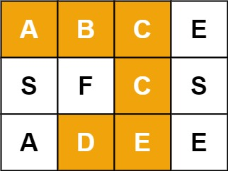

# 🔥 LeetCode 热题 HOT 100


#### [1. 两数之和](https://leetcode-cn.com/problems/two-sum/)

给定一个整数数组 nums 和一个整数目标值 target，请你在该数组中找出 和为目标值 的那 两个 整数，并返回它们的数组下标。

你可以假设每种输入只会对应一个答案。但是，数组中同一个元素不能使用两遍。

你可以按任意顺序返回答案。

**示例 1：**

> 输入：nums = [2,7,11,15], target = 9
> 输出：[0,1]
> 解释：因为 nums[0] + nums[1] == 9 ，返回 [0, 1] 。

**示例 2：**

> 输入：nums = [3,2,4], target = 6
> 输出：[1,2]

**示例 3：**

> 输入：nums = [3,3], target = 6
> 输出：[0,1]

**提示：**

- $2 <= nums.length <= 10^3$
-  $-10^9 <= nums[i] <= 10^9$
- $-10^9 <= target <= 10^9$
- **只会存在一个有效答案**

```c
#define BUCKET_SIZE 100

typedef struct NewList {
    int key;
    int val;
    struct NewList *next;
} List;

void listPush(List *head, int key, int val) {
    List* tmp = malloc(sizeof(List));
    tmp->key = key;
    tmp->val = val;
    tmp->next = head->next;
    head->next = tmp;
}

void listDelete(List* head, int key) {
    for (List* it = head; it->next; it = it->next) {
        if (it->next->key == key) {
            List* tmp = it->next;
            it->next = tmp->next;
            free(tmp);
            break;
        }
    }
}

List* listFind(List* head, int key) {
   
    List *tmp = head->next;
    while (tmp != NULL) {
        if (tmp->key == key) {
            return tmp;
        }
        tmp = tmp->next;
    }

    
    return NULL;
}

void listFree(List* head) {
    while (head->next) {
        List* tmp = head->next;
        head->next = tmp->next;
        free(tmp);
    }
}

int hash(int key) {
    return abs(key) % BUCKET_SIZE;
}

typedef struct {
    List* bucket;
} MyHashMap;

MyHashMap* myHashMapCreate() {
    MyHashMap* ret = malloc(sizeof(MyHashMap));
    ret->bucket = malloc(sizeof(List) * BUCKET_SIZE);
    for (int i = 0; i < BUCKET_SIZE; i++) {
        ret->bucket[i].key = 0;
        ret->bucket[i].val = 0;
        ret->bucket[i].next = NULL;
    }
    return ret;
}

void myHashMapPut(MyHashMap* obj, int key, int value) {
    int h = hash(key);
  
    List* rec = listFind(&(obj->bucket[h]), key);

    if (rec == NULL) {
        listPush(&(obj->bucket[h]), key, value);
    } else {
        rec->val = value;
    }
}

int myHashMapGet(MyHashMap* obj, int key) {
    int h = hash(key);
    List* rec = listFind(&(obj->bucket[h]), key);
    if (rec == NULL) {
        return -1;
    } else {
        return rec->val;
    }
}

void myHashMapRemove(MyHashMap* obj, int key) {
    int h = hash(key);
    listDelete(&(obj->bucket[h]), key);
}

void myHashMapFree(MyHashMap* obj) {
    for (int i = 0; i < BUCKET_SIZE; i++) {
        listFree(&(obj->bucket[i]));
    }
    free(obj->bucket);
}

int* twoSum(int* nums, int numsSize, int target, int* returnSize){
    int *res = (int *)malloc(2 * sizeof(int));
    if (res == NULL) {
        return NULL;
    }
    memset(res, 0, 2 * sizeof(int));
    *returnSize = 2;

    MyHashMap *map = myHashMapCreate();
    for (int i = 0; i < numsSize; i++) {   
        myHashMapPut(map, nums[i], i);      
    }

    for (int i = 0; i < numsSize; i++) {
        int tmp = myHashMapGet(map, target - nums[i]);
       
        if (tmp != -1 && tmp != i) {
            res[0] = i;
            res[1] = tmp;
            myHashMapFree(map);
            return res;
        }
    }
    
    return res;
}
```

#### [2. 两数相加](https://leetcode-cn.com/problems/add-two-numbers/)

给你两个 非空 的链表，表示两个非负的整数。它们每位数字都是按照 逆序 的方式存储的，并且每个节点只能存储 一位 数字。

请你将两个数相加，并以相同形式返回一个表示和的链表。

你可以假设除了数字 0 之外，这两个数都不会以 0 开头。

**示例 1：**


> 输入：l1 = [2,4,3], l2 = [5,6,4]
> 输出：[7,0,8]
> 解释：342 + 465 = 807.

**示例 2：**

> 输入：l1 = [0], l2 = [0]
> 输出：[0]

**示例 3：**

> 输入：l1 = [9,9,9,9,9,9,9], l2 = [9,9,9,9]
> 输出：[8,9,9,9,0,0,0,1]

**提示：**

- 每个链表中的节点数在范围 `[1, 100]` 内
- `0 <= Node.val <= 9`
- 题目数据保证列表表示的数字不含前导零

```c
struct ListNode* addTwoNumbers(struct ListNode* l1, struct ListNode* l2){
    struct ListNode *res = (struct ListNode *)malloc(sizeof(struct ListNode));
    if (res == NULL) {
        return NULL;
    } 
    memset(res, 0, sizeof(struct ListNode));

    struct ListNode *p = res;
    int carry = 0;

    while (l1 != NULL && l2 != NULL) {
        struct ListNode *node = (struct ListNode *)malloc(sizeof(struct ListNode));
        if (node == NULL) {
            return NULL;
        } 
        memset(node, 0, sizeof(struct ListNode));
        node->val = (l1->val + l2->val + carry) % 10 ;
        carry = (l1->val + l2->val + carry) / 10;
        p->next = node;
        p = p->next;

        l1 = l1->next;
        l2 = l2->next;
        
    }

    while (l1 == NULL && l2 != NULL) {
        struct ListNode *node = (struct ListNode *)malloc(sizeof(struct ListNode));
        if (node == NULL) {
            return NULL;
        } 
        memset(node, 0, sizeof(struct ListNode));
        node->val = (l2->val + carry) % 10 ;
        carry = (l2->val + carry) / 10;
        p->next = node;
        p = p->next;
        l2 = l2->next;
    } 

    while (l1 != NULL && l2 == NULL) {
        struct ListNode *node = (struct ListNode *)malloc(sizeof(struct ListNode));
        if (node == NULL) {
            return NULL;
        } 
        memset(node, 0, sizeof(struct ListNode));
        node->val = (l1->val + carry) % 10 ;
        carry = (l1->val + carry) / 10;
        p->next = node;
        p = p->next;
        l1 = l1->next;
    }

    if (carry != 0) {
        struct ListNode *node = (struct ListNode *)malloc(sizeof(struct ListNode));
        if (node == NULL) {
            return NULL;
        } 
        memset(node, 0, sizeof(struct ListNode));
        node->val = carry;
        p->next = node;
    }

    return res->next;
}
```


#### [3. 无重复字符的最长子串](https://leetcode-cn.com/problems/longest-substring-without-repeating-characters/)

给定一个字符串，请你找出其中不含有重复字符的 **最长子串** 的长度。

**示例 1:**

> 输入: s = "abcabcbb"
> 输出: 3 
> 解释: 因为无重复字符的最长子串是 "abc"，所以其长度为 3。

**示例 2:**

> 输入: s = "bbbbb"
> 输出: 1
> 解释: 因为无重复字符的最长子串是 "b"，所以其长度为 1。

**示例 3:**

> 输入: s = "pwwkew"
> 输出: 3
> 解释: 因为无重复字符的最长子串是 "wke"，所以其长度为 3。
>      请注意，你的答案必须是 子串 的长度，"pwke" 是一个子序列，不是子串。

**示例 4:**

> 输入: s = ""
> 输出: 0

```c
#define ASCII_LEN 128

int lengthOfLongestSubstring(char * s)
{
    int sLen = strlen(s);
    if (sLen == 0 || sLen == 1) {
        return sLen;
    }
    int arr[ASCII_LEN];
    memset(arr, -1, ASCII_LEN * sizeof(int));

    int maxLen = 0;
    int l = 0;
    for (int i = 0; i < sLen; i++) {
        if (arr[s[i]] != -1) {
            l = fmax(l, arr[s[i]] + 1);
        }
       
        maxLen = fmax(maxLen, i - l + 1);
        arr[s[i]] = i;
       
    }

    return maxLen;
}
```

#### [4. 寻找两个正序数组的中位数](https://leetcode-cn.com/problems/median-of-two-sorted-arrays/)

给定两个大小分别为 `m` 和 `n` 的正序（从小到大）数组 `nums1` 和 `nums2`。请你找出并返回这两个正序数组的 **中位数** 。

**示例 1：**

> 输入：nums1 = [1,3], nums2 = [2]
> 输出：2.00000
> 解释：合并数组 = [1,2,3] ，中位数 2

**示例 2：**

> 输入：nums1 = [1,2], nums2 = [3,4]
> 输出：2.50000
> 解释：合并数组 = [1,2,3,4] ，中位数 (2 + 3) / 2 = 2.5

**示例 3：**

> 输入：nums1 = [0,0], nums2 = [0,0]
> 输出：0.00000

**示例 4：**

> 输入：nums1 = [], nums2 = [1]
> 输出：1.00000


**示例 5：**

> 输入：nums1 = [2], nums2 = []
> 输出：2.00000

**提示：**

* nums1.length == m
* nums2.length == n
* 0 <= m <= 1000
* 0 <= n <= 1000
* 1 <= m + n <= 2000
* $-10^6 <= nums1[i], nums2[i] <= 10^6$

**进阶：**   你能设计一个时间复杂度为 O(log (m+n)) 的算法解决此问题吗？

```c
double findMedianSortedArrays(int* nums1, int nums1Size, int* nums2, int nums2Size){
    int *arr = (int *)malloc((nums1Size + nums2Size) * sizeof(int));
    if (arr == NULL) {
        return -1;
    }
    memset(arr, 0, (nums1Size + nums2Size) * sizeof(int));
    int l1 = 0;
    int l2 = 0;
    int count = 0;
    while (l1 < nums1Size && l2 < nums2Size) {
        if (nums1[l1] < nums2[l2]) {
            arr[count] = nums1[l1];
            count++;
            l1++;
        } else {
            arr[count] = nums2[l2];
            count++;
            l2++;
        }        
    }

    if (l1 == nums1Size && l2 < nums2Size) {
        while (count < nums1Size + nums2Size) {
            arr[count] = nums2[l2];
            count++;
            l2++;
        }
    } else if (l1 < nums1Size && l2 == nums2Size)  {
        while (count < nums1Size + nums2Size) {
            arr[count] = nums1[l1];
            count++;
            l1++;
        }
    }

    int mid = (nums1Size + nums2Size) / 2;
    bool isEven = (nums1Size + nums2Size) % 2 == 0 ? true : false;

    if (isEven) {
        return (arr[mid] + arr[mid - 1]) / 2.0;
    } else {
        return arr[mid];
    }
}
```

#### [5. 最长回文子串](https://leetcode-cn.com/problems/longest-palindromic-substring/)

给你一个字符串 `s`，找到 `s` 中最长的回文子串。

**示例 1：**

> 输入：s = "babad"
> 输出："bab"
> 解释："aba" 同样是符合题意的答案。

**示例 2：**

> 输入：s = "cbbd"
> 输出："bb"


**示例 3：**

> 输入：s = "a"
> 输出："a"


**示例 4：**

> 输入：s = "ac"
> 输出："a"

**提示：**

* 1 <= s.length <= 1000
* s 仅由数字和英文字母（大写和/或小写）组成

从回文串的定义展开讨论：

* 如果一个字符串的头尾两个字符都不相等，那么这个字符串一定不是回文串；
* 如果一个字符串的头尾两个字符相等，才有必要继续判断下去。
  * 如果里面的子串是回文，整体就是回文串；
  * 如果里面的子串不是回文串，整体就不是回文串。

```c
char * longestPalindrome(char * s)
{
    int len = strlen(s);
    bool dp[len][len];
    memset(dp, false, len * len * sizeof(bool));

    int maxLen = 0;
    int begin = 0; 
    int end = 0;

    for (int i = 0; i < len; i++) {
        dp[i][i] = true;
    }
    for (int i = len - 1; i >= 0; i--) {
        for (int j = i + 1; j < len; j++) {
            dp[i][j] = (s[i] == s[j]) && (j - i <= 2 || dp[i + 1][j - 1]);

            if (dp[i][j] && j - i + 1 > maxLen) {
                maxLen = j - i + 1;
                begin = i;
                end = j;
            }   
        }
    }
    s[end + 1] = '\0';
    
    return &s[begin];
}
```

#### [6. Z 字形变换](https://leetcode-cn.com/problems/zigzag-conversion/)

将一个给定字符串 s 根据给定的行数 numRows ，以从上往下、从左到右进行 Z 字形排列。

比如输入字符串为 "PAYPALISHIRING" 行数为 3 时，排列如下：

> P   A   H   N
> A P L S I I G
> Y   I   R

之后，你的输出需要从左往右逐行读取，产生出一个新的字符串，比如：`"PAHNAPLSIIGYIR"`。

请你实现这个将字符串进行指定行数变换的函数：

> string convert(string s, int numRows);

**示例 1：**

> 输入：s = "PAYPALISHIRING", numRows = 3
> 输出："PAHNAPLSIIGYIR"

**示例 2：**

> 输入：s = "PAYPALISHIRING", numRows = 4
> 输出："PINALSIGYAHRPI"
> 解释：
> P     I    N
> A   L S  I G
> Y A   H R
> P     I

**示例 3：**

> 输入：s = "A", numRows = 1
> 输出："A"

**提示：**

* 1 <= s.length <= 1000
* s 由英文字母（小写和大写）、',' 和 '.' 组成
* 1 <= numRows <= 1000

```c
char * convert(char * s, int numRows){
    if (numRows == 1) {
        return s;
    }
    int len = strlen(s);
    char arr[numRows][len];
    memset(arr,0, numRows * len * sizeof(char));

    int row = 0;
    int col = 0;
    bool isAcc = false;
    int count = 0;
    for (int i = 0; i < len; i++) {
        if (row == 0 || row == numRows - 1) {
            isAcc = !isAcc;
        }

        if (row < numRows - 1 && isAcc) {
            arr[row][col] = s[i];
            row++;
        } 

        if (row >= 0 && !isAcc) {
            arr[row][col] = s[i];
            if (row > 0) {
                row--;
            }
            col++;    
        } 
      
    }

    for (int i = 0; i < numRows; i++) {
        for (int j = 0; j < len; j++) {
            if (arr[i][j] != 0) {
                s[count++] = arr[i][j];
            }
        }
    }

    return s;
}
```

#### [7. 整数反转](https://leetcode-cn.com/problems/reverse-integer/)

给你一个 32 位的有符号整数 x ，返回将 x 中的数字部分反转后的结果。

如果反转后整数超过 32 位的有符号整数的范围 [−231,  231 − 1] ，就返回 0。

**假设环境不允许存储 64 位整数（有符号或无符号）。**

**示例 1：**

> 输入：x = 123
> 输出：321

**示例 2：**

> 输入：x = -123
> 输出：-321


**示例 3：**

> 输入：x = 120
> 输出：21


**示例 4：**

> 输入：x = 0
> 输出：0

**提示：**

* $-2^{31} <= x <= 2^{31} - 1$

```c
int reverse(int x)
{
    int res = 0;
    while (x != 0) {
        if (res < INT_MIN / 10 || res > INT_MAX / 10) {
            return 0;
        }

        res = res * 10 + x % 10;
        x = x / 10;
    }

    return res;
}	
```

#### [8. 字符串转换整数 (atoi)](https://leetcode-cn.com/problems/string-to-integer-atoi/)

请你来实现一个 myAtoi(string s) 函数，使其能将字符串转换成一个 32 位有符号整数（类似 C/C++ 中的 atoi 函数）。

函数 myAtoi(string s) 的算法如下：

* 读入字符串并丢弃无用的前导空格
* 检查下一个字符（假设还未到字符末尾）为正还是负号，读取该字符（如果有）。 确定最终结果是负数还是正数。 如果两者都不存在，则假定结果为正。
* 读入下一个字符，直到到达下一个非数字字符或到达输入的结尾。字符串的其余部分将被忽略。
  将前面步骤读入的这些数字转换为整数（即，"123" -> 123， "0032" -> 32）。如果没有读入数字，则整数为 0 。必要时更改符号（从步骤 2 开始）。
* 如果整数数超过 32 位有符号整数范围 [−231,  231 − 1] ，需要截断这个整数，使其保持在这个范围内。具体来说，小于 −231 的整数应该被固定为 −231 ，大于 231 − 1 的整数应该被固定为 231 − 1 。
* 返回整数作为最终结果。

**注意：**

* 本题中的空白字符只包括空格字符 ' ' 。
* 除前导空格或数字后的其余字符串外，请勿忽略 任何其他字符。

**示例 1：**

> 输入：s = "42"
> 输出：42
> 解释：加粗的字符串为已经读入的字符，插入符号是当前读取的字符。
> 第 1 步："42"（当前没有读入字符，因为没有前导空格）
>          ^
> 第 2 步："42"（当前没有读入字符，因为这里不存在 '-' 或者 '+'）
>          ^
> 第 3 步："42"（读入 "42"）
>            ^
> 解析得到整数 42 。
> 由于 "42" 在范围 [-231, 231 - 1] 内，最终结果为 42 。

**示例 2：**

> 输入：s = "   -42"
> 输出：-42
> 解释：
> 第 1 步："   -42"（读入前导空格，但忽视掉）
>             ^
> 第 2 步："   -42"（读入 '-' 字符，所以结果应该是负数）
>              ^
> 第 3 步："   -42"（读入 "42"）
>                ^
> 解析得到整数 -42 。
> 由于 "-42" 在范围 [-231, 231 - 1] 内，最终结果为 -42 。

**示例 3：**

> 输入：s = "4193 with words"
> 输出：4193
> 解释：
> 第 1 步："4193 with words"（当前没有读入字符，因为没有前导空格）
>          ^
> 第 2 步："4193 with words"（当前没有读入字符，因为这里不存在 '-' 或者 '+'）
>          ^
> 第 3 步："4193 with words"（读入 "4193"；由于下一个字符不是一个数字，所以读入停止）
>              ^
> 解析得到整数 4193 。
> 由于 "4193" 在范围 [-231, 231 - 1] 内，最终结果为 4193 。

**示例 4：**

> 输入：s = "words and 987"
> 输出：0
> 解释：
> 第 1 步："words and 987"（当前没有读入字符，因为没有前导空格）
>          ^
> 第 2 步："words and 987"（当前没有读入字符，因为这里不存在 '-' 或者 '+'）
>          ^
> 第 3 步："words and 987"（由于当前字符 'w' 不是一个数字，所以读入停止）
>          ^
> 解析得到整数 0 ，因为没有读入任何数字。
> 由于 0 在范围 [-231, 231 - 1] 内，最终结果为 0 。

**示例 5：**

> 输入：s = "-91283472332"
> 输出：-2147483648
> 解释：
> 第 1 步："-91283472332"（当前没有读入字符，因为没有前导空格）
>          ^
> 第 2 步："-91283472332"（读入 '-' 字符，所以结果应该是负数）
>           ^
> 第 3 步："-91283472332"（读入 "91283472332"）
>                      ^
> 解析得到整数 -91283472332 。
> 由于 -91283472332 小于范围 [-231, 231 - 1] 的下界，最终结果被截断为 -231 = -2147483648 。

**提示：**

- `0 <= s.length <= 200`
- `s` 由英文字母（大写和小写）、数字（`0-9`）、`' '`、`'+'`、`'-'` 和 `'.'` 组成

```c
int myAtoi(char * s)
{
   
    int len = strlen(s);
    int res = 0;

    int i = 0;
    while (s[i] == ' ') {
        i++;
    }

    bool isNegitive = false;
    if (s[i] == '-') {
        isNegitive = true;
        i++;
    }  else if (s[i] == '+') {
        i++;
    }

    for (i; i < len; i++) {
        if (!(s[i] >= '0' && s[i] <= '9')) {
            break;
        }

        if ( res > INT_MAX / 10 || 
                (res == INT_MAX / 10 && s[i] - '0' > INT_MAX % 10)) {
            
            return isNegitive ? INT_MIN : INT_MAX;
        }  

        res = res * 10 + (s[i] - '0');
    }

    if (isNegitive) {
        res = -res;
    }

    return res;
}
```

#### [9. 回文数](https://leetcode-cn.com/problems/palindrome-number/)

给你一个整数 x ，如果 x 是一个回文整数，返回 true ；否则，返回 false 。

回文数是指正序（从左向右）和倒序（从右向左）读都是一样的整数。例如，121 是回文，而 123 不是。

 **示例 1：**

> 输入：x = 121
> 输出：true


**示例 2：**

> 输入：x = -121
> 输出：false
> 解释：从左向右读, 为 -121 。 从右向左读, 为 121- 。因此它不是一个回文数。


**示例 3：**

> 输入：x = 10
> 输出：false
> 解释：从右向左读, 为 01 。因此它不是一个回文数。


**示例 4：**

> 输入：x = -101
> 输出：false

**提示：**

- 2^31^ <= x <= 2^31^ - 1

```c
#define MAX_INT_SIZE 33
bool isPalindrome(int x){
    char s[MAX_INT_SIZE];
    memset(s, 0, MAX_INT_SIZE * sizeof(char));

    sprintf(s, "%d", x);
    int l = 0;
    int r = strlen(s) - 1;
    while (l < r) {
        if (s[l] != s[r]) {
            return false;
        }

        l++;
        r--;
    }

    return true; 
}
```

#### [10. 正则表达式匹配](https://leetcode-cn.com/problems/regular-expression-matching/)

给你一个字符串 s 和一个字符规律 p，请你来实现一个支持 '.' 和 '*' 的正则表达式匹配。

* '.' 匹配任意单个字符
* '*' 匹配零个或多个前面的那一个元素

所谓匹配，是要涵盖 整个 字符串 s的，而不是部分字符串。

**示例 1：**

> 输入：s = "aa" p = "a"
> 输出：false
> 解释："a" 无法匹配 "aa" 整个字符串。


**示例 2:**

> 输入：s = "aa" p = "a*"
> 输出：true
> 解释：因为 '*' 代表可以匹配零个或多个前面的那一个元素, 在这里前面的元素就是 'a'。因此，字符串 "aa" 可被视为 'a' 重复了一次。


**示例 3：**

> 输入：s = "ab" p = ".*"
> 输出：true
> 解释：".*" 表示可匹配零个或多个（'*'）任意字符（'.'）。


**示例 4：**

> 输入：s = "aab" p = "c*a*b"
> 输出：true
> 解释：因为 '*' 表示零个或多个，这里 'c' 为 0 个, 'a' 被重复一次。因此可以匹配字符串 "aab"。


**示例 5：**

> 输入：s = "mississippi" p = "mis*is*p*."
> 输出：false

**提示：**

* 0 <= s.length <= 20
* 0 <= p.length <= 30
* s 可能为空，且只包含从 a-z 的小写字母。
* p 可能为空，且只包含从 a-z 的小写字母，以及字符 . 和 *。
* 保证每次出现字符 * 时，前面都匹配到有效的字符

```c
bool isMatch(char *s, char *p){
    int lenOfS = strlen(s);
    int lenOfP = strlen(p);

    bool dp[lenOfS + 1][lenOfP + 1];

    memset(dp, false, (lenOfS +1) * (lenOfP + 1) * sizeof(bool));
    
    dp[0][0] = true;
    for( int i = 0 ; i <= lenOfS; i++ ) {
        for(int j = 0 ; j <= lenOfP; j++ ) {       
            if (j > 0 && p[j - 1] != '*') {
                if (i > 0 && (s[i - 1] == p[j - 1] || p[j - 1] == '.')) {
                    dp[i][j] = dp[i - 1][j - 1];
                }
            } else if (j - 2 >= 0) { 
    
                dp[i][j] = dp[i][j - 2];
                if (i > 0 && (s[i - 1] == p[j - 2] || p[j - 2] == '.')) {
                    dp[i][j] |= dp[i - 1][j];
                }
            }                  
        }
    }

    return dp[lenOfS][lenOfP];
}
```

#### [11. 盛最多水的容器](https://leetcode-cn.com/problems/container-with-most-water/)

给你 n 个非负整数 a1，a2，...，an，每个数代表坐标中的一个点 (i, ai) 。在坐标内画 n 条垂直线，垂直线 i 的两个端点分别为 (i, ai) 和 (i, 0) 。找出其中的两条线，使得它们与 x 轴共同构成的容器可以容纳最多的水。

说明：你不能倾斜容器。

**示例 1：**


> 输入：[1,8,6,2,5,4,8,3,7]
> 输出：49 
> 解释：图中垂直线代表输入数组 [1,8,6,2,5,4,8,3,7]。在此情况下，容器能够容纳水（表示为蓝色部分）的最大值为 49。

**示例 2：**

> 输入：height = [1,1]
> 输出：1

**示例 3：**

> 输入：height = [4,3,2,1,4]
> 输出：16

**示例 4：**

> 输入：height = [1,2,1]
> 输出：2

**提示：**

* n = height.length
*  $2 <= n <= 3 * 10^4$
* $0 <= height[i] <= 3 * 10^4$

```c
int maxArea(int* height, int heightSize){
    int maxVal = 0;
    int l = 0;
    int r = heightSize - 1;

    while (l < r) {
        int area = fmin(height[l], height[r]) * (r - l);
        if (height[l] < height[r]) {
            l++;
        } else {
            r--;
        }

        if (area > maxVal) {
            maxVal = area;
        }
    }

    return maxVal;
}
```

#### [12. 整数转罗马数字](https://leetcode-cn.com/problems/integer-to-roman/)

罗马数字包含以下七种字符： `I`， `V`， `X`， `L`，`C`，`D` 和 `M`。

> 字符          数值
> I             1
> V             5
> X             10
> L             50
> C             100
> D             500
> M             1000

例如， 罗马数字 2 写做 II ，即为两个并列的 1。12 写做 XII ，即为 X + II 。 27 写做  XXVII, 即为 XX + V + II 。

通常情况下，罗马数字中小的数字在大的数字的右边。但也存在特例，例如 4 不写做 IIII，而是 IV。数字 1 在数字 5 的左边，所表示的数等于大数 5 减小数 1 得到的数值 4 。同样地，数字 9 表示为 IX。这个特殊的规则只适用于以下六种情况：

* I 可以放在 V (5) 和 X (10) 的左边，来表示 4 和 9。
* X 可以放在 L (50) 和 C (100) 的左边，来表示 40 和 90。 
* C 可以放在 D (500) 和 M (1000) 的左边，来表示 400 和 900。

给定一个整数，将其转为罗马数字。输入确保在 1 到 3999 的范围内。

**示例 1:**

> 输入: 3
> 输出: "III"


**示例 2:**

> 输入: 4
> 输出: "IV"


**示例 3:**

> 输入: 9
> 输出: "IX"


**示例 4:**

> 输入: 58
> 输出: "LVIII"
> 解释: L = 50, V = 5, III = 3.


**示例 5:**

> 输入: 1994
> 输出: "MCMXCIV"
> 解释: M = 1000, CM = 900, XC = 90, IV = 4.

**提示：**

* 1 <= num <= 3999

```c
#define MAX_SIZE 100

char * intToRoman(int num)
{
    char *res = (char *)malloc(MAX_SIZE * sizeof(char));
    if (res == NULL) {
        return NULL;
    }
    memset(res, 0, MAX_SIZE * sizeof(char));

    int nums[] = {1000, 900, 500, 400, 100, 90, 50, 40, 10, 9, 5, 4, 1};
    char *romans[] = {"M", "CM", "D", "CD", "C", "XC", "L", "XL", "X", "IX", "V", "IV", "I"};

    int count = 0;
    while (num > 0) {
        for (int i = 0; i < 13; i++) {
            if (num >= nums[i]) {
                strcpy(&res[count],romans[i]);
                count += strlen(romans[i]);
                num -= nums[i];
                break;
            }
        }
    }

    return res;
}
```

#### [13. 罗马数字转整数](https://leetcode-cn.com/problems/roman-to-integer/)

罗马数字包含以下七种字符: `I`， `V`， `X`， `L`，`C`，`D` 和 `M`。

> 字符          数值
> I             1
> V             5
> X             10
> L             50
> C             100
> D             500
> M             1000


例如， 罗马数字 2 写做 II ，即为两个并列的 1。12 写做 XII ，即为 X + II 。 27 写做  XXVII, 即为 XX + V + II 。

通常情况下，罗马数字中小的数字在大的数字的右边。但也存在特例，例如 4 不写做 IIII，而是 IV。数字 1 在数字 5 的左边，所表示的数等于大数 5 减小数 1 得到的数值 4 。同样地，数字 9 表示为 IX。这个特殊的规则只适用于以下六种情况：

* I 可以放在 V (5) 和 X (10) 的左边，来表示 4 和 9。
* X 可以放在 L (50) 和 C (100) 的左边，来表示 40 和 90。 
* C 可以放在 D (500) 和 M (1000) 的左边，来表示 400 和 900。

 给定一个罗马数字，将其转换成整数。输入确保在 1 到 3999 的范围内。

**示例 1:**

> 输入: "III"
> 输出: 3


**示例 2:**

> 输入: "IV"
> 输出: 4


**示例 3:**

> 输入: "IX"
> 输出: 9


**示例 4:**

> 输入: "LVIII"
> 输出: 58
> 解释: L = 50, V= 5, III = 3.


**示例 5:**

> 输入: "MCMXCIV"
> 输出: 1994
> 解释: M = 1000, CM = 900, XC = 90, IV = 4.

**提示：**

* 1 <= s.length <= 15
* s 仅含字符 ('I', 'V', 'X', 'L', 'C', 'D', 'M')
* 题目数据保证 s 是一个有效的罗马数字，且表示整数在范围 [1, 3999] 内
* 题目所给测试用例皆符合罗马数字书写规则，不会出现跨位等情况。
* IL 和 IM 这样的例子并不符合题目要求，49 应该写作 XLIX，999 应该写作 CMXCIX 。
* 关于罗马数字的详尽书写规则，可以参考 [罗马数字 - Mathematics](https://b2b.partcommunity.com/community/knowledge/zh_CN/detail/10753/罗马数字#knowledge_article)。

```c
int romanToInt(char* s) {
    int symbolValues[26];
    symbolValues['I' - 'A'] = 1;
    symbolValues['V' - 'A'] = 5;
    symbolValues['X' - 'A'] = 10;
    symbolValues['L' - 'A'] = 50;
    symbolValues['C' - 'A'] = 100;
    symbolValues['D' - 'A'] = 500;
    symbolValues['M' - 'A'] = 1000;
    int ans = 0;
    int n = strlen(s);
    for (int i = 0; i < n; ++i) {
        int value = symbolValues[s[i] - 'A'];
        if (i < n - 1 && value < symbolValues[s[i + 1] - 'A']) {
            ans -= value;
        } else {
            ans += value;
        }
    }
    return ans;
}

```

#### [14. 最长公共前缀](https://leetcode-cn.com/problems/longest-common-prefix/)

编写一个函数来查找字符串数组中的最长公共前缀。

如果不存在公共前缀，返回空字符串 ""。 

**示例 1：**

> 输入：strs = ["flower","flow","flight"]
> 输出："fl"


**示例 2：**

> 输入：strs = ["dog","racecar","car"]
> 输出：""
> 解释：输入不存在公共前缀。

**提示：**

* 0 <= strs.length <= 200
* 0 <= strs[i].length <= 200
* strs[i] 仅由小写英文字母组成

```c
char * longestCommonPrefix(char ** strs, int strsSize)
{
    if (strsSize == 1) {
        return strs[0];
    }
    
    int max_len = strlen(strs[0]);
    for (int i = 1; i < strsSize; i++) {
        int j;
        for (j = 0; j < fmin(strlen(strs[i]), max_len); j++) {
            if (strs[i][j] != strs[0][j] ) {
                break;
            }       
        }

        if (max_len > j) {
            max_len = j;
        }
        if (max_len == 0) {
            return "";
        }
    }

    strs[0][max_len] = '\0';
    return strs[0];
}
```

#### [15. 三数之和](https://leetcode-cn.com/problems/3sum/)

给你一个包含 n 个整数的数组 nums，判断 nums 中是否存在三个元素 a，b，c ，使得 a + b + c = 0 ？请你找出所有和为 0 且不重复的三元组。

**注意：**答案中不可以包含重复的三元组。

**示例 1：**

> 输入：nums = [-1,0,1,2,-1,-4]
> 输出：[[-1,-1,2],[-1,0,1]]


**示例 2：**

> 输入：nums = []
> 输出：[]


**示例 3：**

> 输入：nums = [0]
> 输出：[]

**提示：**

* 0 <= nums.length <= 3000
* $-105 <= nums[i] <= 10^5$

```c
int Cmp(const void *a, const void *b)
{
    return *(int *)a - *(int *)b;
}

int** threeSum(int* nums, int numsSize, int* returnSize, int** returnColumnSizes)
{
    qsort(nums, numsSize, sizeof(int), Cmp);

    int **res = (int **)malloc(numsSize  * numsSize * sizeof(int *));
    if (res == NULL) {
        return NULL;
    }
    memset(res, 0,numsSize  * numsSize * sizeof(int *));
    int size = 0;

    *returnColumnSizes = (int *)malloc(numsSize  * numsSize * sizeof(int));
    if (*returnColumnSizes == NULL) {
        return NULL;
    }

    for (int i = 0; i < numsSize - 2; i++) {
        if (nums[i] > 0) {
            break;
        }
        if (i > 0 && nums[i] == nums[i - 1]) {
            continue;
        }
        int l = i + 1;
        int r = numsSize - 1;
        while (l < r) {
            int sum = nums[i] + nums[l] + nums[r];
         
            if (sum == 0) {
                int *tmp = (int *)malloc(3 * sizeof(int));
                if (tmp == NULL) {
                    return NULL;
                }
                tmp[0] = nums[i];
                tmp[1] = nums[l];
                tmp[2] = nums[r];
                
               
                res[size] = tmp;
                (*returnColumnSizes)[size] = 3;
                size++;

                while (l < r && nums[l] == nums[l + 1]) {
                    l++;
                }
                l++;
                r--;
            } else if (sum > 0) {
                r--;
            } else {
                l++;
            }
        }
    }
    
    *returnSize = size;
    
    return res;
}
```

#### [16. 最接近的三数之和](https://leetcode-cn.com/problems/3sum-closest/)

给定一个包括 n 个整数的数组 nums 和 一个目标值 target。找出 nums 中的三个整数，使得它们的和与 target 最接近。返回这三个数的和。假定每组输入只存在唯一答案。

 **示例：**

> 输入：nums = [-1,2,1,-4], target = 1
> 输出：2
> 解释：与 target 最接近的和是 2 (-1 + 2 + 1 = 2) 。

**提示：**

* 3 <= nums.length <= 10^3^
* -10^3^ <= nums[i] <= 10^3^
* -10^4^ <= target <= 10^4^

```c
int Cmp(const void *a, const void *b)
{
    return *(int *)a - *(int *)b;
}

int threeSumClosest(int* nums, int numsSize, int target){
    qsort(nums, numsSize, sizeof(int), Cmp);

    int res = nums[0] + nums[1] + nums[2];

    for (int i = 0; i < numsSize - 2; i++) {
        int l = i + 1;
        int r = numsSize - 1;
        while (l < r) {
            int sum = nums[i] + nums[l] + nums[r];

            if (abs(sum - target) < abs(res - target)) {
                res = sum;
            }
            if (sum > target) {
                r--;
            } else if (sum < target){
                l++;
            } else {
                return target;
            }
        }
    }
    
    return res; 
}
```

#### [17. 电话号码的字母组合](https://leetcode-cn.com/problems/letter-combinations-of-a-phone-number/)

给定一个仅包含数字 2-9 的字符串，返回所有它能表示的字母组合。答案可以按 任意顺序 返回。

给出数字到字母的映射如下（与电话按键相同）。注意 1 不对应任何字母。


**示例 1：**

> 输入：digits = "23"
> 输出：["ad","ae","af","bd","be","bf","cd","ce","cf"]


**示例 2：**

> 输入：digits = ""
> 输出：[]


**示例 3：**

> 输入：digits = "2"
> 输出：["a","b","c"]

**提示：**

> 0 <= digits.length <= 4
> digits[i] 是范围 ['2', '9'] 的一个数字。

```c
#define MAX_SIZE 4*4*4*4

char *words[] = 
{
    "",
    "",
    "abc",
    "def",
    "ghi",
    "jkl",
    "mno",
    "pqrs",
    "tuv",
    "wxyz"
};

void Dfs(char *digits, char *cur, int index, char **res, int *sizeOfRes)
{
    if (index == strlen(digits)) {
        char *tmp = (char *)malloc((index + 1) * sizeof(char));
        for (int i = 0; i < index; i++) {
            tmp[i] = cur[i];
        }
        tmp[index] = '\0';

        res[(*sizeOfRes)++] = tmp;
        return;
    }

    char *word = words[digits[index] - '0'];
    for (int i = 0; i < strlen(word); i++) {
        cur[index] = word[i];
        Dfs(digits, cur, index + 1, res, sizeOfRes);
    }
}

char ** letterCombinations(char * digits, int* returnSize){

    char **res = (char **)malloc(MAX_SIZE * sizeof(char *));
    if (res == NULL) {
        return NULL;
    }
    int sizeOfRes = 0;
    
    char *cur = (char *)malloc(5 * sizeof(char));
    int index = 0;
    
    if (strlen(digits) == 0) {
       *returnSize = 0;
       return NULL;
    }

    Dfs(digits, cur, index, res, &sizeOfRes);
    *returnSize = sizeOfRes;

    return res;
}
```

#### [18. 四数之和](https://leetcode-cn.com/problems/4sum/)

给定一个包含 n 个整数的数组 nums 和一个目标值 target，判断 nums 中是否存在四个元素 a，b，c 和 d ，使得 a + b + c + d 的值与 target 相等？找出所有满足条件且不重复的四元组。

**注意：**答案中不可以包含重复的四元组。

**示例 1：**

> 输入：nums = [1,0,-1,0,-2,2], target = 0
> 输出：[[-2,-1,1,2],[-2,0,0,2],[-1,0,0,1]]


**示例 2：**

> 输入：nums = [], target = 0
> 输出：[]

**提示：**

* 0 <= nums.length <= 200
* -10^9^<= nums[i] <= 10^9^
* -10^9^ <= target <= 10^9^

```c
#define MAX_SIZE 200 * 4

int Cmp(const void *a, const void *b)
{
    return *(int *)a - *(int *)b;
}

int** fourSum(int* nums, int numsSize, int target, int* returnSize, int** returnColumnSizes){
    int **res = (int **)malloc(MAX_SIZE * sizeof(int *));
    if (res == NULL) {
        return NULL;
    }
    int sizeOfRes = 0;

    *returnColumnSizes = (int *)malloc(MAX_SIZE * sizeof(int));
    if (*returnColumnSizes == NULL) {
        return NULL;
    }

    qsort(nums, numsSize, sizeof(int), Cmp);

    for (int i = 0; i < numsSize - 3; i++) {
        if (i > 0 && nums[i] == nums[i - 1]) {
            continue;
        }

        if((long long)nums[i] + nums[i+1] + nums[i+2] + nums[i+3] > target) {
            break;
        }

        for (int j = i + 1; j < numsSize - 2; j++) {
            if (j > i + 1 && nums[j] == nums[j - 1]) {
                continue;
            }
            int l = j + 1;
            int r = numsSize - 1;

            while (l < r) {

                long long sum = (long long)nums[i] + nums[j] + nums[l] + nums[r];

                if (sum == target) {
                    int *tmp = (int *) malloc(4 * sizeof(int));
                    if (tmp == NULL) {
                        return NULL;
                    }

                    tmp[0] = nums[i];
                    tmp[1] = nums[j];
                    tmp[2] = nums[l];
                    tmp[3] = nums[r];

                    res[sizeOfRes] = tmp;
                    (*returnColumnSizes)[sizeOfRes] = 4;
                    sizeOfRes++;

                    while (l < r && nums[l] == nums[l + 1]) {
                        l++;
                    }
                    l++;
                    r--;
                } else if (sum > target) {
                    r--;
                } else {
                    l++;
                }
            }
        }
    }

    *returnSize = sizeOfRes;
    return res;
}
```

#### [19. 删除链表的倒数第 N 个结点](https://leetcode-cn.com/problems/remove-nth-node-from-end-of-list/)

给你一个链表，删除链表的倒数第 n 个结点，并且返回链表的头结点。

**进阶：**你能尝试使用一趟扫描实现吗？

**示例 1：**


> 输入：head = [1,2,3,4,5], n = 2
> 输出：[1,2,3,5]


**示例 2：**

> 输入：head = [1], n = 1
> 输出：[]


**示例 3：**

> 输入：head = [1,2], n = 1
> 输出：[1]

**提示：**

* 链表中结点的数目为 sz
* 1 <= sz <= 30
* 0 <= Node.val <= 100
* 1 <= n <= sz

```c
struct ListNode* removeNthFromEnd(struct ListNode* head, int n){
    struct ListNode *fast = head;
    for (int i = 0; i < n; i++) {
        fast = fast->next;
    }

    if(fast == NULL) {
        return head->next;   //说明删除的是头节点
    }
    struct ListNode *slow = head;
    struct ListNode *pre = NULL;
    while (fast != NULL) {
        fast = fast->next;
        pre = slow;
        slow = slow ->next;
    }

    
    pre->next = pre->next->next;
    
    return head;
}
```

#### [20. 有效的括号](https://leetcode-cn.com/problems/valid-parentheses/)

给定一个只包括 '('，')'，'{'，'}'，'['，']' 的字符串 s ，判断字符串是否有效。

有效字符串需满足：

1. 左括号必须用相同类型的右括号闭合。
2. 左括号必须以正确的顺序闭合。

**示例 1：**

> 输入：s = "()"
> 输出：true


**示例 2：**

> 输入：s = "()[]{}"
> 输出：true


**示例 3：**

> 输入：s = "(]"
> 输出：false


**示例 4：**

> 输入：s = "([)]"
> 输出：false


**示例 5：**

> 输入：s = "{[]}"
> 输出：true

**提示：**

* 1 <= s.length <= 10^4^
* s 仅由括号 '()[]{}' 组成

```c
# define MAX_SIZE 10001
char GetPairs(char a) {
    if (a == '}') return '{';
    if (a == ']') return '[';
    if (a == ')') return '(';
    return 0;
}

bool isValid(char * s){
    char stack[MAX_SIZE];
    memset(stack, 0, MAX_SIZE * sizeof(char));
    int top = 0;

    int len = strlen(s);
     if (len % 2 == 1) {
        return false;
    }
    for (int i = 0; i < len; i++) {
        if (s[i] == '(' || s[i] == '[' || s[i] == '{') {
            stack[top++] = s[i];
        } else {
            char tmp = GetPairs(s[i]);
       
            if (tmp != 0 && top > 0 && tmp == stack[top - 1]) {
                top--;
            } else {
                return false;
            }
        }
        
        
    }

    if (top != 0) {
        return false;
    } 
    
    return true;
   
}
```

#### [21. 合并两个有序链表](https://leetcode-cn.com/problems/merge-two-sorted-lists/)

将两个升序链表合并为一个新的 **升序** 链表并返回。新链表是通过拼接给定的两个链表的所有节点组成的。 

**示例 1：**


> 输入：l1 = [1,2,4], l2 = [1,3,4]
> 输出：[1,1,2,3,4,4]

**示例 2：**

> 输入：l1 = [], l2 = []
> 输出：[]


**示例 3：**

> 输入：l1 = [], l2 = [0]
> 输出：[0]

**提示：**

* 两个链表的节点数目范围是 [0, 50]
* -100 <= Node.val <= 100
* l1 和 l2 均按 非递减顺序 排列

```c
struct ListNode* mergeTwoLists(struct ListNode* list1, struct ListNode* list2){
    struct ListNode * res = (struct ListNode *)malloc(sizeof(struct ListNode));
    if (res == NULL) {
        return NULL;
    }
    memset(res, 0, sizeof(struct ListNode));

    struct ListNode *p = res;

    while (list1 != NULL && list2 != NULL) {
        if (list1->val < list2->val) {
            p->next = list1;
            list1 = list1->next;
        } else {
            p->next = list2;
            list2 = list2->next;
        }
        p = p->next;
    }

    if (list1 == NULL && list2 != NULL) {
        p->next = list2;
    } else if (list1 != NULL && list2 == NULL) {
        p->next = list1;
    }

    return res->next;
}
```

#### [22. 括号生成](https://leetcode-cn.com/problems/generate-parentheses/)

数字 n 代表生成括号的对数，请你设计一个函数，用于能够生成所有可能的并且有效的括号组合。 

**示例 1：**

> 输入：n = 3
> 输出：["((()))","(()())","(())()","()(())","()()()"]

**示例 2：**

> 输入：n = 1
> 输出：["()"]

**提示：**

* 1 <= n <= 8

```c
#define MAX_SIZE 10001

void GetParenthesis(char *str,int left, int right, int len, char **res, int *sizeofRes)
{
    if(left == 0 && right == 0 ){
        char *tmp = (char *)malloc((len + 1) * sizeof(char));
        for (int i = 0; i < len; i++) {
            tmp[i] = str[i];
        }
        tmp[len] = '\0';

        res[(*sizeofRes)++] = tmp;
        return;
    }
    if(left == right){
        //剩余左右括号数相等，下一个只能用左括号
        str[len] = '(';
        GetParenthesis(str,left-1, right, len + 1, res, sizeofRes);
    }else if(left < right){
        //剩余左括号小于右括号，下一个可以用左括号也可以用右括号
        if(left > 0){
            str[len] = '(';
            GetParenthesis(str,left-1, right, len + 1, res, sizeofRes);
        }
        str[len] = ')';
        GetParenthesis(str, left, right-1, len + 1, res, sizeofRes);
    }
}

char ** generateParenthesis(int n, int* returnSize){
    char **res = (char **)malloc(MAX_SIZE * sizeof(char *));
    int sizeofRes = 0;

    char *s = (char *)malloc((n * 2 + 1) * sizeof(char));
    memset(s, 0, (n * 2 + 1) * sizeof(char));
    GetParenthesis(s, n, n, 0, res, &sizeofRes);

    *returnSize = sizeofRes;
    return res;
}
```

#### [23. 合并K个升序链表](https://leetcode-cn.com/problems/merge-k-sorted-lists/)

给你一个链表数组，每个链表都已经按升序排列。

请你将所有链表合并到一个升序链表中，返回合并后的链表。

**示例 1：**

> 输入：lists = [[1,4,5],[1,3,4],[2,6]]
> 输出：[1,1,2,3,4,4,5,6]
> 解释：链表数组如下：
> [
>   1->4->5,
>   1->3->4,
>   2->6
> ]
> 将它们合并到一个有序链表中得到。
> 1->1->2->3->4->4->5->6

**示例 2：**

> 输入：lists = []
> 输出：[]


**示例 3：**

> 输入：lists = [[]]
> 输出：[]

**提示：**

* k == lists.length
* 0 <= k <= 10^4^
* 0 <= lists[i].length <= 500
* -10^4^ <= lists[i ]  [ j ] <= 10^4^
* lists[i] 按 升序 排列
* lists[i].length 的总和不超过 10^4^

```c
struct ListNode * MergeTwoList(struct ListNode *a, struct ListNode *b)
{
    if (a == NULL || b == NULL) {
        return a == NULL ? b : a;
    }

    struct ListNode *tmpA = a;
    struct ListNode *tmpB = b;

    struct ListNode *dummy = (struct ListNode *)malloc(sizeof(struct ListNode));
    struct ListNode *p = dummy;
    while (tmpA != NULL && tmpB != NULL) {
        if (tmpA->val < tmpB->val) {
            p->next = tmpA;
            tmpA = tmpA->next;
        } else {
            p->next = tmpB;
            tmpB = tmpB->next;  
        }
        p = p->next;
    }

    if (tmpA == NULL) {
        p->next = tmpB;
    } else {
        p->next = tmpA;
    }

    return dummy->next;
}

struct ListNode* mergeKLists(struct ListNode** lists, int listsSize){
    struct ListNode *p = NULL;

    for (int i = 0; i < listsSize; i++) {
        p = MergeTwoList(p, lists[i]);
    }

    return p;
}
```

#### [24. 两两交换链表中的节点](https://leetcode-cn.com/problems/swap-nodes-in-pairs/)

给定一个链表，两两交换其中相邻的节点，并返回交换后的链表。

**你不能只是单纯的改变节点内部的值**，而是需要实际的进行节点交换。

**示例 1：**


> 输入：head = [1,2,3,4]
> 输出：[2,1,4,3]

**示例 2：**

> 输入：head = []
> 输出：[]

**示例 3：**

> 输入：head = [1]
> 输出：[1]

**提示：**

   * 链表中节点的数目在范围 [0, 100] 内
   * 0 <= Node.val <= 100

```c
struct ListNode* swapPairs(struct ListNode* head){

    struct ListNode *dummy = (struct ListNode *)malloc(sizeof(struct ListNode));
    dummy->next = head;
    struct ListNode *cur = dummy;

    while (head != NULL && head->next != NULL) {
        cur->next = head->next;
        struct ListNode *tmp = head->next->next;
        head->next->next = head;
        head->next = tmp;
       
        cur = head;
        head = tmp;
    }

    return dummy->next;
}
```

#### [25. K 个一组翻转链表](https://leetcode-cn.com/problems/reverse-nodes-in-k-group/)

给你一个链表，每 k 个节点一组进行翻转，请你返回翻转后的链表。

k 是一个正整数，它的值小于或等于链表的长度。

如果节点总数不是 k 的整数倍，那么请将最后剩余的节点保持原有顺序。

**进阶：**

* 你可以设计一个只使用常数额外空间的算法来解决此问题吗？
* 你不能只是单纯的改变节点内部的值，而是需要实际进行节点交换。

**示例 1：**


> 输入：head = [1,2,3,4,5], k = 2
> 输出：[2,1,4,3,5]

**示例 2：**


> 输入：head = [1,2,3,4,5], k = 3
> 输出：[3,2,1,4,5]

**示例 3：**

> 输入：head = [1,2,3,4,5], k = 1
> 输出：[1,2,3,4,5]


**示例 4：**

> 输入：head = [1], k = 1
> 输出：[1]


**提示：**

*  列表中节点的数量在范围 sz 内
*  1 <= sz <= 5000
*  0 <= Node.val <= 1000
*  1 <= k <= sz

```c
struct ListNode * ReverseListNode(struct ListNode * head)
{
    if (head == NULL || head->next == NULL) {
        return head;
    }

    struct ListNode *pre = NULL;
    struct ListNode *cur = head;

    while (cur != NULL) {
        struct ListNode *tmp = cur->next;
        cur->next = pre;
        pre = cur;
        cur = tmp;
    }

    return pre;
}

struct ListNode* reverseKGroup(struct ListNode* head, int k){
    if (head == NULL || head->next == NULL){
        return head;
    }
        
    struct ListNode *dummy = (struct ListNode *)malloc(sizeof(struct ListNode));
    dummy->next=head;
  
    struct ListNode *pre = dummy;
    struct ListNode *end = dummy;

    while (end->next != NULL) {
        
        for (int i = 0; i < k && end != NULL; i++) {
            end=end->next;
        }
       
        if (end == NULL) {
            break;
        }
        
        struct ListNode *next = end->next;
        end->next=NULL;
        
        struct ListNode *start = pre->next;
       
        pre->next = ReverseListNode(start);
        start->next = next;
        
        pre = start;
        end = start;
    }
    return dummy->next;
}
```

#### [26. 删除有序数组中的重复项](https://leetcode-cn.com/problems/remove-duplicates-from-sorted-array/)

给你一个有序数组 nums ，请你 **原地** 删除重复出现的元素，使每个元素 **只出现一次** ，返回删除后数组的新长度。

不要使用额外的数组空间，你必须在 **原地 修改输入数组** 并在使用 O(1) 额外空间的条件下完成。

**说明:**

为什么返回数值是整数，但输出的答案是数组呢?

请注意，输入数组是以**「引用」**方式传递的，这意味着在函数里修改输入数组对于调用者是可见的。

你可以想象内部操作如下:

```
// nums 是以“引用”方式传递的。也就是说，不对实参做任何拷贝
int len = removeDuplicates(nums);

// 在函数里修改输入数组对于调用者是可见的。
// 根据你的函数返回的长度, 它会打印出数组中 该长度范围内 的所有元素。
for (int i = 0; i < len; i++) {
    print(nums[i]);
}
```

**示例 1：**

> 输入：nums = [1,1,2]
> 输出：2, nums = [1,2]
> 解释：函数应该返回新的长度 2 ，并且原数组 nums 的前两个元素被修改为 1, 2 。不需要考虑数组中超出新长度后面的元素。


**示例 2：**

> 输入：nums = [0,0,1,1,1,2,2,3,3,4]
> 输出：5, nums = [0,1,2,3,4]
> 解释：函数应该返回新的长度 5 ， 并且原数组 nums 的前五个元素被修改为 0, 1, 2, 3, 4 。不需要考虑数组中超出新长度后面的元素。

**提示：**

*  0 <= nums.length <= 3 * 10^4^
*  -10^4^ <= nums[i] <= 10^4^
*  nums 已按升序排列

```c
int removeDuplicates(int* nums, int numsSize){
    if (numsSize == 0) {
        return 0;
    }

    int l = 1;
    for (int i = 1; i < numsSize; i++) {
        if (nums[i] == nums[i - 1]) {
            continue;
        }
        nums[l] = nums[i];
        l++;
    }

    return l;
}
```

#### [27. 移除元素](https://leetcode-cn.com/problems/remove-element/)

给你一个数组 nums 和一个值 val，你需要 **原地** 移除所有数值等于 val 的元素，并返回移除后数组的新长度。

不要使用额外的数组空间，你必须仅使用 O(1) 额外空间并 **原地 修改输入数组**。

元素的顺序可以改变。你不需要考虑数组中超出新长度后面的元素。

**说明:**

为什么返回数值是整数，但输出的答案是数组呢?

请注意，输入数组是以**「引用」**方式传递的，这意味着在函数里修改输入数组对于调用者是可见的。

你可以想象内部操作如下:

```
// nums 是以“引用”方式传递的。也就是说，不对实参作任何拷贝
int len = removeElement(nums, val);

// 在函数里修改输入数组对于调用者是可见的。
// 根据你的函数返回的长度, 它会打印出数组中 该长度范围内 的所有元素。
for (int i = 0; i < len; i++) {
    print(nums[i]);
}
```

**示例 1：**

> 输入：nums = [3,2,2,3], val = 3
> 输出：2, nums = [2,2]
> 解释：函数应该返回新的长度 2, 并且 nums 中的前两个元素均为 2。你不需要考虑数组中超出新长度后面的元素。例如，函数返回的新长度为 2 ，而 nums = [2,2,3,3] 或 nums = [2,2,0,0]，也会被视作正确答案。


**示例 2：**

> 输入：nums = [0,1,2,2,3,0,4,2], val = 2
> 输出：5, nums = [0,1,4,0,3]
> 解释：函数应该返回新的长度 5, 并且 nums 中的前五个元素为 0, 1, 3, 0, 4。注意这五个元素可为任意顺序。你不需要考虑数组中超出新长度后面的元素。

**提示：**

*  0 <= nums.length <= 100
* 0 <= nums[i] <= 50
* 0 <= val <= 100

```c
int removeElement(int* nums, int numsSize, int val){
    int l = 0;
    
    for (int i = 0; i < numsSize; i++) {
        if (nums[i] == val) {
            continue;
        }
        nums[l++] = nums[i];
    }

    return l;
}
```

#### [28. 实现 strStr()](https://leetcode-cn.com/problems/implement-strstr/)

实现 strStr() 函数。

给定一个 haystack 字符串和一个 needle 字符串，在 haystack 字符串中找出 needle 字符串出现的第一个位置 (从0开始)。如果不存在，则返回  -1。

**示例 1:**

> 输入: haystack = "hello", needle = "ll"
> 输出: 2

**示例 2:**

> 输入: haystack = "aaaaa", needle = "bba"
> 输出: -1


**说明:**

当 needle 是空字符串时，我们应当返回什么值呢？这是一个在面试中很好的问题。

对于本题而言，当 needle 是空字符串时我们应当返回 0 。这与C语言的 strstr() 以及 Java的 indexOf() 定义相符。

```c
int * kmpNext(char * haystack) {
    
    int len = strlen(haystack);
    int *next = (int *)malloc(len * sizeof(int));
   
    next[0] = 0; 
    for(int i = 1, j = 0; i < len; i++) {
        while(j > 0 &&haystack[i] != haystack[j]) {
            j = next[j - 1];
        }

        if(haystack[i] == haystack[j]) {
            j++;
        }
        next[i] = j; 
    }
    return next;
}

int strStr(char * haystack, char * needle){
    int *next = kmpNext(needle); //先得到next数组
    int lenOfHaystack = strlen(haystack);
    int lenOfneedle = strlen(needle);
    int i, j = 0;
    for( i = 0 ; i < lenOfHaystack && j < lenOfneedle; i++){
        
        while( j > 0 && haystack[i] != needle[j]) {
            j = next[j-1]; 
        }
        
        if (haystack[i] == needle[j]){ 
            j++;
        }

        if (j == lenOfneedle) {
            return i - j + 1;
        }
    }
    
    return -1;
}
```

#### [29. 两数相除](https://leetcode-cn.com/problems/divide-two-integers/)

给定两个整数，被除数 dividend 和除数 divisor。将两数相除，要求不使用乘法、除法和 mod 运算符。

返回被除数 dividend 除以除数 divisor 得到的商。

整数除法的结果应当截去（truncate）其小数部分，例如：truncate(8.345) = 8 以及 truncate(-2.7335) = -2

示例 1:

> 输入: dividend = 10, divisor = 3
> 输出: 3
> 解释: 10/3 = truncate(3.33333..) = truncate(3) = 3

示例 2:

> 输入: dividend = 7, divisor = -3
> 输出: -2
> 解释: 7/-3 = truncate(-2.33333..) = -2


提示：

* 被除数和除数均为 32 位有符号整数。
* 除数不为 0。
* 假设我们的环境只能存储 32 位有符号整数，其数值范围是 [−231,  231 − 1]。本题中，如果除法结果溢出，则返回 231 − 1。

```c
int divide(int dividend, int divisor){
    bool isPositive = true; //全都转为负数计算，因为负数比正数多一个，负转正不好转

    if (dividend > 0) {
        dividend = -dividend;
        isPositive = !isPositive;
    }

    if (divisor > 0) {
        divisor = -divisor;
        isPositive = !isPositive;
    }

    long count = 0;    // 这里有可能是2147483647 + 1
    long douCount = 1; // 这里可能是2147483647 * 2
    while (dividend <= douCount * divisor) {
        dividend -= douCount * divisor;
        count += douCount;
        douCount *= 2;
    }
    
    while (dividend <= divisor) {
        dividend -= divisor;
        count++;
    }

    if (!isPositive) {
        return (int)-1 * count;
    }
    
    return count > INT_MAX ? INT_MAX : count;
}
```

#### [30. 串联所有单词的子串](https://leetcode-cn.com/problems/substring-with-concatenation-of-all-words/)

给定一个字符串 s 和一些 长度相同 的单词 words 。找出 s 中恰好可以由 words 中所有单词串联形成的子串的起始位置。

注意子串要与 words 中的单词完全匹配，中间不能有其他字符 ，但不需要考虑 words 中单词串联的顺序。

 示例 1：

> 输入：s = "barfoothefoobarman", words = ["foo","bar"]
> 输出：[0,9]
> 解释：
> 从索引 0 和 9 开始的子串分别是 "barfoo" 和 "foobar" 。
> 输出的顺序不重要, [9,0] 也是有效答案。

示例 2：

> 输入：s = "wordgoodgoodgoodbestword", words = ["word","good","best","word"]
> 输出：[]

示例 3：

> 输入：s = "barfoofoobarthefoobarman", words = ["bar","foo","the"]
> 输出：[6,9,12]


提示：

* 1 <= s.length <= 104
* s 由小写英文字母组成
* 1 <= words.length <= 5000
* 1 <= words[i].length <= 30
* words[i] 由小写英文字母组成

```

```

#### [31. 下一个排列](https://leetcode-cn.com/problems/next-permutation/)

整数数组的一个 排列  就是将其所有成员以序列或线性顺序排列。

* 例如，arr = [1,2,3] ，以下这些都可以视作 arr 的排列：[1,2,3]、[1,3,2]、[3,1,2]、[2,3,1] 。

整数数组的 下一个排列 是指其整数的下一个字典序更大的排列。更正式地，如果数组的所有排列根据其字典顺序从小到大排列在一个容器中，那么数组的 下一个排列 就是在这个有序容器中排在它后面的那个排列。如果不存在下一个更大的排列，那么这个数组必须重排为字典序最小的排列（即，其元素按升序排列）。

* 例如，arr = [1,2,3] 的下一个排列是 [1,3,2] 。
* 类似地，arr = [2,3,1] 的下一个排列是 [3,1,2] 。
* 而 arr = [3,2,1] 的下一个排列是 [1,2,3] ，因为 [3,2,1] 不存在一个字典序更大的排列。

给你一个整数数组 nums ，找出 nums 的下一个排列。

必须 原地 修改，只允许使用额外常数空间。

示例 1：

> 输入：nums = [1,2,3]
> 输出：[1,3,2]

示例 2：

> 输入：nums = [3,2,1]
> 输出：[1,2,3]

示例 3：

> 输入：nums = [1,1,5]
> 输出：[1,5,1]


提示：

* 1 <= nums.length <= 100
* 0 <= nums[i] <= 100

这个题目的意思就是说从一个深度优先的排列中找它的下一个排列，如下图所示：


对于一个深度优先的全排列来说，可以很明显的看到bac的下一个排列就是bca，而且满足关系bac < bca。

从右往左找到第一个破坏降序序列的元素i，然后从右往左找到第一个比i大的元素j，j也是整个降序序列中最接近i的元素，然后将它们交换。这时j后面的元素还是降序的，需要将它们转为升序。

整体的时间复杂度是O(n)

```c
void Swap(int *nums, int i, int j){
    int tmp = nums[i];
    nums[i] = nums[j];
    nums[j] = tmp; 
}

void Reverse(int *nums, int l, int r) {
    while(l < r){
        Swap(nums, l, r);
        l++;
        r--;
    }
}

void nextPermutation(int* nums, int numsSize){
    int i = numsSize - 2;

    while(i >= 0 && nums[i] >= nums[i + 1]) 
        i--;
    if (i >= 0) {
        int j = numsSize - 1;

        while( j >= 0 && nums[j] <= nums[i])
            j--;                 
        Swap(nums,i,j);
        
    }

    Reverse(nums, i + 1, numsSize - 1);
}
```

#### [32. 最长有效括号](https://leetcode-cn.com/problems/longest-valid-parentheses/)

给你一个只包含 '(' 和 ')' 的字符串，找出最长有效（格式正确且连续）括号子串的长度。 

示例 1：

> 输入：s = "(()"
> 输出：2
> 解释：最长有效括号子串是 "()"

示例 2：

> 输入：s = ")()())"
> 输出：4
> 解释：最长有效括号子串是 "()()"

示例 3：

> 输入：s = ""
> 输出：0


提示：

* 0 <= s.length <= 3 * 104
* s[i] 为 '(' 或 ')'

```c
//正向逆向结合
int longestValidParentheses(char * s)
{
    int l = 0;
    int r = 0;
    int maxLen = 0;

    int len = strlen(s);
    for (int i = 0; i < len; i++) {
        if (s[i] == '(') {
            l++;
        }

        if (s[i] == ')') {
            r++;
        }
    
        if (l < r) {
            r = 0;
            l = 0;
        } else if (l == r && maxLen < l + r) {
            maxLen = l + r;
        }
    }

    l = r = 0;
    for (int i = len - 1; i >= 0; i--) {
        if (s[i] == ')') {
            r++;
        }

        if (s[i] == '(') {
            l++;
        }

        if (r < l) {
            r = 0;
            l = 0;
        } else if (l == r && maxLen < l + r) {
            maxLen = l + r;
        }
    }

    return maxLen;
}
```

```c
//栈
int longestValidParentheses(char * s)
{
    int stack[3 * 10000];
    int size = 0;

    stack[size++] = -1;  // 表示s被下标为-1的位置分成了两部分
    int len = strlen(s);

    int maxLen = 0;
    for (int i = 0; i < len; i++) {
        if (s[i] == '(') {
            stack[size++] = i;
        }
        if (s[i] == ')') {
            size--;

            if (size > 0) {
                int curLen = i - stack[size - 1];
                if (maxLen < curLen) {
                    maxLen = curLen;
                }
            } else { //当前栈为空，说明这个')'就是用来分割的，将它入栈
                stack[size++] = i;
            }
        }
    }

    return maxLen;
}
```

#### [33. 搜索旋转排序数组](https://leetcode-cn.com/problems/search-in-rotated-sorted-array/)

整数数组 nums 按升序排列，数组中的值 互不相同 。

在传递给函数之前，nums 在预先未知的某个下标 k（0 <= k < nums.length）上进行了 旋转，使数组变为 [nums[k], nums[k+1], ..., nums[n-1], nums[0], nums[1], ..., nums[k-1]]（下标 从 0 开始 计数）。例如， [0,1,2,4,5,6,7] 在下标 3 处经旋转后可能变为 [4,5,6,7,0,1,2] 。

给你 旋转后 的数组 nums 和一个整数 target ，如果 nums 中存在这个目标值 target ，则返回它的下标，否则返回 -1 。 

示例 1：

> 输入：nums = [4,5,6,7,0,1,2], target = 0
> 输出：4

示例 2：

> 输入：nums = [4,5,6,7,0,1,2], target = 3
> 输出：-1

示例 3：

> 输入：nums = [1], target = 0
> 输出：-1


提示：

* 1 <= nums.length <= 5000
* -10^4 <= nums[i] <= 10^4
* nums 中的每个值都 独一无二
* 题目数据保证 nums 在预先未知的某个下标上进行了旋转
* -10^4 <= target <= 10^4


进阶：你可以设计一个时间复杂度为 O(log n) 的解决方案吗？


**这道题的整体思路如下：**

​				如果mid在第一段的升序序列：

​							如果 target < mid，target可能在前半段，也可能在后半段；

​							否则，target只能在后半段。				

​             mid在第二段的升序序列：

​							如果target > mid，target可能在后半段也可能在前半段；

​							否则，target只能在前半段。

代码如下：

```c
int search(int* nums, int numsSize, int target){
    int l = 0;
    int r = numsSize - 1;

    while (l <= r) {
        int mid = l + (r - l) / 2;

        if (nums[mid] == target) {
            return mid;
        } else if (nums[mid] >= nums[l]) {
            if (nums[mid] > target) { // target可能在左，也可能在右
                if(target < nums[l]) {
                    l = mid + 1;
                } else {
                    r = mid - 1;
                }
            } else {
                l = mid + 1;
            }
        } else {
            if (nums[mid] < target) { // target可能在左，也可能在右
                if(target < nums[l]) {
                    l = mid + 1;
                } else {
                    r = mid - 1;
                }
            } else {
                r = mid - 1;
            }
        }
    }

    return -1;
}
```

我们观察上面的代码块会发现，有很多的判断语句可以合并起来，使得代码看上去更加简洁。但是可读性将会变差，如下所示：

```c
int search(int* nums, int numsSize, int target){
    int l = 0;
    int r = numsSize - 1;

    while (l <= r) {
        int mid = l + (r - l) / 2;

        if (nums[mid] == target) {
            return mid;
        } else if (nums[mid] >= nums[l]) {
            if (nums[mid] > target && target >= nums[l]) {                
                r = mid - 1;          
            } else {
                l = mid + 1;
            }
        } else {
            if (nums[mid] < target && target < nums[l]) { 
                l = mid + 1;
            } else {
                r = mid - 1;
            }
        }
    }

    return -1;
}
```

#### [34. 在排序数组中查找元素的第一个和最后一个位置](https://leetcode-cn.com/problems/find-first-and-last-position-of-element-in-sorted-array/)

给定一个按照升序排列的整数数组 nums，和一个目标值 target。找出给定目标值在数组中的开始位置和结束位置。

如果数组中不存在目标值 target，返回 [-1, -1]。

进阶：

你可以设计并实现时间复杂度为 O(log n) 的算法解决此问题吗？


示例 1：

> 输入：nums = [5,7,7,8,8,10], target = 8
> 输出：[3,4]

示例 2：

> 输入：nums = [5,7,7,8,8,10], target = 6
> 输出：[-1,-1]

示例 3：

> 输入：nums = [], target = 0
> 输出：[-1,-1]


提示：

* 0 <= nums.length <= 105
* -109 <= nums[i] <= 109
* nums 是一个非递减数组
* -109 <= target <= 109

```c
int BinarySearch(int *nums, int l, int r,int target)
{
    int ans = r;
    while (l <= r) {
        int mid = l + (r -l) / 2;
        if (nums[mid] >= target) {
            ans = mid;
            r = mid - 1;
        } else {
            l++;
        }
    }
    return ans;
}

int* searchRange(int* nums, int numsSize, int target, int* returnSize){
    *returnSize = 2;
    int *res = (int *)malloc(*returnSize * sizeof(int));
    if (res == NULL) {
        return NULL;
    } 
    memset(res, -1, *returnSize *sizeof(int));

    if (numsSize == 0) {
        return res;
    }
    int left = BinarySearch(nums, 0, numsSize - 1, target);
    int right = BinarySearch(nums, 0, numsSize - 1, target + 1);
    
    if (nums[left] == target) {
        res[0] = left;
    }
   
    if (res[0] != -1 ) {
        if (right == numsSize - 1) {
            res[1] = nums[right] == target ? right : right - 1; 
        } else {
            res[1] = right - 1;
        }
       
    }
    
    return res;
}
```

#### [35. 搜索插入位置](https://leetcode-cn.com/problems/search-insert-position/)

给定一个排序数组和一个目标值，在数组中找到目标值，并返回其索引。如果目标值不存在于数组中，返回它将会被按顺序插入的位置。

请必须使用时间复杂度为 O(log n) 的算法。

 示例 1:

> 输入: nums = [1,3,5,6], target = 5
> 输出: 2

示例 2:

> 输入: nums = [1,3,5,6], target = 2
> 输出: 1

示例 3:

> 输入: nums = [1,3,5,6], target = 7
> 输出: 4


提示:

* 1 <= nums.length <= 104
* -104 <= nums[i] <= 104
* nums 为 无重复元素 的 升序 排列数组
* -104 <= target <= 104

```c
int searchInsert(int* nums, int numsSize, int target)
{
    int ans = numsSize - 1;
    int l = 0;
    int r = numsSize - 1;

    int mid;
    while (l <= r) {
        mid = l + (r - l) / 2;
        if (nums[mid] >= target) {
            ans = mid;
            r = mid - 1;
        } else {
            l = l + 1;
        }
    }

    if (ans == numsSize - 1 && target > nums[numsSize - 1]) {
        ans = numsSize;
    }

    return ans;
}
```

#### [36. 有效的数独](https://leetcode-cn.com/problems/valid-sudoku/)

请你判断一个 9 x 9 的数独是否有效。只需要 根据以下规则 ，验证已经填入的数字是否有效即可。

数字 1-9 在每一行只能出现一次。
数字 1-9 在每一列只能出现一次。
数字 1-9 在每一个以粗实线分隔的 3x3 宫内只能出现一次。（请参考示例图）


注意：

* 一个有效的数独（部分已被填充）不一定是可解的。
* 只需要根据以上规则，验证已经填入的数字是否有效即可。
* 空白格用 '.' 表示。

示例 1：


> 输入：board = 
> [["5","3",".",".","7",".",".",".","."]
> ,["6",".",".","1","9","5",".",".","."]
> ,[".","9","8",".",".",".",".","6","."]
> ,["8",".",".",".","6",".",".",".","3"]
> ,["4",".",".","8",".","3",".",".","1"]
> ,["7",".",".",".","2",".",".",".","6"]
> ,[".","6",".",".",".",".","2","8","."]
> ,[".",".",".","4","1","9",".",".","5"]
> ,[".",".",".",".","8",".",".","7","9"]]
> 输出：true

示例 2：

> 输入：board = 
> [["8","3",".",".","7",".",".",".","."]
> ,["6",".",".","1","9","5",".",".","."]
> ,[".","9","8",".",".",".",".","6","."]
> ,["8",".",".",".","6",".",".",".","3"]
> ,["4",".",".","8",".","3",".",".","1"]
> ,["7",".",".",".","2",".",".",".","6"]
> ,[".","6",".",".",".",".","2","8","."]
> ,[".",".",".","4","1","9",".",".","5"]
> ,[".",".",".",".","8",".",".","7","9"]]
> 输出：false
> 解释：除了第一行的第一个数字从 5 改为 8 以外，空格内其他数字均与 示例1 相同。 但由于位于左上角的 3x3 宫内有两个 8 存在, 因此这个数独是无效的。


提示：

* board.length == 9
* board[i].length == 9
* board[i]  [j] 是一位数字（1-9）或者 '.'

```c
bool isValidSudoku(char** board, int boardSize, int* boardColSize)
{
    int rowArr[boardSize][9];
    memset(rowArr, 0, boardSize * 9 * sizeof(int));
    int colArr[boardColSize[0]][9];
    memset(colArr, 0, boardColSize[0] * 9 * sizeof(int));
    int subArr[boardSize / 3][boardColSize[0] / 3][9];
    memset(subArr, 0, (boardSize / 3) * (boardColSize[0] / 3) * 9 * sizeof(int));

    for (int i = 0; i < boardSize; i++) {
        for (int j = 0; j < boardColSize[i]; j++) {
            if (board[i][j] == '.') {
                continue;
            }
            int index = board[i][j] - '0' - 1; // 下标0-8表示1-9
            rowArr[i][index] += 1;
            colArr[j][index] += 1;
            subArr[i / 3][j / 3][index] += 1;

            if (rowArr[i][index] > 1 || colArr[j][index] > 1 
                	|| subArr[i / 3][j / 3][index] > 1) {
                return false;
            }
        }
    }

    return true;
}
```

#### [37. 解数独](https://leetcode-cn.com/problems/sudoku-solver/)

编写一个程序，通过填充空格来解决数独问题。

数独的解法需 遵循如下规则：

* 数字 1-9 在每一行只能出现一次。
* 数字 1-9 在每一列只能出现一次。
* 数字 1-9 在每一个以粗实线分隔的 3x3 宫内只能出现一次。（请参考示例图）

数独部分空格内已填入了数字，空白格用 '.' 表示。

示例 1：

.png)

> 输入：board = [["5","3",".",".","7",".",".",".","."],["6",".",".","1","9","5",".",".","."],[".","9","8",".",".",".",".","6","."],["8",".",".",".","6",".",".",".","3"],["4",".",".","8",".","3",".",".","1"],["7",".",".",".","2",".",".",".","6"],[".","6",".",".",".",".","2","8","."],[".",".",".","4","1","9",".",".","5"],[".",".",".",".","8",".",".","7","9"]]
> 输出：[["5","3","4","6","7","8","9","1","2"],["6","7","2","1","9","5","3","4","8"],["1","9","8","3","4","2","5","6","7"],["8","5","9","7","6","1","4","2","3"],["4","2","6","8","5","3","7","9","1"],["7","1","3","9","2","4","8","5","6"],["9","6","1","5","3","7","2","8","4"],["2","8","7","4","1","9","6","3","5"],["3","4","5","2","8","6","1","7","9"]]
> 解释：输入的数独如上图所示，唯一有效的解决方案如下所示：
>
> 


提示：

* board.length == 9
* board[i].length == 9
* board[i][j] 是一位数字或者 '.'
* 题目数据 保证 输入数独仅有一个解

```c
bool Dfs(char **board, bool rowArr[9][9], bool colArr[9][9], bool subArr[3][3][9], int row, int col)
{
    if (col == 9) {
        col = 0;
        row += 1;
        if (row == 9) {
            return true;
        }
    }

    if (board[row][col] == '.') {
        for (int index = 0; index < 9; index++) {
            if (rowArr[row][index] == true || colArr[col][index] == true 
                	|| subArr[row / 3][col / 3][index] == true) {
                continue;
            }
        
            board[row][col] = (char)('0' + index + 1);
            
            rowArr[row][index] = true;
            colArr[col][index] = true;
            subArr[row / 3][col / 3][index] = true;

            bool isTrue = Dfs(board, rowArr, colArr, subArr, row, col + 1);
            if (isTrue) {
                return true;
            }

            board[row][col] = '.';
            rowArr[row][index] = false;
            colArr[col][index] = false;
            subArr[row / 3][col / 3][index] = false;
        }   
    } else {
        return Dfs(board, rowArr, colArr, subArr, row, col + 1);
    }
    
    return false;
}
void solveSudoku(char** board, int boardSize, int* boardColSize){
    
    bool rowArr[boardSize][9];
    memset(rowArr, false, boardSize * 9 * sizeof(bool));
    bool colArr[boardColSize[0]][9];
    memset(colArr, false, boardColSize[0] * 9 * sizeof(bool));
    bool subArr[3][3][9];
    memset(subArr, false, 3 * 3 * 9 * sizeof(bool));

    for (int i = 0; i < boardSize; i++) {
        for (int j = 0; j < boardColSize[0]; j++) {
            if (board[i][j] == '.') {
                continue;
            }

            int index = board[i][j] - '0' - 1; // 下标0-8表示1-9
            rowArr[i][index] = true;
            colArr[j][index] = true;
            subArr[i / 3][j / 3][index] = true;
        }
    }

    Dfs(board, rowArr, colArr, subArr, 0, 0);
}
```

#### [38. 外观数列](https://leetcode-cn.com/problems/count-and-say/)

给定一个正整数 n ，输出外观数列的第 n 项。

「外观数列」是一个整数序列，从数字 1 开始，序列中的每一项都是对前一项的描述。

你可以将其视作是由递归公式定义的数字字符串序列：

* countAndSay(1) = "1"
* countAndSay(n) 是对 countAndSay(n-1) 的描述，然后转换成另一个数字字符串。

前五项如下：

> 1.     1
> 2.     11
> 3.     21
> 4.     1211
> 5.     111221
> 第一项是数字 1 
> 描述前一项，这个数是 1 即 “ 一 个 1 ”，记作 "11"
> 描述前一项，这个数是 11 即 “ 二 个 1 ” ，记作 "21"
> 描述前一项，这个数是 21 即 “ 一 个 2 + 一 个 1 ” ，记作 "1211"
> 描述前一项，这个数是 1211 即 “ 一 个 1 + 一 个 2 + 二 个 1 ” ，记作 "111221"
>

要 描述 一个数字字符串，首先要将字符串分割为 最小 数量的组，每个组都由连续的最多 相同字符 组成。然后对于每个组，先描述字符的数量，然后描述字符，形成一个描述组。要将描述转换为数字字符串，先将每组中的字符数量用数字替换，再将所有描述组连接起来。

例如，数字字符串 "3322251" 的描述如下图：


示例 1：

> 输入：n = 1
> 输出："1"
> 解释：这是一个基本样例。

示例 2：

> 输入：n = 4
> 输出："1211"
>
> 解释：
> countAndSay(1) = "1"
> countAndSay(2) = 读 "1" = 一 个 1 = "11"
> countAndSay(3) = 读 "11" = 二 个 1 = "21"
> countAndSay(4) = 读 "21" = 一 个 2 + 一 个 1 = "12" + "11" = "1211"


提示：

* 1 <= n <= 30

```c
char * countAndSay(int n)
{
    char *result = malloc(sizeof(char) * 10000);
    int size = 0;
  
    if (n == 1) {
        return "1";
    }
        
    char *tmp = countAndSay(n - 1);
    int len = strlen(tmp);
   
    int count = 1;
    for (int i = 0; i < len; i++) {
       
        if (i < len && tmp[i] == tmp[i + 1]) {
            count++;
        } else {       
            result[size++] = count + '0';
            result[size++] = tmp[i];
            count = 1;
        }
    }

    result[size] = '\0';
    return result;

}
```

#### [39. 组合总和](https://leetcode-cn.com/problems/combination-sum/)

给你一个 无重复元素 的整数数组 candidates 和一个目标整数 target ，找出 candidates 中可以使数字和为目标数 target 的 所有 不同组合 ，并以列表形式返回。你可以按 任意顺序 返回这些组合。

candidates 中的 同一个 数字可以 无限制重复被选取 。如果至少一个数字的被选数量不同，则两种组合是不同的。 

对于给定的输入，保证和为 target 的不同组合数少于 150 个。

 示例 1：

> 输入：candidates = [2,3,6,7], target = 7
> 输出：[[2,2,3],[7]]
> 解释：
> 2 和 3 可以形成一组候选，2 + 2 + 3 = 7 。注意 2 可以使用多次。
> 7 也是一个候选， 7 = 7 。
> 仅有这两种组合。


示例 2：

> 输入: candidates = [2,3,5], target = 8
> 输出: [[2,2,2,2],[2,3,3],[3,5]]

示例 3：

> 输入: candidates = [2], target = 1
> 输出: []


提示：

* 1 <= candidates.length <= 30
* 1 <= candidates[i] <= 200
* candidate 中的每个元素都 互不相同
* 1 <= target <= 500

```c
int ansSize;

int combineSize;

int* ansColumnSize;

void dfs(int* candidates, int candidatesSize, int target, int** ans, int* combine, int idx) {
    if (idx == candidatesSize || target < 0) {
        return;
    }
    if (target == 0) {
        int* tmp = malloc(sizeof(int) * combineSize);
        for (int i = 0; i < combineSize; ++i) {
            tmp[i] = combine[i];
        }
        ans[ansSize] = tmp;
        ansColumnSize[ansSize++] = combineSize;
        return;
    }
    
    dfs(candidates, candidatesSize, target, ans, combine, idx + 1);
 
    combine[combineSize++] = candidates[idx];
    dfs(candidates, candidatesSize, target - candidates[idx], ans, combine, idx);
    combineSize--;
   
}

int** combinationSum(int* candidates, int candidatesSize, int target, int* returnSize, int** returnColumnSizes) {

    ansSize = combineSize = 0;
    int** ans = malloc(sizeof(int*) * 1001);
    ansColumnSize = malloc(sizeof(int) * 1001);
    int combine[2001];
    dfs(candidates, candidatesSize, target, ans, combine, 0);
    *returnSize = ansSize;
    *returnColumnSizes = ansColumnSize;
    return ans;
}
```

#### [40. 组合总和 II](https://leetcode.cn/problems/combination-sum-ii/)

给定一个候选人编号的集合 candidates 和一个目标数 target ，找出 candidates 中所有可以使数字和为 target 的组合。

candidates 中的每个数字在每个组合中只能使用 一次 。

注意：解集不能包含重复的组合。 

 示例 1:

> 输入: candidates = [10,1,2,7,6,1,5], target = 8,
> 输出:
> [
> [1,1,6],
> [1,2,5],
> [1,7],
> [2,6]
> ]

示例 2:

> 输入: candidates = [2,5,2,1,2], target = 5,
> 输出:
> [
> [1,2,2],
> [5]
> ]


提示:

* 1 <= candidates.length <= 100
* 1 <= candidates[i] <= 50
* 1 <= target <= 30

```c
int ansSize;

int combineSize;

int* ansColumnSize;

void Dfs(int* candidates, int candidatesSize, int target, int** ans, int* combine, int idx) {

    if (target == 0) {

        int* tmp = malloc(sizeof(int) * combineSize);
        for (int i = 0; i < combineSize; ++i) {
            tmp[i] = combine[i];
        }
        ans[ansSize] = tmp;
        ansColumnSize[ansSize++] = combineSize;
        return;
    }
    
    for (int i = idx; i < candidatesSize && candidates[i] <= target; i++) {
        if (i > idx && candidates[i] == candidates[i - 1]) {
            continue;
        }

        combine[combineSize++] = candidates[i];
        Dfs(candidates, candidatesSize, target - candidates[i], ans, combine, i + 1);
        combineSize--;
    }
}

int Cmp(const void* a, const void* b) {
    return *(int*)a - *(int*)b;
}

int** combinationSum2(int* candidates, int candidatesSize, int target, int* returnSize, int** returnColumnSizes) {

    ansSize = combineSize = 0;
    int** ans = malloc(sizeof(int*) * 1001);
    ansColumnSize = malloc(sizeof(int) * 1001);
    int combine[2001];
    
    qsort(candidates, candidatesSize, sizeof(int), Cmp);

    Dfs(candidates, candidatesSize, target, ans, combine, 0);
    *returnSize = ansSize;
    *returnColumnSizes = ansColumnSize;
    return ans;
}
```

#### [41. 缺失的第一个正数](https://leetcode.cn/problems/first-missing-positive/)

给你一个未排序的整数数组 nums ，请你找出其中没有出现的最小的正整数。

请你实现时间复杂度为 O(n) 并且只使用常数级别额外空间的解决方案。


示例 1：

> 输入：nums = [1,2,0]
> 输出：3

示例 2：

> 输入：nums = [3,4,-1,1]
> 输出：2

示例 3：

> 输入：nums = [7,8,9,11,12]
> 输出：1
>


提示：

* 1 <= nums.length <= 5 * 105
* -231 <= nums[i] <= 231 - 1

```c
int firstMissingPositive(int* nums, int numsSize){
    
    int i;
    for (i = 0; i < numsSize; i++) {
        if (nums[i] == 1) {
            break;
        }
    }

    if (i == numsSize) {
        return 1;
    }

    for (i = 0; i < numsSize; i++) {
        if (nums[i] <= 0 || nums[i] > numsSize) {
            nums[i] = 1;
        }
    }

    for (i = 0; i < numsSize; i++) {
        int index = abs(nums[i]) - 1;
        nums[index] = -abs(nums[index]);
    }

    for (i = 0; i < numsSize; i++) {
        if (nums[i] > 0) {
            return i + 1;
        }
    }

    return numsSize + 1;
}
```

#### [42. 接雨水](https://leetcode.cn/problems/trapping-rain-water/)

给定 n 个非负整数表示每个宽度为 1 的柱子的高度图，计算按此排列的柱子，下雨之后能接多少雨水。

 

示例 1：


> 输入：height = [0,1,0,2,1,0,1,3,2,1,2,1]
> 输出：6
> 解释：上面是由数组 [0,1,0,2,1,0,1,3,2,1,2,1] 表示的高度图，在这种情况下，可以接 6 个单位的雨水（蓝色部分表示雨水）。 

示例 2：

> 输入：height = [4,2,0,3,2,5]
> 输出：9


提示：

* n == height.length
* 1 <= n <= 2 * 104
* 0 <= height[i] <= 105

```c
void PreMax(int *nums, int size, int *preMax)
{
    preMax[0] = nums[0];
    for (int i = 1; i < size; i++) {
        preMax[i] = fmax(nums[i], preMax[i - 1]);
    }
}

void PostMax(int *nums, int size, int *postMax)
{
    postMax[size - 1] = nums[size - 1];
    for (int i = size - 2; i >= 0; i--) {
        postMax[i] = fmax(nums[i], postMax[i + 1]);
    }
}

int trap(int* height, int heightSize){
    int preMax[heightSize];
    int postMax[heightSize];

    PreMax(height, heightSize, preMax);
    PostMax(height, heightSize, postMax);

    int ans = 0;
    for (int i = 0; i < heightSize; i++) {
        ans += fmin(preMax[i], postMax[i]) - height[i];
    }

    return ans;
}
```

#### [43. 字符串相乘](https://leetcode.cn/problems/multiply-strings/)

给定两个以字符串形式表示的非负整数 num1 和 num2，返回 num1 和 num2 的乘积，它们的乘积也表示为字符串形式。

注意：不能使用任何内置的 BigInteger 库或直接将输入转换为整数。

 示例 1:

> 输入: num1 = "2", num2 = "3"
> 输出: "6"

示例 2:

> 输入: num1 = "123", num2 = "456"
> 输出: "56088"


提示：

* 1 <= num1.length, num2.length <= 200
* num1 和 num2 只能由数字组成。
* num1 和 num2 都不包含任何前导零，除了数字0本身。

```c
char * multiply(char * num1, char * num2)
{
    int len1 = strlen(num1);
    int len2 = strlen(num2);
    if ((len1 == 1 && num1[0] == '0') || (len2 == 1 && num2[0] == '0')) {
        return "0";
    }
    int len = len1 + len2;
    int *arr = (int *)malloc(len * sizeof(int));
    memset(arr, 0, len * sizeof(int));

    for (int i = len1 - 1; i >= 0; i--) {
        int val1 = num1[i] - '0';
        for (int j = len2 - 1; j >= 0; j--) {
            int val2 = num2[j] - '0';
            int sum = arr[i + j + 1] + val1 * val2;
            arr[i + j + 1] = sum % 10;
            arr[i + j] += sum / 10;
        }
    }

    char *ans = (char *)malloc((len + 1) * sizeof(char));
    int size = 0;
    for (int i = 0; i < len; i++) {
        if (i == 0 && arr[i] == 0) {
            continue;
        }
        ans[size++] = arr[i] + '0';
    }
    ans[size] = '\0';

    return ans;
}
```

#### [44. 通配符匹配](https://leetcode.cn/problems/wildcard-matching/)

给定一个字符串 (s) 和一个字符模式 (p) ，实现一个支持 '?' 和 '*' 的通配符匹配。

'?' 可以匹配任何单个字符。
'*' 可以匹配任意字符串（包括空字符串）。
两个字符串完全匹配才算匹配成功。

说明:

s 可能为空，且只包含从 a-z 的小写字母。
p 可能为空，且只包含从 a-z 的小写字母，以及字符 ? 和 *。
示例 1:

> 输入:
> s = "aa"
> p = "a"
> 输出: false
> 解释: "a" 无法匹配 "aa" 整个字符串。

示例 2:

> 输入:
> s = "aa"
> p = "*"
> 输出: true
> 解释: '*' 可以匹配任意字符串。

示例 3:

> 输入:
> s = "cb"
> p = "?a"
> 输出: false
> 解释: '?' 可以匹配 'c', 但第二个 'a' 无法匹配 'b'。

示例 4:

> 输入:
> s = "adceb"
> p = "*a*b"
> 输出: true
> 解释: 第一个 '*' 可以匹配空字符串, 第二个 '*' 可以匹配字符串 "dce".

示例 5:

> 输入:
> s = "acdcb"
> p = "a*c?b"
> 输出: false

```c
bool isMatch(char * s, char * p){
    int m = strlen(s);
    int n = strlen(p);
    int dp[m + 1][n + 1];
    memset(dp, 0, sizeof(dp));
    dp[0][0] = true;
    for (int i = 1; i <= n; ++i) {
        if (p[i - 1] == '*') {
            dp[0][i] = true;
        } else {
            break;
        }
    }

    for (int i = 1; i <= m; ++i) {
        for (int j = 1; j <= n; ++j) {
            if (p[j - 1] != '*') {
                dp[i][j] = dp[i - 1][j - 1] && (p[j - 1] == '?' || s[i - 1] == p[j - 1]);
            } else {
                dp[i][j] = dp[i][j - 1] | dp[i - 1][j];
            }
        }
    }

    return dp[m][n];
}
```

#### [45. 跳跃游戏 II](https://leetcode.cn/problems/jump-game-ii/)

给你一个非负整数数组 nums ，你最初位于数组的第一个位置。

数组中的每个元素代表你在该位置可以跳跃的最大长度。

你的目标是使用最少的跳跃次数到达数组的最后一个位置。

假设你总是可以到达数组的最后一个位置。

 示例 1:

> 输入: nums = [2,3,1,1,4]
> 输出: 2
> 解释: 跳到最后一个位置的最小跳跃数是 2。
>      从下标为 0 跳到下标为 1 的位置，跳 1 步，然后跳 3 步到达数组的最后一个位置。

示例 2:

> 输入: nums = [2,3,0,1,4]
> 输出: 2


提示:

* 1 <= nums.length <= 104
* 0 <= nums[i] <= 1000

```c
int jump(int* nums, int numsSize){
    int arr[numsSize];
    for (int i = 0; i < numsSize; i++) {
        arr[i] = INT_MAX;
    }
    arr[0] = 0;
    for (int i = 0; i < numsSize; i++) {
        for (int j = i + 1; j <= i + nums[i] && j < numsSize; j++) {
            arr[j] = fmin(arr[j], arr[i] + 1);
        }
    } 
    
    return arr[numsSize - 1];
}
```

```c
int jump(int* nums, int numsSize){
    int maxLoc = 0;
    int steps = 0;
    int end = 0;

    for (int i = 0; i < numsSize - 1; i++) {
        maxLoc = fmax(maxLoc, nums[i] + i);
        if (i == end) {
            end = maxLoc;
            steps++;
        }
    } 

    return steps;
}
```

#### [46. 全排列](https://leetcode.cn/problems/permutations/)

给定一个不含重复数字的数组 nums ，返回其 所有可能的全排列 。你可以 按任意顺序 返回答案。

 示例 1：

> 输入：nums = [1,2,3]
> 输出：[[1,2,3],[1,3,2],[2,1,3],[2,3,1],[3,1,2],[3,2,1]]

示例 2：

> 输入：nums = [0,1]
> 输出：[[0,1],[1,0]]

示例 3：

> 输入：nums = [1]
> 输出：[[1]]


提示：

* 1 <= nums.length <= 6
* -10 <= nums[i] <= 10
* nums 中的所有整数 互不相同

```c
void Swap(int *nums, int i, int j)
{
    int tmp = nums[i];
    nums[i] = nums[j];
    nums[j] = tmp;
}

void BackTrack(int *nums, int numsSize, int **res, int *sizeOfRes, int cur)
{
    if (cur == numsSize - 1) {
        int *tmp = (int *)malloc(numsSize * sizeof(int));
        if (tmp == NULL) {
            return;
        }
       
        for (int i = 0; i < numsSize; i++) {
            tmp[i] = nums[i];
        }

        res[*sizeOfRes] = tmp;
        (*sizeOfRes)++;
        return;
    }

    for (int i = cur; i < numsSize; i++) {
        Swap(nums, i, cur);
        BackTrack(nums, numsSize, res, sizeOfRes, cur + 1);
        Swap(nums, i, cur);
    }
}

int** permute(int* nums, int numsSize, int* returnSize, int** returnColumnSizes){
    int **res = (int **)malloc(pow(numsSize, numsSize) * sizeof(int *));
    if (res == NULL) {
        return NULL;
    }
    int sizeOfRes = 0;

    BackTrack(nums, numsSize, res, &sizeOfRes, 0);

    *returnColumnSizes = (int *)malloc(sizeOfRes * sizeof(int));
    if (*returnColumnSizes == NULL) {
        return NULL;
    }
    for (int i = 0; i < sizeOfRes; i++) {
        (*returnColumnSizes)[i] = numsSize;
    }

    *returnSize = sizeOfRes;
    return res;

}
```

#### [47. 全排列 II](https://leetcode.cn/problems/permutations-ii/)

给定一个可包含重复数字的序列 nums ，按任意顺序 返回所有不重复的全排列。

 示例 1：

> 输入：nums = [1,1,2]
> 输出：
> [[1,1,2],
>  [1,2,1],
>  [2,1,1]]

示例 2：

> 输入：nums = [1,2,3]
> 输出：[[1,2,3],[1,3,2],[2,1,3],[2,3,1],[3,1,2],[3,2,1]]


提示：

* 1 <= nums.length <= 8
* -10 <= nums[i] <= 10

```c
void Swap(int *nums, int i, int j)
{
    int tmp = nums[i];
    nums[i] = nums[j];
    nums[j] = tmp;
}

void BackTrack(int *nums, int numsSize, int **res, int *sizeOfRes, int cur)
{
    if (cur == numsSize - 1) {
        int *tmp = (int *)malloc(numsSize * sizeof(int));
        if (tmp == NULL) {
            return;
        }
       
        for (int i = 0; i < numsSize; i++) {
            tmp[i] = nums[i];
        }

        res[*sizeOfRes] = tmp;
        (*sizeOfRes)++;
        return;
    }
 
    for (int i = cur; i < numsSize; i++) {
        bool flag = false;
        for (int j = cur; j < i; j++) {
            if (nums[j] == nums[i]) {
                flag = true;
                break;
            }
        }
        if (flag) {
            continue;
        }
        Swap(nums, i, cur);
        BackTrack(nums, numsSize, res, sizeOfRes, cur + 1);
        Swap(nums, i, cur);
    }
}

int** permuteUnique(int* nums, int numsSize, int* returnSize, int** returnColumnSizes){
    int **res = (int **)malloc(pow(numsSize, numsSize) * sizeof(int *));
    if (res == NULL) {
        return NULL;
    }
    int sizeOfRes = 0;

    BackTrack(nums, numsSize, res, &sizeOfRes, 0);

    *returnColumnSizes = (int *)malloc(sizeOfRes * sizeof(int));
    if (*returnColumnSizes == NULL) {
        return NULL;
    }
    for (int i = 0; i < sizeOfRes; i++) {
        (*returnColumnSizes)[i] = numsSize;
    }

    *returnSize = sizeOfRes;
    return res;

}
```

#### [48. 旋转图像](https://leetcode.cn/problems/rotate-image/)

给定一个 n × n 的二维矩阵 matrix 表示一个图像。请你将图像顺时针旋转 90 度。

你必须在 原地 旋转图像，这意味着你需要直接修改输入的二维矩阵。请不要 使用另一个矩阵来旋转图像。

 示例 1：


> 输入：matrix = [[1,2,3],[4,5,6],[7,8,9]]
> 输出：[[7,4,1],[8,5,2],[9,6,3]]

示例 2：


> 输入：matrix = [[5,1,9,11],[2,4,8,10],[13,3,6,7],[15,14,12,16]]
> 输出：[[15,13,2,5],[14,3,4,1],[12,6,8,9],[16,7,10,11]]


提示：

* n == matrix.length == matrix[i].length
* 1 <= n <= 20
* -1000 <= matrix[i][j] <= 1000

```c
void Swap(int *a, int *b)
{
    int tmp = *a;
    *a = *b;
    *b = tmp;
}

void rotate(int** matrix, int matrixSize, int* matrixColSize){
    // 先转置，再左右翻转
    for (int i = 0; i < matrixSize; i++) {
        for (int j = 0; j < i; j++) {
            Swap(&matrix[i][j], &matrix[j][i]);
        }
    }

    for (int i = 0; i < matrixSize; i++) {
        for (int j = 0; j < matrixSize / 2; j++) {
            Swap(&matrix[i][j], &matrix[i][matrixSize - j - 1]);
        }
    }

    return matrix;
}
```

#### [49. 字母异位词分组](https://leetcode.cn/problems/group-anagrams/)

给你一个字符串数组，请你将 字母异位词 组合在一起。可以按任意顺序返回结果列表。

字母异位词 是由重新排列源单词的字母得到的一个新单词，所有源单词中的字母通常恰好只用一次。

 示例 1:

> 输入: strs = ["eat", "tea", "tan", "ate", "nat", "bat"]
> 输出: [["bat"],["nat","tan"],["ate","eat","tea"]]

示例 2:

> 输入: strs = [""]
> 输出: [[""]]

示例 3:

> 输入: strs = ["a"]
> 输出: [["a"]]


提示：

* 1 <= strs.length <= 104
* 0 <= strs[i].length <= 100
* strs[i] 仅包含小写字母

```java
class Solution {
    public List<List<String>> groupAnagrams(String[] strs) {
        Map<String, List<String>> map = new HashMap<String, List<String>>();
        for (String str : strs) {
            char[] array = str.toCharArray();
            Arrays.sort(array);
            String key = new String(array);
            List<String> list = map.getOrDefault(key, new ArrayList<String>());
            list.add(str);
            map.put(key, list);
        }

        return new ArrayList<List<String>>(map.values());
    }
}
```

#### [50. Pow(x, n)](https://leetcode.cn/problems/powx-n/)

实现 pow(x, n) ，即计算 x 的 n 次幂函数（即，xn ）。

 示例 1：

> 输入：x = 2.00000, n = 10
> 输出：1024.00000

示例 2：

> 输入：x = 2.10000, n = 3
> 输出：9.26100

示例 3：

> 输入：x = 2.00000, n = -2
> 输出：0.25000
> 解释：2-2 = 1/22 = 1/4 = 0.25


提示：

* -100.0 < x < 100.0
* -231 <= n <= 231-1
* -104 <= xn <= 104

```c
double MyPowWithPositive(double x, long n)
{
    if (n == 0) {
        return 1;
    }
    if (n == 1) {
        return x;
    }

    return pow(MyPowWithPositive(x, n / 2) , 2) * MyPowWithPositive(x, n % 2); 
}

double myPow(double x, int n){
    bool isNegtive = false;
    long N = n;
    if (N < 0) {
        isNegtive = true;
        N = -N;
    }

    double num = MyPowWithPositive(x, N);
    if (isNegtive) {
        return 1 / num;
    }
    return num;
}
```

#### [51. N 皇后](https://leetcode.cn/problems/n-queens/)

n 皇后问题 研究的是如何将 n 个皇后放置在 n×n 的棋盘上，并且使皇后彼此之间不能相互攻击。

给你一个整数 n ，返回所有不同的 n 皇后问题 的解决方案。

每一种解法包含一个不同的 n 皇后问题 的棋子放置方案，该方案中 'Q' 和 '.' 分别代表了皇后和空位。

 示例 1：


> 输入：n = 4
> 输出：[[".Q..","...Q","Q...","..Q."],["..Q.","Q...","...Q",".Q.."]]
> 解释：如上图所示，4 皇后问题存在两个不同的解法。

示例 2：

> 输入：n = 1
> 输出：[["Q"]]


提示：

* 1 <= n <= 9

```c
#define MAX_SIZE 1000

bool IsValid(char **arr, int arrSize, int row, int col)
{
    for (int i = 0;  i < row; i++) {
        if (arr[i][col] == 'Q') {
            return false;
        }
    }

    for (int i = row - 1, j = col + 1; i >= 0 && j < arrSize; i--, j++) {
        if (arr[i][j] == 'Q') {
            return false;
        }
    }

    for (int i = row - 1, j = col - 1; i >= 0 && j >= 0; i--, j--) {
        if (arr[i][j] == 'Q') {
            return false;
        }
    }

    return true;
}

void BackTrack(char **arr, int arrSize, int cur, char ***res, int *sizeOfRes)
{
    if (cur == arrSize) {
        char **tmp = (char **)malloc(arrSize * sizeof(char *));
        for (int i = 0; i < arrSize; i++) {
            tmp[i] = (char *)malloc((arrSize + 1) * sizeof(char));
            for (int j = 0; j < arrSize; j++) {
                tmp[i][j] = arr[i][j];
            }
            tmp[i][arrSize] = '\0';
        }
        res[(*sizeOfRes)++] = tmp;
        return;
    }

    for (int i = 0; i < arrSize; i++) {
        
        if (!IsValid(arr, arrSize, cur, i)) {
           continue;
        }
        arr[cur][i] = 'Q';
        BackTrack(arr, arrSize, cur + 1, res, sizeOfRes);
        arr[cur][i] = '.';         
    }
}

char *** solveNQueens(int n, int* returnSize, int** returnColumnSizes){
    char ***res = (char ***)malloc(MAX_SIZE * sizeof(char **));
    int sizeOfRes = 0;
 
    char **arr = (char **)malloc(n * sizeof(char *));
    for (int i = 0; i < n; i++) {
        arr[i] = (char *)malloc((n + 1) * sizeof(char));
        memset(arr[i], '.', n * sizeof(char));
        arr[i][n] = '\0';
    }

    BackTrack(arr, n, 0, res, &sizeOfRes);

    for (int i = 0; i < n; i++) {
        free(arr[i]);
    }
    free(arr);
  
    *returnSize = sizeOfRes;
    *returnColumnSizes = (int *)malloc(sizeOfRes * sizeof(int));
    for (int i = 0; i < sizeOfRes; i++) {
        (*returnColumnSizes)[i] = n;
    }
    return res;
}
```

#### [52. N皇后 II](https://leetcode.cn/problems/n-queens-ii/)

n 皇后问题 研究的是如何将 n 个皇后放置在 n × n 的棋盘上，并且使皇后彼此之间不能相互攻击。

给你一个整数 n ，返回 n 皇后问题 不同的解决方案的数量。

 示例 1：


> 输入：n = 4
> 输出：2
> 解释：如上图所示，4 皇后问题存在两个不同的解法。

示例 2：

> 输入：n = 1
> 输出：1


提示：

* 1 <= n <= 9

```c
bool IsValid(int **arr, int arrSize, int row, int col)
{
    for (int i = 0;  i < row; i++) {
        if (arr[i][col] == 1) {
            return false;
        }
    }

    for (int i = row - 1, j = col + 1; i >= 0 && j < arrSize; i--, j++) {
        if (arr[i][j] == 1) {
            return false;
        }
    }

    for (int i = row - 1, j = col - 1; i >= 0 && j >= 0; i--, j--) {
        if (arr[i][j] == 1) {
            return false;
        }
    }

    return true;
}

void BackTrack(int **arr, int arrSize, int cur, int *num)
{
    if (cur == arrSize) {
        (*num)++;
        return;
    }

    for (int i = 0; i < arrSize; i++) {
        
        if (!IsValid(arr, arrSize, cur, i)) {
           continue;
        }
        arr[cur][i] = 1;
        BackTrack(arr, arrSize, cur + 1, num);
        arr[cur][i] = 0;         
    }
}

int totalNQueens(int n)
{
    int **arr = (int **)malloc(n * sizeof(int *));
    if (arr == NULL) {
        return 0;
    }
    for (int i = 0; i < n; i++) {
        arr[i] = (int *)malloc(n * sizeof(int));
        if (arr[i] == NULL) {
            return 0;
        }
        memset(arr[i] , 0, n * sizeof(int));
    }

    int num = 0;
    BackTrack(arr, n, 0, &num);

    for (int i = 0; i < n; i++) {
        free(arr[i]);
    }
    free(arr);
    
    return num;
}
```

#### [53. 最大子数组和](https://leetcode.cn/problems/maximum-subarray/)

给你一个整数数组 nums ，请你找出一个具有最大和的连续子数组（子数组最少包含一个元素），返回其最大和。

子数组 是数组中的一个连续部分。

 示例 1：

> 输入：nums = [-2,1,-3,4,-1,2,1,-5,4]
> 输出：6
> 解释：连续子数组 [4,-1,2,1] 的和最大，为 6 。

示例 2：

> 输入：nums = [1]
> 输出：1

示例 3：

> 输入：nums = [5,4,-1,7,8]
> 输出：23


提示：

* 1 <= nums.length <= 105
* -104 <= nums[i] <= 104

```c
int maxSubArray(int* nums, int numsSize){
    int maxSum = nums[0];
    int arr[numsSize];

    arr[0] = nums[0];
    for (int i = 1; i < numsSize; i++) {
        arr[i] = fmax(arr[i - 1] + nums[i], nums[i]);
        if (maxSum < arr[i]) {
            maxSum = arr[i];
        }
    }
    return maxSum;
}
```

#### [54. 螺旋矩阵](https://leetcode.cn/problems/spiral-matrix/)

给你一个 m 行 n 列的矩阵 matrix ，请按照 顺时针螺旋顺序 ，返回矩阵中的所有元素。

 示例 1：


> 输入：matrix = [[1,2,3],[4,5,6],[7,8,9]]
> 输出：[1,2,3,6,9,8,7,4,5]

示例 2：


> 输入：matrix = [[1,2,3,4],[5,6,7,8],[9,10,11,12]]
> 输出：[1,2,3,4,8,12,11,10,9,5,6,7]


提示：

* m == matrix.length
* n == matrix[i].length
* 1 <= m, n <= 10
* -100 <= matrix[i][j] <= 100

```c
int* spiralOrder(int** matrix, int matrixSize, int* matrixColSize, int* returnSize){
    *returnSize = matrixSize * matrixColSize[0];
    int *res = (int *)malloc(*returnSize * sizeof(int));
    int size = 0;

    int l = 0; 
    int r = matrixColSize[0] - 1;
    int up = 0;
    int down = matrixSize - 1;

    while (size < *returnSize) {
       
        for (int i = l; i <= r && size < *returnSize; i++) {
            res[size++] = matrix[up][i];
        }
        up++;
        for (int i = up; i <= down && size < *returnSize; i++) {
            res[size++] = matrix[i][r];
        }
        r--;
        
        for (int i = r; i >= l && size < *returnSize; i--) {
            res[size++] = matrix[down][i];
        }
        down--;
        
        for (int i = down; i >= up && size < *returnSize; i--) {
            res[size++] = matrix[i][l];
        }
        l++;
       
    }

    return res;
}
```

#### [55. 跳跃游戏](https://leetcode.cn/problems/jump-game/)

给定一个非负整数数组 nums ，你最初位于数组的 第一个下标 。

数组中的每个元素代表你在该位置可以跳跃的最大长度。

判断你是否能够到达最后一个下标。

 示例 1：

> 输入：nums = [2,3,1,1,4]
> 输出：true
> 解释：可以先跳 1 步，从下标 0 到达下标 1, 然后再从下标 1 跳 3 步到达最后一个下标。

示例 2：

> 输入：nums = [3,2,1,0,4]
> 输出：false
> 解释：无论怎样，总会到达下标为 3 的位置。但该下标的最大跳跃长度是 0 ， 所以永远不可能到达最后一个下标。


提示：

* 1 <= nums.length <= 3 * 104
* 0 <= nums[i] <= 105

```c
bool canJump(int* nums, int numsSize)
{
    int maxLoc = 0;
    for (int i = 0; i < numsSize && maxLoc < numsSize; i++) {
        if (maxLoc < i) {
            return false;
        }
        maxLoc = fmax(i + nums[i], maxLoc);
    } 

    return maxLoc >= numsSize - 1 ? true : false;
}
```

#### [56. 合并区间](https://leetcode.cn/problems/merge-intervals/)

以数组 intervals 表示若干个区间的集合，其中单个区间为 intervals[i] = [starti, endi] 。请你合并所有重叠的区间，并返回 一个不重叠的区间数组，该数组需恰好覆盖输入中的所有区间 。

 示例 1：

> 输入：intervals = [[1,3],[2,6],[8,10],[15,18]]
> 输出：[[1,6],[8,10],[15,18]]
> 解释：区间 [1,3] 和 [2,6] 重叠, 将它们合并为 [1,6].

示例 2：

> 输入：intervals = [[1,4],[4,5]]
> 输出：[[1,5]]
> 解释：区间 [1,4] 和 [4,5] 可被视为重叠区间。


提示：

* 1 <= intervals.length <= 104
* intervals[i].length == 2
* 0 <= starti <= endi <= 104

```c
int Cmp(const void *a, const void *b)
{
    int *tmp1 = *(int **)a;
    int *tmp2 = *(int **)b;
    return tmp1[0] - tmp2[0];
}

int** merge(int** intervals, int intervalsSize, int* intervalsColSize, int* returnSize, int** returnColumnSizes){
    qsort(intervals, intervalsSize, sizeof(int *), Cmp);
    int **res = (int **)malloc(intervalsSize * sizeof(int *));
    int sizeOfRes = 0;

    int l = intervals[0][0];
    int r = intervals[0][1];
    for (int i = 0; i < intervalsSize; i++) {
       
        if (i < intervalsSize - 1 && r >= intervals[i + 1][0]) {
            r = fmax(r, intervals[i + 1][1]);
            continue;
        } 

        int *tmp = (int *)malloc(2 * sizeof(int));
        tmp[0] = l;
        tmp[1] = r;
        res[sizeOfRes++] = tmp;

        if (i + 1 < intervalsSize) {
            l = intervals[i + 1][0];
            r = intervals[i + 1][1];  
        }   
    }
    
    *returnSize = sizeOfRes;
    *returnColumnSizes = (int *)malloc(sizeOfRes * sizeof(int));
    for (int i = 0; i < sizeOfRes; i++) {
        (*returnColumnSizes)[i] = 2;
    }
    return res;
}
```

#### [57. 插入区间](https://leetcode.cn/problems/insert-interval/)

给你一个 无重叠的 ，按照区间起始端点排序的区间列表。

在列表中插入一个新的区间，你需要确保列表中的区间仍然有序且不重叠（如果有必要的话，可以合并区间）。

 示例 1：

> 输入：intervals = [[1,3],[6,9]], newInterval = [2,5]
> 输出：[[1,5],[6,9]]

示例 2：

> 输入：intervals = [[1,2],[3,5],[6,7],[8,10],[12,16]], newInterval = [4,8]
> 输出：[[1,2],[3,10],[12,16]]
> 解释：这是因为新的区间 [4,8] 与 [3,5],[6,7],[8,10] 重叠。

示例 3：

> 输入：intervals = [], newInterval = [5,7]
> 输出：[[5,7]]

示例 4：

> 输入：intervals = [[1,5]], newInterval = [2,3]
> 输出：[[1,5]]

示例 5：

> 输入：intervals = [[1,5]], newInterval = [2,7]
> 输出：[[1,7]]


提示：

* 0 <= intervals.length <= 104
* intervals[i].length == 2
* 0 <= intervals[i][0] <= intervals[i][1] <= 105
* intervals 根据 intervals[i][0] 按 升序 排列
* newInterval.length == 2
* 0 <= newInterval[0] <= newInterval[1] <= 105

```c
int Cmp(const void *a, const void *b)
{
    int *tmp1 = *(int **)a;
    int *tmp2 = *(int **)b;
    return tmp1[0] - tmp2[0];
}

int** merge(int** intervals, int intervalsSize, int* returnSize, int** returnColumnSizes){
    qsort(intervals, intervalsSize, sizeof(int *), Cmp);
    int **res = (int **)malloc(intervalsSize * sizeof(int *));
    int sizeOfRes = 0;

    int l = intervals[0][0];
    int r = intervals[0][1];
    for (int i = 0; i < intervalsSize; i++) {
       
        if (i < intervalsSize - 1 && r >= intervals[i + 1][0]) {
            r = fmax(r, intervals[i + 1][1]);
            continue;
        } 

        int *tmp = (int *)malloc(2 * sizeof(int));
        tmp[0] = l;
        tmp[1] = r;
        res[sizeOfRes++] = tmp;

        if (i + 1 < intervalsSize) {
            l = intervals[i + 1][0];
            r = intervals[i + 1][1];  
        }   
    }
    
    *returnSize = sizeOfRes;
    *returnColumnSizes = (int *)malloc(sizeOfRes * sizeof(int));
    for (int i = 0; i < sizeOfRes; i++) {
        (*returnColumnSizes)[i] = 2;
    }
    return res;
}

int** insert(int** intervals, int intervalsSize, int* intervalsColSize, int* newInterval, int newIntervalSize, int* returnSize, int** returnColumnSizes){
    int **res = (int **)malloc((intervalsSize + 1) * sizeof(int *));
    for (int i = 0; i < intervalsSize; i++) {
        res[i] = intervals[i];
    }
    res[intervalsSize] = newInterval;
    return merge(res, intervalsSize + 1, returnSize, returnColumnSizes);
}
```

#### [58. 最后一个单词的长度](https://leetcode.cn/problems/length-of-last-word/)

给你一个字符串 s，由若干单词组成，单词前后用一些空格字符隔开。返回字符串中 最后一个 单词的长度。

单词 是指仅由字母组成、不包含任何空格字符的最大子字符串。

 示例 1：

> 输入：s = "Hello World"
> 输出：5
> 解释：最后一个单词是“World”，长度为5。

示例 2：

> 输入：s = "   fly me   to   the moon  "
> 输出：4
> 解释：最后一个单词是“moon”，长度为4。

示例 3：

> 输入：s = "luffy is still joyboy"
> 输出：6
> 解释：最后一个单词是长度为6的“joyboy”。


提示：

* 1 <= s.length <= 104
* s 仅有英文字母和空格 ' ' 组成
* s 中至少存在一个单词

```c
int lengthOfLastWord(char * s){
    int len = strlen(s);
    int i = len - 1;
    while (s[i] == ' ') {
        i--;
    }

    int count = 0;
    while (i >= 0 && s[i] != ' ') {
        count++;
        i--;
    }

    return count;
}
```

#### [59. 螺旋矩阵 II](https://leetcode.cn/problems/spiral-matrix-ii/)

给你一个正整数 n ，生成一个包含 1 到 n2 所有元素，且元素按顺时针顺序螺旋排列的 n x n 正方形矩阵 matrix 。

 示例 1：


> 输入：n = 3
> 输出：[[1,2,3],[8,9,4],[7,6,5]]

示例 2：

> 输入：n = 1
> 输出：[[1]]


提示：

* 1 <= n <= 20

```c
int** generateMatrix(int n, int* returnSize, int** returnColumnSizes){
    int **res = (int **)malloc(n * sizeof(int *));
    for (int i = 0; i < n; i++) {
        res[i] = (int *)malloc(n * sizeof(int));
    }
    int count = 1;
    int totalSize = n * n;

    int l = 0; 
    int r = n - 1;
    int up = 0;
    int down = n - 1;

    while (count <= totalSize) {
       
        for (int i = l; i <= r && count <= totalSize; i++) {
            res[up][i] = count++;
        }
        up++;
        for (int i = up; i <= down && count <= totalSize; i++) {
            res[i][r] = count++;
        }
        r--;
        
        for (int i = r; i >= l && count <= totalSize; i--) {
            res[down][i] = count++;
        }
        down--;
        
        for (int i = down; i >= up && count <= totalSize; i--) {
            res[i][l] = count++;
        }
        l++;   
    }

    *returnSize = n;
    *returnColumnSizes = (int *)malloc(n * sizeof(int));
    for (int i = 0; i < n; i++) {
        (*returnColumnSizes)[i] = n;
    }
    return res;
}
```

#### [60. 排列序列](https://leetcode.cn/problems/permutation-sequence/)

给出集合 [1,2,3,...,n]，其所有元素共有 n! 种排列。

按大小顺序列出所有排列情况，并一一标记，当 n = 3 时, 所有排列如下：

"123"
"132"
"213"
"231"
"312"
"321"
给定 n 和 k，返回第 k 个排列。

 示例 1：

> 输入：n = 3, k = 3
> 输出："213"

示例 2：

> 输入：n = 4, k = 9
> 输出："2314"

示例 3：

> 输入：n = 3, k = 1
> 输出："123"


提示：

* 1 <= n <= 9
* 1 <= k <= n!

```c
char * getPermutation(int n, int k){
    int fact[n + 1]; //记录n的阶乘
    fact[0] = 1;
    for (int i = 1; i <= n; i++) {
        fact[i] = fact[i - 1] * i;
    }

    bool isUsed[n + 1];
    memset(isUsed, false, (n + 1) * sizeof(bool));
    
    char *res = (char *)malloc((n + 1) * sizeof(char));
    res[n] = '\0';
    int size = 0;
    for (int i = 0; i < n; i++) {
        int count = fact[n - i - 1];
        for (int j = 1; j <= n; j++) {
            if (isUsed[j]) {
                continue;
            }
            if (k > count) {
                k -= count;
            } else {
                res[size++] = j + '0';
                isUsed[j] = true;
                break;
            }
        }
    }

    return res;
}
```

#### [61. 旋转链表](https://leetcode.cn/problems/rotate-list/)

给你一个链表的头节点 head ，旋转链表，将链表每个节点向右移动 k 个位置。

 示例 1：


> 输入：head = [1,2,3,4,5], k = 2
> 输出：[4,5,1,2,3]

示例 2：


> 输入：head = [0,1,2], k = 4
> 输出：[2,0,1]


提示：

* 链表中节点的数目在范围 [0, 500] 内
* -100 <= Node.val <= 100
* 0 <= k <= 2 * 109

```c
struct ListNode* rotateRight(struct ListNode* head, int k){
    if (head == NULL) {
        return head;
    }

    //先成环，再断开
    struct ListNode *cur = head;
    int size = 1;
    while (cur->next != NULL) {
        cur = cur->next;
        size++;
    }

    cur->next = head;
    for (int i = 0; i < size - k % size; i++) {
        cur = cur->next;
    }
    
    head = cur->next;
    cur->next = NULL;
    return head;
}
```

#### [62. 不同路径](https://leetcode.cn/problems/unique-paths/)

一个机器人位于一个 m x n 网格的左上角 （起始点在下图中标记为 “Start” ）。

机器人每次只能向下或者向右移动一步。机器人试图达到网格的右下角（在下图中标记为 “Finish” ）。

问总共有多少条不同的路径？

示例 1：


> 输入：m = 3, n = 7
> 输出：28

示例 2：

> 输入：m = 3, n = 2
> 输出：3
> 解释：
> 从左上角开始，总共有 3 条路径可以到达右下角。
>
> 1. 向右 -> 向下 -> 向下
> 2. 向下 -> 向下 -> 向右
> 3. 向下 -> 向右 -> 向下
>

示例 3：

> 输入：m = 7, n = 3
> 输出：28

示例 4：

> 输入：m = 3, n = 3
> 输出：6


提示：

* 1 <= m, n <= 100
* 题目数据保证答案小于等于 2 * 109

```c
int uniquePaths(int m, int n){
    int dp[m][n];

    for (int i = 0; i < m; i++) {
        dp[i][0] = 1;
    }
    for (int i = 0; i < n; i++) {
        dp[0][i] = 1;
    }

    for (int i = 1; i < m; i++) {
        for (int j = 1; j < n; j++) {
            dp[i][j] = dp[i - 1][j] + dp[i][j - 1];
        }
    }

    return dp[m - 1][n - 1];
}
```

#### [63. 不同路径 II](https://leetcode.cn/problems/unique-paths-ii/)

一个机器人位于一个 m x n 网格的左上角 （起始点在下图中标记为 “Start” ）。

机器人每次只能向下或者向右移动一步。机器人试图达到网格的右下角（在下图中标记为 “Finish”）。

现在考虑网格中有障碍物。那么从左上角到右下角将会有多少条不同的路径？

网格中的障碍物和空位置分别用 1 和 0 来表示。

 示例 1：


> 输入：obstacleGrid = [[0,0,0],[0,1,0],[0,0,0]]
> 输出：2
> 解释：3x3 网格的正中间有一个障碍物。
> 从左上角到右下角一共有 2 条不同的路径：
>
> 1. 向右 -> 向右 -> 向下 -> 向下
> 2. 向下 -> 向下 -> 向右 -> 向右
>

示例 2：


> 输入：obstacleGrid = [[0,1],[0,0]]
> 输出：1


提示：

* m == obstacleGrid.length
* n == obstacleGrid[i].length
* 1 <= m, n <= 100
* obstacleGrid[i][j] 为 0 或 1

```c
int uniquePathsWithObstacles(int** obstacleGrid, int obstacleGridSize, int* obstacleGridColSize){
    if (obstacleGrid[0][0] == 1) {
        return 0;
    }
    
    int m = obstacleGridSize;
    int n = obstacleGridColSize[0];
    int dp[m][n];
    
    dp[0][0] = 1;
    for (int i = 1; i < m; i++) {
        if (obstacleGrid[i][0] == 1) {
            dp[i][0] = 0;
        } else {
            dp[i][0] = dp[i - 1][0];
        }
        
    }
    for (int i = 1; i < n; i++) {
        if (obstacleGrid[0][i] == 1) {
            dp[0][i] = 0;
        } else {
            dp[0][i] = dp[0][i - 1];
        }
        
    }

    for (int i = 1; i < m; i++) {
        for (int j = 1; j < n; j++) {
            if (obstacleGrid[i][j]) {
                dp[i][j] = 0;
            } else {
                dp[i][j] = dp[i - 1][j] + dp[i][j - 1];
            } 
        }
    }

    return dp[m -1][n - 1];
}
```

#### [64. 最小路径和](https://leetcode.cn/problems/minimum-path-sum/)

给定一个包含非负整数的 m x n 网格 grid ，请找出一条从左上角到右下角的路径，使得路径上的数字总和为最小。

说明：每次只能向下或者向右移动一步。

 示例 1：


> 输入：grid = [[1,3,1],[1,5,1],[4,2,1]]
> 输出：7
> 解释：因为路径 1→3→1→1→1 的总和最小。

示例 2：

> 输入：grid = [[1,2,3],[4,5,6]]
> 输出：12


提示：

* m == grid.length
* n == grid[i].length
* 1 <= m, n <= 200
* 0 <= grid[i][j] <= 100

```c
int minPathSum(int** grid, int gridSize, int* gridColSize){
    int m = gridSize;
    int n = gridColSize[0];
    int dp[m][n];
    
    dp[0][0] = grid[0][0];
    for (int i = 1; i < m; i++) {    
        dp[i][0] = dp[i - 1][0] + grid[i][0];        
    }
    for (int i = 1; i < n; i++) {
        dp[0][i] = dp[0][i - 1] + grid[0][i];     
    }

    for (int i = 1; i < m; i++) {
        for (int j = 1; j < n; j++) {     
            dp[i][j] = fmin(dp[i - 1][j], dp[i][j - 1]) + grid[i][j];       
        }
    }

    return dp[m -1][n - 1];
}
```

#### [65. 有效数字](https://leetcode.cn/problems/valid-number/)

**有效数字**（按顺序）可以分成以下几个部分：

* 一个 小数 或者 整数
* （可选）一个 'e' 或 'E' ，后面跟着一个 整数

**小数**（按顺序）可以分成以下几个部分：

* （可选）一个符号字符（'+' 或 '-'）
* 下述格式之一：
  * 至少一位数字，后面跟着一个点 '.' ，后面再跟着至少一位数字
  * 一个点 '.' ，后面跟着至少一位数字
  * 至少一位数字，后面跟着一个点 '.'

**整数**（按顺序）可以分成以下几个部分：

* （可选）一个符号字符（'+' 或 '-'）
* 至少一位数字

部分有效数字列举如下：["2", "0089", "-0.1", "+3.14", "4.", "-.9", "2e10", "-90E3", "3e+7", "+6e-1", "53.5e93", "-123.456e789"]

部分无效数字列举如下：["abc", "1a", "1e", "e3", "99e2.5", "--6", "-+3", "95a54e53"]

给你一个字符串 s ，如果 s 是一个 有效数字 ，请返回 true 。

示例 1：

> 输入：s = "0"
> 输出：true

示例 2：

> 输入：s = "e"
> 输出：false

示例 3：

> 输入：s = "."
> 输出：false


提示：

* 1 <= s.length <= 20
* s 仅含英文字母（大写和小写），数字（0-9），加号 '+' ，减号 '-' ，或者点 '.' 。

```c
bool Check(char *s, int start, int end, bool isInt)
{
    if (s[start] == '+' || s[start] == '-') {
        start++;
    }

    bool point = false;
    int numDigit = 0;
    for (int i = start; i < end; i++) {
        if (s[i] == '.') {
            if (point || isInt) {
                return false;
            } 
            point = true;
        } else if (isdigit(s[i])) {
            numDigit++;
        } else {
            return false;
        }   
    }

    if (numDigit > 0) {
        return true;
    }
    return false;
}

bool isNumber(char * s){
    int len = strlen(s);
    int idx = -1;
    for (int i = 0; i < len; i++) {
        if (s[i] == 'e' || s[i] == 'E') {
            if (idx == -1) {
                idx = i;
            } else {
                return false;
            }
        }
    }

    if (idx == -1) {
        return Check(s, 0, len, false);
    }

    return Check(s, 0, idx, false) && Check(s, idx + 1, len, true);

}
```

#### [66. 加一](https://leetcode.cn/problems/plus-one/)

给定一个由 整数 组成的 非空 数组所表示的非负整数，在该数的基础上加一。

最高位数字存放在数组的首位， 数组中每个元素只存储单个数字。

你可以假设除了整数 0 之外，这个整数不会以零开头。

 示例 1：

> 输入：digits = [1,2,3]
> 输出：[1,2,4]
> 解释：输入数组表示数字 123。

示例 2：

> 输入：digits = [4,3,2,1]
> 输出：[4,3,2,2]
> 解释：输入数组表示数字 4321。

示例 3：

> 输入：digits = [0]
> 输出：[1]


提示：

* 1 <= digits.length <= 100
* 0 <= digits[i] <= 9

```c
int* plusOne(int* digits, int digitsSize, int* returnSize){  
    int carry = 1;

    int sum;
    for (int i = digitsSize - 1; i >= 0; i--) {
        sum = carry + digits[i];
        digits[i] = sum % 10;
        carry = sum / 10;
        if (carry == 0) {
            *returnSize = digitsSize;
            return digits;
        }
    }

    if (carry == 1) {
        int * res = (int *)malloc((digitsSize + 1) * sizeof(int));
        res[0] = 1;
        for (int i = 1; i <= digitsSize; i++) {
            res[i] = digits[i - 1];
        }

        free(digits);
        *returnSize = digitsSize + 1;
        return res;
    }

    *returnSize = digitsSize;
    return digits;
}
```

#### [67. 二进制求和](https://leetcode.cn/problems/add-binary/)

给你两个二进制字符串，返回它们的和（用二进制表示）。

输入为 非空 字符串且只包含数字 1 和 0。

 示例 1:

> 输入: a = "11", b = "1"
> 输出: "100"

示例 2:

> 输入: a = "1010", b = "1011"
> 输出: "10101"


提示：

* 每个字符串仅由字符 '0' 或 '1' 组成。
* 1 <= a.length, b.length <= 10^4
* 字符串如果不是 "0" ，就都不含前导零。

```c
char * addBinary(char * a, char * b){
    int lenOfA = strlen(a);
    int lenOfB= strlen(b);
    int size = fmax(lenOfA, lenOfB) + 1;
    char *res = (char *)malloc((size + 1) * sizeof(char));
    res[size] = '\0';

    int carry = 0;
    int sum;
    while (lenOfA > 0 && lenOfB > 0) {
        int tmpA = a[lenOfA - 1] - '0';
        int tmpB = b[lenOfB - 1] - '0';
        sum = tmpA + tmpB + carry;
        res[--size] = sum % 2 + '0';
        carry = sum / 2;

        lenOfA--;
        lenOfB--;
    }
   
    while (lenOfA > 0) {
        sum = a[lenOfA - 1] - '0' + carry;
        lenOfA--;
        res[--size] = sum % 2 + '0';
        carry = sum / 2;
    }

    while (lenOfB > 0) {
        sum = b[lenOfB - 1] - '0' + carry;
        lenOfB--;
        res[--size] = sum % 2 + '0';
        carry = sum / 2;
    }

    if (carry == 1) {
        res[0] = '1';
        return res;
    }
    return &res[1];
}
```

#### [68. 文本左右对齐](https://leetcode.cn/problems/text-justification/)

给定一个单词数组 words 和一个长度 maxWidth ，重新排版单词，使其成为每行恰好有 maxWidth 个字符，且左右两端对齐的文本。

你应该使用 “贪心算法” 来放置给定的单词；也就是说，尽可能多地往每行中放置单词。必要时可用空格 ' ' 填充，使得每行恰好有 maxWidth 个字符。

要求尽可能均匀分配单词间的空格数量。如果某一行单词间的空格不能均匀分配，则左侧放置的空格数要多于右侧的空格数。

文本的最后一行应为左对齐，且单词之间不插入额外的空格。

注意:

* 单词是指由非空格字符组成的字符序列。
* 每个单词的长度大于 0，小于等于 maxWidth。
* 输入单词数组 words 至少包含一个单词。


示例 1:

> 输入: words = ["This", "is", "an", "example", "of", "text", "justification."], maxWidth = 16
> 输出:
> [
>    "This    is    an",
>    "example  of text",
>    "justification.  "
> ]

示例 2:

> 输入:words = ["What","must","be","acknowledgment","shall","be"], maxWidth = 16
> 输出:
> [
>   "What   must   be",
>   "acknowledgment  ",
>   "shall be        "
> ]
> 解释: 注意最后一行的格式应为 "shall be    " 而不是 "shall     be",
>      因为最后一行应为左对齐，而不是左右两端对齐。       
>      第二行同样为左对齐，这是因为这行只包含一个单词。

示例 3:

> 输入:words = ["Science","is","what","we","understand","well","enough","to","explain","to","a","computer.","Art","is","everything","else","we","do"]，maxWidth = 20
> 输出:
> [
>   "Science  is  what we",
>   "understand      well",
>   "enough to explain to",
>   "a  computer.  Art is",
>   "everything  else  we",
>   "do                  "
> ]


提示:

* 1 <= words.length <= 300
* 1 <= words[i].length <= 20
* words[i] 由小写英文字母和符号组成
* 1 <= maxWidth <= 100
* words[i].length <= maxWidth

```c
#define MAX_WIDTH_SIZE 101

char * FillSpace(char **cur, int sizeOfCur, int maxWidth, bool isLast)
{
    int curWidth = 0;
    for (int i = 0; i < sizeOfCur; i++) {
        if (i != sizeOfCur - 1) {
            int lenOfCur = strlen(cur[i]);
            char *tmp = (char *)malloc((lenOfCur + 2) * sizeof(char));
            for (int j = 0; j < lenOfCur; j++) {
                tmp[j] = cur[i][j];
            }
            tmp[lenOfCur] = ' ';
            tmp[lenOfCur + 1] = '\0';

            free(cur[i]);
            cur[i] = tmp;
        }

        curWidth += strlen(cur[i]);
    }

    if (isLast || sizeOfCur == 1) {
        int lenOfCur = strlen(cur[sizeOfCur - 1]);
        char *tmp = (char *)malloc((lenOfCur + maxWidth - curWidth + 1) * sizeof(char));
        int lenOfTmp = lenOfCur + maxWidth - curWidth;
        for (int j = 0; j < lenOfTmp; j++) {
            if (j < lenOfCur) {
                tmp[j] = cur[sizeOfCur - 1][j];
            } else {
                tmp[j] = ' ';
            }           
        }
        tmp[lenOfTmp] = '\0';
        cur[sizeOfCur - 1] = tmp; 
    } else {
        for (int i = 0; curWidth++ < maxWidth; i = (i + 1) % (sizeOfCur - 1)) {
            int lenOfCur = strlen(cur[i]);
            char *tmp = (char *)malloc((lenOfCur + 2) * sizeof(char));
            for (int j = 0; j < lenOfCur; j++) {
                tmp[j] = cur[i][j];
            }
            tmp[lenOfCur] = ' ';
            tmp[lenOfCur + 1] = '\0';

            free(cur[i]);
            cur[i] = tmp;
        }
    }

    char *ans = (char *)malloc(MAX_WIDTH_SIZE * sizeof(char));
    int size = 0;
    for (int i = 0; i < sizeOfCur; i++) {
        int lenOfCur = strlen(cur[i]);
        for (int j = 0; j < lenOfCur; j++) {
            ans[size++] = cur[i][j];
        }
    }
    ans[size] = '\0';
    return ans;
}
char ** fullJustify(char ** words, int wordsSize, int maxWidth, int* returnSize){
    char **res = (char **)malloc(wordsSize * sizeof(char *));
    int sizeOfRes = 0;
    char **cur = (char **)malloc(wordsSize * sizeof(char *));
    int sizeOfCur = 0;

    for (int i = 0, curWidth = 0; i < wordsSize; i++) {
        // 这里sizeOfCur是因为单词之间至少一个空格
        int lenOfWord = strlen(words[i]);
        if (lenOfWord + curWidth + sizeOfCur <= maxWidth) { 
            curWidth += lenOfWord;
            cur[sizeOfCur++] = words[i];
        } else {
            res[sizeOfRes++] = FillSpace(cur, sizeOfCur, maxWidth, false);
            sizeOfCur = 0;
            curWidth = 0;
            cur[sizeOfCur++] = words[i];
            curWidth += lenOfWord;
        }
    }
    res[sizeOfRes++] = FillSpace(cur, sizeOfCur, maxWidth, true);

    *returnSize = sizeOfRes;
    return res;
}
```

#### [69. x 的平方根 ](https://leetcode.cn/problems/sqrtx/)

给你一个非负整数 x ，计算并返回 x 的 算术平方根 。

由于返回类型是整数，结果只保留 整数部分 ，小数部分将被 舍去 。

注意：不允许使用任何内置指数函数和算符，例如 pow(x, 0.5) 或者 x ** 0.5 。

 示例 1：

> 输入：x = 4
> 输出：2

示例 2：

> 输入：x = 8
> 输出：2
> 解释：8 的算术平方根是 2.82842..., 由于返回类型是整数，小数部分将被舍去。


提示：

* 0 <= x <= 231 - 1

```c
int mySqrt(int x){
    int ans = 0;

    int l = 0;
    int r = x;

    while (l <= r) {
        int mid = l + (r - l) / 2;
        long tmp = (long)mid * mid;
        if (tmp <= x) {
            ans = mid;
            l = mid + 1;
        } else {
            r = mid - 1;
        }
    }

    return ans;
}
```

#### [70. 爬楼梯](https://leetcode.cn/problems/climbing-stairs/)

假设你正在爬楼梯。需要 n 阶你才能到达楼顶。

每次你可以爬 1 或 2 个台阶。你有多少种不同的方法可以爬到楼顶呢？

 示例 1：

> 输入：n = 2
> 输出：2
> 解释：有两种方法可以爬到楼顶。
> 1. 1 阶 + 1 阶
> 2. 2 阶
>

示例 2：

> 输入：n = 3
> 输出：3
> 解释：有三种方法可以爬到楼顶。
>
> 1. 1 阶 + 1 阶 + 1 阶
> 2. 1 阶 + 2 阶
> 3. 2 阶 + 1 阶
>


提示：

* 1 <= n <= 45

```c
int climbStairs(int n)
{
    if (n == 1 || n == 2) {
        return n;
    }
    int first = 1;
    int second = 2;

    int tmp;
    for (int i = 3; i <= n; i++) {
        tmp = first + second;
        first = second;
        second = tmp;        
    }

    return second;
}
```

#### [71. 简化路径](https://leetcode.cn/problems/simplify-path/)

给你一个字符串 path ，表示指向某一文件或目录的 Unix 风格 绝对路径 （以 '/' 开头），请你将其转化为更加简洁的规范路径。

在 Unix 风格的文件系统中，一个点（.）表示当前目录本身；此外，两个点 （..） 表示将目录切换到上一级（指向父目录）；两者都可以是复杂相对路径的组成部分。任意多个连续的斜杠（即，'//'）都被视为单个斜杠 '/' 。 对于此问题，任何其他格式的点（例如，'...'）均被视为文件/目录名称。

请注意，返回的 规范路径 必须遵循下述格式：

始终以斜杠 '/' 开头。
两个目录名之间必须只有一个斜杠 '/' 。
最后一个目录名（如果存在）不能 以 '/' 结尾。
此外，路径仅包含从根目录到目标文件或目录的路径上的目录（即，不含 '.' 或 '..'）。
返回简化后得到的 规范路径 。

 示例 1：

> 输入：path = "/home/"
> 输出："/home"
> 解释：注意，最后一个目录名后面没有斜杠。 

示例 2：

> 输入：path = "/../"
> 输出："/"
> 解释：从根目录向上一级是不可行的，因为根目录是你可以到达的最高级。

示例 3：

> 输入：path = "/home//foo/"
> 输出："/home/foo"
> 解释：在规范路径中，多个连续斜杠需要用一个斜杠替换。

示例 4：

> 输入：path = "/a/./b/../../c/"
> 输出："/c"


提示：

* 1 <= path.length <= 3000
* path 由英文字母，数字，'.'，'/' 或 '_' 组成。
* path 是一个有效的 Unix 风格绝对路径。

```c
char * simplifyPath(char * path){
    int len = strlen(path);
    char *curPath = (char *)malloc((len + 1) * sizeof(char));
    int sizeOfCurPath = 0;

    char **stack = (char **)malloc(len * sizeof(char *));
    int sizeOfStack = 0;
    for (int i = 0; i < len; i++) {
        if (path[i] == '/' || i == len - 1) {
            if (i == len - 1 && path[i] != '/') {
                curPath[sizeOfCurPath++] = path[i];
            }
            curPath[sizeOfCurPath++] = '\0';
            if (strcmp(curPath, "..") == 0) {
                if (sizeOfStack > 0) {
                    free(stack[sizeOfStack - 1]);
                    sizeOfStack--;
                } 
            } else if (strcmp(curPath, ".") != 0 && strcmp(curPath, "") != 0) {
                char *tmp = (char *)malloc((sizeOfCurPath + 1) * sizeof(char));
                for (int j = 0; j < sizeOfCurPath; j++) {
                    tmp[j] = curPath[j];
                }
                tmp[sizeOfCurPath] = '\0';
                stack[sizeOfStack++] = tmp;
            }
            sizeOfCurPath = 0;
        } else {
            curPath[sizeOfCurPath++] = path[i];
        }
    }

    char *res = (char *)malloc((len + 1) * sizeof(char));
    int sizeOfRes = 0;
    for (int i = 0; i < sizeOfStack; i++) {
        res[sizeOfRes++] = '/';
        for (int j = 0; j < strlen(stack[i]); j++) {
            res[sizeOfRes++] = stack[i][j];
        }
    }
    res[sizeOfRes++] = '\0';
    return sizeOfStack == 0 ? "/" : res;
}
```

#### [72. 编辑距离](https://leetcode.cn/problems/edit-distance/)

给你两个单词 word1 和 word2， 请返回将 word1 转换成 word2 所使用的最少操作数  。

你可以对一个单词进行如下三种操作：

插入一个字符
删除一个字符
替换一个字符


示例 1：

> 输入：word1 = "horse", word2 = "ros"
> 输出：3
> 解释：
> horse -> rorse (将 'h' 替换为 'r')
> rorse -> rose (删除 'r')
> rose -> ros (删除 'e')

示例 2：

> 输入：word1 = "intention", word2 = "execution"
> 输出：5
> 解释：
> intention -> inention (删除 't')
> inention -> enention (将 'i' 替换为 'e')
> enention -> exention (将 'n' 替换为 'x')
> exention -> exection (将 'n' 替换为 'c')
> exection -> execution (插入 'u')


提示：

* 0 <= word1.length, word2.length <= 500
* word1 和 word2 由小写英文字母组成

```c
int minDistance(char * word1, char * word2){
    int m = strlen(word1);
    int n = strlen(word2);
   
    int dp[m + 1][n + 1]; // dp[0][0] 表示 word1 和 word2 都为空
    for (int i = 0; i <= m; i++) {
        dp[i][0] = i; // word2 为空，要删除 m 次
    }
    for (int j = 0; j <= n; j++) {
        dp[0][j] = j; // word1 为空，要插入 n 次
    }

    for (int i = 1; i <= m; i++) {
        for (int j = 1; j <= n; j++) {
            if (word1[i - 1] == word2[j - 1]) {
                dp[i][j] = dp[i - 1][j - 1];
            } else {
                /*
                   dp[i, j - 1] + 1 插入
                   dp[i - 1, j] + 1 删除
                   dp[i - 1][j - 1] + 1 替换
                */
                dp[i][j] = fmin(dp[i][j - 1] + 1, fmin(dp[i - 1][j] + 1, dp[i - 1][j - 1] + 1));
            }
        }
    }

    return dp[m][n];
}
```

#### [73. 矩阵置零](https://leetcode.cn/problems/set-matrix-zeroes/)

给定一个 m x n 的矩阵，如果一个元素为 0 ，则将其所在行和列的所有元素都设为 0 。请使用 原地 算法。

 示例 1：

> 输入：matrix = [[1,1,1],[1,0,1],[1,1,1]]
> 输出：[[1,0,1],[0,0,0],[1,0,1]]

示例 2：

> 输入：matrix = [[0,1,2,0],[3,4,5,2],[1,3,1,5]]
> 输出：[[0,0,0,0],[0,4,5,0],[0,3,1,0]]


提示：

* m == matrix.length
* n == matrix[0].length
* 1 <= m, n <= 200
* -231 <= matrix[i][j] <= 231 - 1


进阶：

* 一个直观的解决方案是使用  O(mn) 的额外空间，但这并不是一个好的解决方案。
* 一个简单的改进方案是使用 O(m + n) 的额外空间，但这仍然不是最好的解决方案。
* 你能想出一个仅使用常量空间的解决方案吗？

```c
void setZeroes(int** matrix, int matrixSize, int* matrixColSize){
    bool row = false;
    bool col = false;

    for (int i = 0; i < matrixSize; i++) {
        for (int j = 0; j < matrixColSize[0]; j++) {
            if (matrix[i][j] == 0) {
                if (i == 0) {
                    row = true;
                } 
                if (j == 0) {
                    col = true;
                }
                matrix[i][0] = 0;
                matrix[0][j] = 0;
            }
        }
    }

    for (int i = 1; i < matrixSize; i++) {
        if (matrix[i][0] != 0) {
            continue;
        }
        for (int j = 1; j < matrixColSize[0]; j++) {
            matrix[i][j] = 0;    
        }
    }

    for (int j = 1; j < matrixColSize[0]; j++) {
        if (matrix[0][j] != 0) {
            continue;
        }
        for (int i = 1; i < matrixSize; i++) {
            matrix[i][j] = 0;    
        }
    }
    if (row) {
        for (int i = 0; i < matrixColSize[0]; i++) {
            matrix[0][i] = 0;
        }
    }
    if (col) {
        for (int i = 0; i < matrixSize; i++) {
            matrix[i][0] = 0;
        }
    }
    return matrix;
}
```

#### [74. 搜索二维矩阵](https://leetcode.cn/problems/search-a-2d-matrix/)

编写一个高效的算法来判断 m x n 矩阵中，是否存在一个目标值。该矩阵具有如下特性：

每行中的整数从左到右按升序排列。
每行的第一个整数大于前一行的最后一个整数。

示例 1：


> 输入：matrix = [[1,3,5,7],[10,11,16,20],[23,30,34,60]], target = 3
> 输出：true

示例 2：

> 输入：matrix = [[1,3,5,7],[10,11,16,20],[23,30,34,60]], target = 13
> 输出：false


提示：

* m == matrix.length
* n == matrix[i].length
* 1 <= m, n <= 100
* -104 <= matrix[i][j], target <= 104

```c
bool searchMatrix(int** matrix, int matrixSize, int* matrixColSize, int target){
    int l = 0;
    int r = matrixSize * matrixColSize[0] - 1;

    while (l <= r) {
        int mid = l + (r - l) / 2;
        int midSize = matrix[mid / matrixColSize[0]][mid % matrixColSize[0]];
        if (midSize == target) {
            return true;
        } else if (midSize > target) {
            r = mid - 1;
        } else {
            l = mid + 1;
        }
    }

    return false;
}
```

#### [75. 颜色分类](https://leetcode.cn/problems/sort-colors/)

给定一个包含红色、白色和蓝色、共 n 个元素的数组 nums ，原地对它们进行排序，使得相同颜色的元素相邻，并按照红色、白色、蓝色顺序排列。

我们使用整数 0、 1 和 2 分别表示红色、白色和蓝色。

必须在不使用库的sort函数的情况下解决这个问题。

 示例 1：

> 输入：nums = [2,0,2,1,1,0]
> 输出：[0,0,1,1,2,2]

示例 2：

> 输入：nums = [2,0,1]
> 输出：[0,1,2]


提示：

* n == nums.length
* 1 <= n <= 300
* nums[i] 为 0、1 或 2


进阶：

* 你可以不使用代码库中的排序函数来解决这道题吗？
* 你能想出一个仅使用常数空间的一趟扫描算法吗？

```c
void Swap(int *a, int *b)
{
    int tmp = *a;
    *a = *b;
    *b = tmp;
}

void sortColors(int* nums, int numsSize){
    int i = 0;
    int j = 0;
    int k = numsSize - 1;
    
    while (j <= k) {
        if (nums[j] == 0) {
            Swap(&nums[j], &nums[i]);
            i++;
            j++;
        } else if (nums[j] == 2) {
            Swap(&nums[j], &nums[k]);
            k--;
        } else {
            j++;
        }

    }
    
    return nums;
}
```

#### [76. 最小覆盖子串](https://leetcode.cn/problems/minimum-window-substring/)

给你一个字符串 s 、一个字符串 t 。返回 s 中涵盖 t 所有字符的最小子串。如果 s 中不存在涵盖 t 所有字符的子串，则返回空字符串 "" 。

 注意：

对于 t 中重复字符，我们寻找的子字符串中该字符数量必须不少于 t 中该字符数量。
如果 s 中存在这样的子串，我们保证它是唯一的答案。


示例 1：

> 输入：s = "ADOBECODEBANC", t = "ABC"
> 输出："BANC"

示例 2：

> 输入：s = "a", t = "a"
> 输出："a"

示例 3:

> 输入: s = "a", t = "aa"
> 输出: ""
> 解释: t 中两个字符 'a' 均应包含在 s 的子串中，
> 因此没有符合条件的子字符串，返回空字符串。


提示：

* 1 <= s.length, t.length <= 105
* s 和 t 由英文字母组成


进阶：你能设计一个在 o(n) 时间内解决此问题的算法吗？

```c
#define CHAR_SIZE 128
char * minWindow(char * s, char * t)
{
    int lenOfS = strlen(s);
    int lenOfT = strlen(t);
 
    int countT[CHAR_SIZE];
    memset(countT, 0, CHAR_SIZE * sizeof(int));
    for (int i = 0; i < lenOfT; i++) {
        countT[t[i]]++;
    }

    char *minSubStr = (char *)malloc((lenOfS + 1) * sizeof(char));
    int size = lenOfS + 1;

    int countCur[CHAR_SIZE];
    memset(countCur, 0, CHAR_SIZE * sizeof(int));

    int i = 0;
    int count = 0;  // count表示匹配了多少个t中的字符
    for (int j = 0; j < lenOfS; j++) {
        countCur[s[j]]++;
        if (countCur[s[j]] <= countT[s[j]]) {
            count++;
        }
         
        while (i <= j && countCur[s[i]] > countT[s[i]]) {
            countCur[s[i]]--;
            i++;
        }
           
        if (count == lenOfT && size > j - i + 1) {            
            char *tmp = (char *)malloc((j - i + 2) * sizeof(char));
            for (int k = i; k <= j; k++) {
                tmp[k - i] = s[k];
            }
            tmp[j - i + 1] = '\0';
            minSubStr = tmp;
            size = j - i + 1;
        }
    }
    
    if (size == lenOfS + 1) {
        return "";
    }
    return minSubStr;
}
```

#### [77. 组合](https://leetcode.cn/problems/combinations/)

给定两个整数 n 和 k，返回范围 [1, n] 中所有可能的 k 个数的组合。

你可以按 任何顺序 返回答案。

 示例 1：

> 输入：n = 4, k = 2
> 输出：
> [
>   [2,4],
>   [3,4],
>   [2,3],
>   [1,2],
>   [1,3],
>   [1,4],
> ]

示例 2：

> 输入：n = 1, k = 1
> 输出：[[1]]


提示：

* 1 <= n <= 20
* 1 <= k <= n

```c
void BackTrack(int n, int k, int *curArr,int curNum, int idx, int **res, int *sizeOfRes)
{
    if (idx > k || curNum > n + 1) {
        return;
    }
    if (idx == k) {
        int *tmp = (int *)malloc(k * sizeof(int));
        for (int i = 0; i < k; i++) {
            tmp[i] = curArr[i];
        }
        res[(*sizeOfRes)++] = tmp;
        return;
    }
    BackTrack(n, k, curArr, curNum + 1, idx, res, sizeOfRes);
    curArr[idx] = curNum; 
    BackTrack(n, k, curArr, curNum + 1, idx + 1, res, sizeOfRes);
} 
int** combine(int n, int k, int* returnSize, int** returnColumnSizes){
    long long sizeOfRes = 1;
    for (int i = 0; i < k; i++) {
        sizeOfRes *= (n - i);
    }
    for (int i = 1; i <= k; i++) {
        sizeOfRes /= i;
    }
    int ** res = (int **)malloc(sizeOfRes * sizeof(int *));
    sizeOfRes = 0;
    
    int *curArr = (int *)malloc(k * sizeof(int));
    BackTrack(n, k, curArr, 1, 0, res, &sizeOfRes);

    *returnSize = sizeOfRes;
    *returnColumnSizes = (int *)malloc(sizeOfRes * sizeof(int));
    for (int i = 0; i < sizeOfRes; i++) {
        (*returnColumnSizes)[i] = k;
    }
    return res;
}
```

```c
void BackTrack(int n, int k, int start, int *curArr, int idx, int **res, int *sizeOfRes)
{
    if (idx == k) {
        int *tmp = (int *)malloc(k * sizeof(int));
        for (int i = 0; i < k; i++) {
            tmp[i] = curArr[i];
        }
        res[(*sizeOfRes)++] = tmp;
        return;
    }

    for (int i = start; i <= n; i++) {
        curArr[idx++] = i;
        BackTrack(n, k, i + 1, curArr, idx, res, sizeOfRes);
        idx--;
    }
} 
int** combine(int n, int k, int* returnSize, int** returnColumnSizes){
    long long sizeOfRes = 1;
    for (int i = 0; i < k; i++) {
        sizeOfRes *= (n - i);
    }
    for (int i = 1; i <= k; i++) {
        sizeOfRes /= i;
    }
    int ** res = (int **)malloc(sizeOfRes * sizeof(int *));
    sizeOfRes = 0;
    
    int *curArr = (int *)malloc(k * sizeof(int));
    BackTrack(n, k, 1, curArr, 0, res, &sizeOfRes);

    *returnSize = sizeOfRes;
    *returnColumnSizes = (int *)malloc(sizeOfRes * sizeof(int));
    for (int i = 0; i < sizeOfRes; i++) {
        (*returnColumnSizes)[i] = k;
    }
    return res;
}
```

#### [78. 子集](https://leetcode.cn/problems/subsets/)

给你一个整数数组 nums ，数组中的元素 互不相同 。返回该数组所有可能的子集（幂集）。

解集 不能 包含重复的子集。你可以按 任意顺序 返回解集。

 示例 1：

> 输入：nums = [1,2,3]
> 输出：[[],[1],[2],[1,2],[3],[1,3],[2,3],[1,2,3]]

示例 2：

> 输入：nums = [0]
> 输出：[[],[0]]


提示：

* 1 <= nums.length <= 10
* -10 <= nums[i] <= 10
* nums 中的所有元素 互不相同

```c
void BackTrack(int *nums, int numsSize, int start, int *curArr, int idx, 
    int **res, int *sizeOfRes, int *returnColumnSizes)
{
    if (idx > numsSize) {
        return;
    }
    if (idx >= 0) {
        int *tmp = (int *)malloc(idx * sizeof(int));
        for (int i = 0; i < idx; i++) {
            tmp[i] = curArr[i];
        }
        res[(*sizeOfRes)] = tmp;
        returnColumnSizes[(*sizeOfRes)++] = idx;
    }

    for (int i = start; i < numsSize; i++) {
        curArr[idx++] = nums[i];
        BackTrack(nums, numsSize, i + 1, curArr, idx, res, sizeOfRes, returnColumnSizes);
        idx--;
    }
} 

int** subsets(int* nums, int numsSize, int* returnSize, int** returnColumnSizes){
    int sizeOfRes = (int)pow(2, numsSize);
    int **res = (int **)malloc(sizeOfRes * sizeof(int *));
    memset(res, 0, sizeOfRes * sizeof(int *));
    int *curArr = (int *)malloc(sizeOfRes * sizeof(int));
    *returnColumnSizes = (int *)malloc(sizeOfRes * sizeof(int));
    sizeOfRes = 0;
    BackTrack(nums, numsSize, 0, curArr, 0, res, &sizeOfRes, *returnColumnSizes);

    *returnSize = sizeOfRes;
    return res;
}
```

#### [79. 单词搜索](https://leetcode.cn/problems/word-search/)

给定一个 m x n 二维字符网格 board 和一个字符串单词 word 。如果 word 存在于网格中，返回 true ；否则，返回 false 。

单词必须按照字母顺序，通过相邻的单元格内的字母构成，其中“相邻”单元格是那些水平相邻或垂直相邻的单元格。同一个单元格内的字母不允许被重复使用。

 示例 1：



> 输入：board = [["A","B","C","E"],["S","F","C","S"],["A","D","E","E"]], word = "ABCCED"
> 输出：true

示例 2：


> 输入：board = [["A","B","C","E"],["S","F","C","S"],["A","D","E","E"]], word = "SEE"
> 输出：true

示例 3：


> 输入：board = [["A","B","C","E"],["S","F","C","S"],["A","D","E","E"]], word = "ABCB"
> 输出：false


提示：

* m == board.length
* n = board[i].length
* 1 <= m, n <= 6
* 1 <= word.length <= 15
* board 和 word 仅由大小写英文字母组成


进阶：你可以使用搜索剪枝的技术来优化解决方案，使其在 board 更大的情况下可以更快解决问题？

```c
bool BackTrack(char** board, int m, int n, char * word, int idx, int x, int y)
{
    if (x < 0 || y < 0 || x >= m || y >= n || 
        board[x][y] != word[idx] || board[x][y] == '/') {
        return false;
    }

    if (idx == strlen(word) - 1) {
        return true;
    }

    board[x][y] = '/';
    bool isTrue = BackTrack(board, m, n, word, idx + 1, x + 1, y) ||
                    BackTrack(board, m, n, word, idx + 1, x - 1, y) || 
                    BackTrack(board, m, n, word, idx + 1, x , y + 1) ||
                    BackTrack(board, m, n, word, idx + 1, x, y - 1);
    board[x][y] = word[idx];
    return isTrue;
}

bool exist(char** board, int boardSize, int* boardColSize, char * word){
    
    for (int i = 0; i < boardSize; i++) {
        for (int j = 0; j < boardColSize[0]; j++) {
            if (board[i][j] != word[0]) {
                continue;
            }
            if (BackTrack(board, boardSize, boardColSize[0], word, 0, i, j)) {
                return true;
            }
        }
    }
    
    return false;
}
```

#### [80. 删除有序数组中的重复项 II](https://leetcode.cn/problems/remove-duplicates-from-sorted-array-ii/)

给你一个有序数组 nums ，请你 原地 删除重复出现的元素，使每个元素 最多出现两次 ，返回删除后数组的新长度。

不要使用额外的数组空间，你必须在 原地 修改输入数组 并在使用 O(1) 额外空间的条件下完成。

 说明：

为什么返回数值是整数，但输出的答案是数组呢？

请注意，输入数组是以「引用」方式传递的，这意味着在函数里修改输入数组对于调用者是可见的。

你可以想象内部操作如下:

> // nums 是以“引用”方式传递的。也就是说，不对实参做任何拷贝
> int len = removeDuplicates(nums);
>
> // 在函数里修改输入数组对于调用者是可见的。
> // 根据你的函数返回的长度, 它会打印出数组中 该长度范围内 的所有元素。
> for (int i = 0; i < len; i++) {
>     print(nums[i]);
> }


示例 1：

> 输入：nums = [1,1,1,2,2,3]
> 输出：5, nums = [1,1,2,2,3]
> 解释：函数应返回新长度 length = 5, 并且原数组的前五个元素被修改为 1, 1, 2, 2, 3 。 不需要考虑数组中超出新长度后面的元素。

示例 2：

> 输入：nums = [0,0,1,1,1,1,2,3,3]
> 输出：7, nums = [0,0,1,1,2,3,3]
> 解释：函数应返回新长度 length = 7, 并且原数组的前五个元素被修改为 0, 0, 1, 1, 2, 3, 3 。 不需要考虑数组中超出新长度后面的元素。


提示：

* 1 <= nums.length <= 3 * 104
* -104 <= nums[i] <= 104
* nums 已按升序排列

```c
int removeDuplicates(int* nums, int numsSize){
    if (numsSize <= 2) {
        return numsSize;
    }

    int l = 2;
    for (int i = 2; i < numsSize; i++) {
        if (nums[i] == nums[l - 2]) {
            continue;
        }
        nums[l] = nums[i];
        l++;
    }
    
    return l;
}
```

#### [81. 搜索旋转排序数组 II](https://leetcode.cn/problems/search-in-rotated-sorted-array-ii/)

已知存在一个按非降序排列的整数数组 nums ，数组中的值不必互不相同。

在传递给函数之前，nums 在预先未知的某个下标 k（0 <= k < nums.length）上进行了 旋转 ，使数组变为 [nums[k], nums[k+1], ..., nums[n-1], nums[0], nums[1], ..., nums[k-1]]（下标 从 0 开始 计数）。例如， [0,1,2,4,4,4,5,6,6,7] 在下标 5 处经旋转后可能变为 [4,5,6,6,7,0,1,2,4,4] 。

给你 旋转后 的数组 nums 和一个整数 target ，请你编写一个函数来判断给定的目标值是否存在于数组中。如果 nums 中存在这个目标值 target ，则返回 true ，否则返回 false 。

你必须尽可能减少整个操作步骤。

 示例 1：

> 输入：nums = [2,5,6,0,0,1,2], target = 0
> 输出：true

示例 2：

> 输入：nums = [2,5,6,0,0,1,2], target = 3
> 输出：false


提示：

* 1 <= nums.length <= 5000
* -104 <= nums[i] <= 104
* 题目数据保证 nums 在预先未知的某个下标上进行了旋转
* -104 <= target <= 104


进阶：

* 这是 搜索旋转排序数组 的延伸题目，本题中的 nums  可能包含重复元素。
* 这会影响到程序的时间复杂度吗？会有怎样的影响，为什么？

```c
bool search(int* nums, int numsSize, int target){
    int l = 0;
    int r = numsSize - 1;

    while (l <= r) {
        int mid = l + (r - l) / 2;

        if (nums[mid] == target) {
            return true;
        } else if (nums[mid] > nums[l]) {
            if (nums[mid] > target && target >= nums[l]) {                
                r = mid - 1;          
            } else {
                l = mid + 1;
            }
        } else if (nums[mid] < nums[l]) {
            if (nums[mid] < target && target < nums[l]) { 
                l = mid + 1;
            } else {
                r = mid - 1;
            }
        } else {
            l++;
        }
    }

    return false;
}
```

#### [82. 删除排序链表中的重复元素 II](https://leetcode.cn/problems/remove-duplicates-from-sorted-list-ii/)

给定一个已排序的链表的头 head ， 删除原始链表中所有重复数字的节点，只留下不同的数字 。返回 已排序的链表 。

 示例 1：


> 输入：head = [1,2,3,3,4,4,5]
> 输出：[1,2,5]

示例 2：


> 输入：head = [1,1,1,2,3]
> 输出：[2,3]


提示：

* 链表中节点数目在范围 [0, 300] 内
* -100 <= Node.val <= 100
* 题目数据保证链表已经按升序 排列

```c
struct ListNode* deleteDuplicates(struct ListNode* head){
    if (head == NULL || head->next == NULL) {
        return head;
    }
    struct ListNode *dummy = (struct ListNode *)malloc(sizeof(struct ListNode));
    dummy->next = head;
    struct ListNode *p = dummy;
    while (p->next != NULL) {
        struct ListNode *q = p->next;
        while (q->next != NULL && q->val == q->next->val) {
            q = q->next;
        }
        if (p->next == q) {
            p = p->next;
        } else {
            p->next = q->next;      
        } 
    }

    return dummy->next;
}
```

#### [83. 删除排序链表中的重复元素](https://leetcode.cn/problems/remove-duplicates-from-sorted-list/)

给定一个已排序的链表的头 head ， 删除所有重复的元素，使每个元素只出现一次 。返回 已排序的链表 。

 示例 1：


> 输入：head = [1,1,2]
> 输出：[1,2]

示例 2：


> 输入：head = [1,1,2,3,3]
> 输出：[1,2,3]


提示：

* 链表中节点数目在范围 [0, 300] 内
* -100 <= Node.val <= 100
* 题目数据保证链表已经按升序 排列

```c
struct ListNode* deleteDuplicates(struct ListNode* head){
    if (head == NULL || head->next == NULL) {
        return head;
    }
    struct ListNode *p = head;
    while (p->next != NULL) {
        if (p->val == p->next->val) {
            p->next = p->next->next;
        } else {
            p = p->next;
        }
    }
    return head;
}
```

#### [84. 柱状图中最大的矩形](https://leetcode.cn/problems/largest-rectangle-in-histogram/)

给定 n 个非负整数，用来表示柱状图中各个柱子的高度。每个柱子彼此相邻，且宽度为 1 。

求在该柱状图中，能够勾勒出来的矩形的最大面积。

 示例 1:


> 输入：heights = [2,1,5,6,2,3]
> 输出：10
> 解释：最大的矩形为图中红色区域，面积为 10

示例 2：


> 输入： heights = [2,4]
> 输出： 4


提示：

* 1 <= heights.length <=105
* 0 <= heights[i] <= 104

```c
#define MAX_SIZE 100001

int largestRectangleArea(int* heights, int heightsSize){
    int stack[MAX_SIZE];
    int size = 0;
    int maxSize = 0;
    
    int val;
    for (int i = 0; i <= heightsSize; i++) {
        if (i == heightsSize) {
            val = -1;   // 为了防止出现heights是单调递增的情况，需要在最后加一个-1来判断
        } else {
            val = heights[i];
        }
        while (size > 0 && val < heights[stack[size - 1]]) {
            int idx = stack[size - 1];
            size--;
            int left = size == 0 ? -1 : stack[size - 1];
            maxSize = fmax(maxSize, (i - left - 1) * heights[idx]);
        }
        stack[size++] = i;
    }
    return maxSize;
}
```

#### [85. 最大矩形](https://leetcode.cn/problems/maximal-rectangle/)

给定一个仅包含 0 和 1 、大小为 rows x cols 的二维二进制矩阵，找出只包含 1 的最大矩形，并返回其面积。

 示例 1：

> 输入：matrix = [["1","0","1","0","0"],["1","0","1","1","1"],["1","1","1","1","1"],["1","0","0","1","0"]]
> 输出：6
> 解释：最大矩形如上图所示。

示例 2：

> 输入：matrix = []
> 输出：0

示例 3：

> 输入：matrix = [["0"]]
> 输出：0

示例 4：

> 输入：matrix = [["1"]]
> 输出：1

示例 5：

> 输入：matrix = [["0","0"]]
> 输出：0


提示：

* rows == matrix.length
* cols == matrix[0].length
* 1 <= row, cols <= 200
* matrix[i][j] 为 '0' 或 '1'

```c
#define MAX_SIZE 100001

int largestRectangleArea(int* heights, int heightsSize){
    int stack[MAX_SIZE];
    int size = 0;
    int maxSize = 0;
    
    int val;
    for (int i = 0; i <= heightsSize; i++) {
        if (i == heightsSize) {
            val = -1;   // 为了防止出现heights是单调递增的情况，需要在最后加一个-1来判断
        } else {
            val = heights[i];
        }
        while (size > 0 && val < heights[stack[size - 1]]) {
            int idx = stack[size - 1];
            size--;
            int left = size == 0 ? -1 : stack[size - 1];
            maxSize = fmax(maxSize, (i - left - 1) * heights[idx]);
        }
        stack[size++] = i;
    }
    return maxSize;
}

int maximalRectangle(char** matrix, int matrixSize, int* matrixColSize){
    int ans = 0;
    int heights[matrixColSize[0]];
    memset(heights, 0, matrixColSize[0] * sizeof(int));

    for (int i = 0; i < matrixSize; i++) {
        for (int j = 0; j < matrixColSize[0]; j++) {
            if (matrix[i][j] == '1') {
                heights[j] += 1;
            } else {
                heights[j] = 0;
            }
        }
        ans = fmax(ans, largestRectangleArea(heights, matrixColSize[0]));
    }
    return ans;
}
```

#### [86. 分隔链表](https://leetcode.cn/problems/partition-list/)

给你一个链表的头节点 head 和一个特定值 x ，请你对链表进行分隔，使得所有 小于 x 的节点都出现在 大于或等于 x 的节点之前。

你应当 保留 两个分区中每个节点的初始相对位置。

 示例 1：


> 输入：head = [1,4,3,2,5,2], x = 3
> 输出：[1,2,2,4,3,5]

示例 2：

> 输入：head = [2,1], x = 2
> 输出：[1,2]


提示：

* 链表中节点的数目在范围 [0, 200] 内
* -100 <= Node.val <= 100
* -200 <= x <= 200

```c
struct ListNode* partition(struct ListNode* head, int x){
    struct ListNode *left = (struct ListNode *)malloc(sizeof(struct ListNode));
    struct ListNode *p = left;
    struct ListNode *right = (struct ListNode *)malloc(sizeof(struct ListNode));
    struct ListNode *q = right;
    while (head != NULL) {
        if (head->val < x) {
            p->next = head;
            p = p->next;
        } else {
            q->next = head;
            q = q->next;
        }
        head = head->next;
    }
    q->next = NULL;
    p->next = right->next;
    return left->next;
}
```

#### [87. 扰乱字符串](https://leetcode.cn/problems/scramble-string/)

使用下面描述的算法可以扰乱字符串 s 得到字符串 t ：

* 如果字符串的长度为 1 ，算法停止
* 如果字符串的长度 > 1 ，执行下述步骤：
  * 在一个随机下标处将字符串分割成两个非空的子字符串。即，如果已知字符串 s ，则可以将其分成两个子字符串 x 和 y ，且满足 s = x + y 。
  * 随机 决定是要「交换两个子字符串」还是要「保持这两个子字符串的顺序不变」。即，在执行这一步骤之后，s 可能是 s = x + y 或者 s = y + x 。
  * 在 x 和 y 这两个子字符串上继续从步骤 1 开始递归执行此算法。

给你两个 长度相等 的字符串 s1 和 s2，判断 s2 是否是 s1 的扰乱字符串。如果是，返回 true ；否则，返回 false 。

示例 1：

> 输入：s1 = "great", s2 = "rgeat"
> 输出：true
> 解释：s1 上可能发生的一种情形是：
> "great" --> "gr/eat" // 在一个随机下标处分割得到两个子字符串
> "gr/eat" --> "gr/eat" // 随机决定：「保持这两个子字符串的顺序不变」
> "gr/eat" --> "g/r / e/at" // 在子字符串上递归执行此算法。两个子字符串分别在随机下标处进行一轮分割
> "g/r / e/at" --> "r/g / e/at" // 随机决定：第一组「交换两个子字符串」，第二组「保持这两个子字符串的顺序不变」
> "r/g / e/at" --> "r/g / e/ a/t" // 继续递归执行此算法，将 "at" 分割得到 "a/t"
> "r/g / e/ a/t" --> "r/g / e/ a/t" // 随机决定：「保持这两个子字符串的顺序不变」
> 算法终止，结果字符串和 s2 相同，都是 "rgeat"
> 这是一种能够扰乱 s1 得到 s2 的情形，可以认为 s2 是 s1 的扰乱字符串，返回 true

示例 2：

> 输入：s1 = "abcde", s2 = "caebd"
> 输出：false

示例 3：

> 输入：s1 = "a", s2 = "a"
> 输出：true


提示：

* s1.length == s2.length
* 1 <= s1.length <= 30
* s1 和 s2 由小写英文字母组成

```c
bool isScramble(char * s1, char * s2){
    int len = strlen(s1);

    bool dp[len + 1][len + 1][len + 1];
    memset(dp, false, (len + 1) * (len + 1) * (len + 1) * sizeof(bool));
    for (int k = 1; k <= len; k++) {
        for (int i = 0; i + k - 1 < len; i++) {
            for (int j = 0; j + k - 1 < len; j++) {
                if (k == 1) {
                    dp[i][j][k] = s1[i] == s2[j];
                    continue;
                }

                for (int u = 1; u < k; u++) {
                    bool isMatchL = dp[i][j][u] && dp[i + u][j + u][k - u];
                    bool isMatchR = dp[i][j + k - u][u] && dp[i + u][j][k - u];
                    if (isMatchL || isMatchR) {
                        dp[i][j][k] = true;
                        break;
                    }
                }
            }
        }
    }

    return dp[0][0][len];
}
```

#### [88. 合并两个有序数组](https://leetcode.cn/problems/merge-sorted-array/)

给你两个按 非递减顺序 排列的整数数组 nums1 和 nums2，另有两个整数 m 和 n ，分别表示 nums1 和 nums2 中的元素数目。

请你 合并 nums2 到 nums1 中，使合并后的数组同样按 非递减顺序 排列。

注意：最终，合并后数组不应由函数返回，而是存储在数组 nums1 中。为了应对这种情况，nums1 的初始长度为 m + n，其中前 m 个元素表示应合并的元素，后 n 个元素为 0 ，应忽略。nums2 的长度为 n 。

 示例 1：

> 输入：nums1 = [1,2,3,0,0,0], m = 3, nums2 = [2,5,6], n = 3
> 输出：[1,2,2,3,5,6]
> 解释：需要合并 [1,2,3] 和 [2,5,6] 。
> 合并结果是 [1,2,2,3,5,6] ，其中斜体加粗标注的为 nums1 中的元素。

示例 2：

> 输入：nums1 = [1], m = 1, nums2 = [], n = 0
> 输出：[1]
> 解释：需要合并 [1] 和 [] 。
> 合并结果是 [1] 。

示例 3：

> 输入：nums1 = [0], m = 0, nums2 = [1], n = 1
> 输出：[1]
> 解释：需要合并的数组是 [] 和 [1] 。
> 合并结果是 [1] 。
> 注意，因为 m = 0 ，所以 nums1 中没有元素。nums1 中仅存的 0 仅仅是为了确保合并结果可以顺利存放到 nums1 中。


提示：

* nums1.length == m + n
* nums2.length == n
* 0 <= m, n <= 200
* 1 <= m + n <= 200
* -109 <= nums1[i], nums2[j] <= 109


进阶：你可以设计实现一个时间复杂度为 O(m + n) 的算法解决此问题吗？

```c
void merge(int* nums1, int nums1Size, int m, int* nums2, int nums2Size, int n){
    int a = m - 1;
    int b = n - 1;

    int size = m + n - 1;
    while (a >= 0 && b >= 0) {
        if (nums1[a] > nums2[b]) {
            nums1[size--] = nums1[a--];
        } else {
            nums1[size--] = nums2[b--];
        }
    }

    while (a >= 0) {
        nums1[size--] = nums1[a--];
    }
    while (b >= 0) {
        nums1[size--] = nums2[b--];
    }
    return nums1;
}
```

#### [89. 格雷编码](https://leetcode.cn/problems/gray-code/)

n 位格雷码序列 是一个由 2n 个整数组成的序列，其中：

* 每个整数都在范围 [0, 2n - 1] 内（含 0 和 2n - 1）
* 第一个整数是 0
* 一个整数在序列中出现 不超过一次
* 每对 相邻 整数的二进制表示 恰好一位不同 ，且
* 第一个 和 最后一个 整数的二进制表示 恰好一位不同

给你一个整数 n ，返回任一有效的 n 位格雷码序列 。

 示例 1：

> 输入：n = 2
> 输出：[0,1,3,2]
> 解释：
> [0,1,3,2] 的二进制表示是 [00,01,11,10] 。
>
> - 00 和 01 有一位不同
> - 01 和 11 有一位不同
> - 11 和 10 有一位不同
> - 10 和 00 有一位不同
> [0,2,3,1] 也是一个有效的格雷码序列，其二进制表示是 [00,10,11,01] 。
> - 00 和 10 有一位不同
> - 10 和 11 有一位不同
> - 11 和 01 有一位不同
> - 01 和 00 有一位不同
>

示例 2：

> 输入：n = 1
> 输出：[0,1]


提示：

1 <= n <= 16

```c
int* grayCode(int n, int* returnSize){
    *returnSize = (int)pow(2, n);
    int *ans = (int *)malloc(*returnSize * sizeof(int));
    int size = 0;

    ans[size++] = 0;
    for (int i = 0; i < n; i++) {
        for (int j = size - 1; j >= 0; j--) {
            ans[j] <<= 1;
            ans[size++] = ans[j] + 1;
        }
    }
    return ans;
}
```

#### [90. 子集 II](https://leetcode.cn/problems/subsets-ii/)

给你一个整数数组 nums ，其中可能包含重复元素，请你返回该数组所有可能的子集（幂集）。

解集 不能 包含重复的子集。返回的解集中，子集可以按 任意顺序 排列。

 示例 1：

> 输入：nums = [1,2,2]
> 输出：[[],[1],[1,2],[1,2,2],[2],[2,2]]

示例 2：

> 输入：nums = [0]
> 输出：[[],[0]]


提示：

* 1 <= nums.length <= 10
* -10 <= nums[i] <= 10

```c
int Cmp(const void *a, const void *b)
{
    return *(int *)a - *(int *)b;
}
void BackTrack(int *nums, int numsSize, int start, int *curArr, int idx, 
    int **res, int *sizeOfRes, int *returnColumnSizes)
{
    if (idx > numsSize) {
        return;
    }
    if (idx >= 0) {
        int *tmp = (int *)malloc(idx * sizeof(int));
        for (int i = 0; i < idx; i++) {
            tmp[i] = curArr[i];
        }
        res[(*sizeOfRes)] = tmp;
        returnColumnSizes[(*sizeOfRes)++] = idx;
    }

    for (int i = start; i < numsSize; i++) {
        if (i > start && nums[i] == nums[i - 1]) {
            continue;
        }
        curArr[idx++] = nums[i];
        BackTrack(nums, numsSize, i + 1, curArr, idx, res, sizeOfRes, returnColumnSizes);
        idx--;
    }
} 
```

#### [91. 解码方法](https://leetcode.cn/problems/decode-ways/)

一条包含字母 A-Z 的消息通过以下映射进行了 编码 ：

> 'A' -> "1"
> 'B' -> "2"
> ...
> 'Z' -> "26"

要 解码 已编码的消息，所有数字必须基于上述映射的方法，反向映射回字母（可能有多种方法）。例如，"11106" 可以映射为：

* "AAJF" ，将消息分组为 (1 1 10 6)
* "KJF" ，将消息分组为 (11 10 6)

注意，消息不能分组为  (1 11 06) ，因为 "06" 不能映射为 "F" ，这是由于 "6" 和 "06" 在映射中并不等价。

给你一个只含数字的 非空 字符串 s ，请计算并返回 解码 方法的 总数 。

题目数据保证答案肯定是一个 32 位 的整数。

 示例 1：

> 输入：s = "12"
> 输出：2
> 解释：它可以解码为 "AB"（1 2）或者 "L"（12）。

示例 2：

> 输入：s = "226"
> 输出：3
> 解释：它可以解码为 "BZ" (2 26), "VF" (22 6), 或者 "BBF" (2 2 6) 。

示例 3：

> 输入：s = "0"
> 输出：0
> 解释：没有字符映射到以 0 开头的数字。
> 含有 0 的有效映射是 'J' -> "10" 和 'T'-> "20" 。
> 由于没有字符，因此没有有效的方法对此进行解码，因为所有数字都需要映射。


提示：

* 1 <= s.length <= 100
* s 只包含数字，并且可能包含前导零。

```c
int numDecodings(char * s){
    int len = strlen(s);
    int dp[len + 1];
    memset(dp, 0, (len + 1) * sizeof(int));

    dp[0] = 1;
    for (int i = 1; i <= len; i++) {   
        if (s[i - 1] > '0') {
            dp[i] += dp[i - 1];
        }
        
        if (i >= 2 && s[i - 2] != '0' && ((s[i - 2] - '0') * 10 + (s[i - 1] - '0') <= 26)) {  
            dp[i] += dp[i - 2];        
        }
    }
   
    return dp[len];
}
```

#### [92. 反转链表 II](https://leetcode.cn/problems/reverse-linked-list-ii/)

给你单链表的头指针 head 和两个整数 left 和 right ，其中 left <= right 。请你反转从位置 left 到位置 right 的链表节点，返回 反转后的链表 。


示例 1：

> 输入：head = [1,2,3,4,5], left = 2, right = 4
> 输出：[1,4,3,2,5]

示例 2：

> 输入：head = [5], left = 1, right = 1
> 输出：[5]


提示：

* 链表中节点数目为 n
* 1 <= n <= 500
* -500 <= Node.val <= 500
* 1 <= left <= right <= n


进阶： 你可以使用一趟扫描完成反转吗？

```c
struct ListNode * ReverseLinkedList(struct ListNode* head)
{
    struct ListNode *pre = NULL;
    struct ListNode *cur = head;
    while (cur != NULL) {
        struct ListNode *tmp = cur->next;
        cur->next = pre;
        pre = cur;
        cur = tmp;
    }
    return pre;
}

struct ListNode* reverseBetween(struct ListNode* head, int left, int right){
    struct ListNode *dummy = malloc(sizeof(struct ListNode));
    dummy->next = head;

    struct ListNode *pre = dummy;
    for (int i = 0; i < left - 1; i++) {
        pre = pre->next;
    }
    struct ListNode *cur = pre->next;
    for (int i = 0; i < right - left; i++) {
        struct ListNode *tmp = cur->next;
        cur->next = tmp->next;
        tmp->next = pre->next;
        pre->next = tmp;
    }
    return dummy->next;
}
```

#### [93. 复原 IP 地址](https://leetcode.cn/problems/restore-ip-addresses/)

有效 IP 地址 正好由四个整数（每个整数位于 0 到 255 之间组成，且不能含有前导 0），整数之间用 '.' 分隔。

例如："0.1.2.201" 和 "192.168.1.1" 是 有效 IP 地址，但是 "0.011.255.245"、"192.168.1.312" 和 "192.168@1.1" 是 无效 IP 地址。
给定一个只包含数字的字符串 s ，用以表示一个 IP 地址，返回所有可能的有效 IP 地址，这些地址可以通过在 s 中插入 '.' 来形成。你 不能 重新排序或删除 s 中的任何数字。你可以按 任何 顺序返回答案。

 示例 1：

> 输入：s = "25525511135"
> 输出：["255.255.11.135","255.255.111.35"]

示例 2：

> 输入：s = "0000"
> 输出：["0.0.0.0"]

示例 3：

> 输入：s = "101023"
> 输出：["1.0.10.23","1.0.102.3","10.1.0.23","10.10.2.3","101.0.2.3"]


提示：

* 1 <= s.length <= 20
* s 仅由数字组成

```c
#define MAX_SIZE 5001

void Dfs(char *s, int idx, int start, int *arr, int sizeOfArr, char **res, int *sizeOfRes)
{
    if (idx > 4 || start > strlen(s)) {
        return;
    }

    if (idx == 4 && start == strlen(s)) {
        char *tmp = (char *)malloc(20 * sizeof(char));
        int size = 0;
        for (int i = 0; i < sizeOfArr; i++) {
            char *c = (char *)malloc(4 * sizeof(char));
            sprintf(c, "%d", arr[i]);
            for (int j = 0; j < strlen(c); j++) {
                tmp[j + size] = c[j];
            }
            size += strlen(c);
            free(c);
            tmp[size++] = '.';
        }
        tmp[size - 1] = '\0';
        res[(*sizeOfRes)++] = tmp;
        return;
    }

    int num = 0;
    for (int i = start; i < strlen(s); i++) {
        num = num * 10 + (s[i] - '0');
        if (num > 255) {
            break;
        }
        arr[sizeOfArr++] = num;
        Dfs(s, idx + 1, i + 1, arr, sizeOfArr, res, sizeOfRes);
        sizeOfArr--;
        if (num == 0) {
            break;
        }
    }
}
char ** restoreIpAddresses(char * s, int* returnSize){
    char **res = (char **)malloc(MAX_SIZE * sizeof(char *));
    int sizeOfRes = 0;

    int *arr = (int *)malloc(20 * sizeof(int));
    Dfs(s, 0, 0, arr, 0, res, &sizeOfRes);

    *returnSize = sizeOfRes;
    return res;
}
```

#### [94. 二叉树的中序遍历](https://leetcode.cn/problems/binary-tree-inorder-traversal/)

给定一个二叉树的根节点 root ，返回 它的 中序 遍历 。

 示例 1：

> 输入：root = [1,null,2,3]
> 输出：[1,3,2]

示例 2：

> 输入：root = []
> 输出：[]

示例 3：

> 输入：root = [1]
> 输出：[1]


提示：

* 树中节点数目在范围 [0, 100] 内
* -100 <= Node.val <= 100


进阶: 递归算法很简单，你可以通过迭代算法完成吗？

```c
#define MAX_SIZE 101
void Dfs(struct TreeNode *root, int *arr, int *arrSize)
{
    if (root == NULL) {
        return;
    }
    Dfs(root->left, arr, arrSize);
    arr[(*arrSize)++] = root->val;
    Dfs(root->right, arr, arrSize);
}
int* inorderTraversal(struct TreeNode* root, int* returnSize){
    int *arr = (int *)malloc(MAX_SIZE * sizeof(int));
    *returnSize = 0;
    Dfs(root, arr, returnSize);
    return arr;
}
```

```c
#define MAX_SIZE 101

int* inorderTraversal(struct TreeNode* root, int* returnSize){
    int *arr = (int *)malloc(MAX_SIZE * sizeof(int));
    *returnSize = 0;
    
    struct TreeNode *stack[MAX_SIZE];
    int sizeOfStack = 0;
    while (root != NULL || sizeOfStack > 0) {
        while (root != NULL) {
            stack[sizeOfStack++] = root;
            root = root->left;
        }
        root = stack[sizeOfStack - 1];
        sizeOfStack--;
        arr[(*returnSize)++] = root->val;
        root = root->right;
    }
    return arr;
}
```

#### [95. 不同的二叉搜索树 II](https://leetcode.cn/problems/unique-binary-search-trees-ii/)

给你一个整数 n ，请你生成并返回所有由 n 个节点组成且节点值从 1 到 n 互不相同的不同 二叉搜索树 。可以按 任意顺序 返回答案。

 示例 1：


> 输入：n = 3
> 输出：[[1,null,2,null,3],[1,null,3,2],[2,1,3],[3,1,null,null,2],[3,2,null,1]]

示例 2：

> 输入：n = 1
> 输出：[[1]]


提示：

* 1 <= n <= 8

```c
struct TreeNode** Build(int l, int r, int *returnSize){
    if (l > r) {
        *returnSize = 1;
        struct TreeNode** ret = malloc(sizeof(struct TreeNode*));
        ret[0] = NULL;
        return ret;
    }

    struct TreeNode **res = (struct TreeNode **)malloc(1500 * sizeof(struct TreeNode *));
    *returnSize = 0;
    for (int i = l; i <= r; i++) {
        int lSize;
        int rSize;
        struct TreeNode **lnodes = Build(l, i - 1, &lSize);
        struct TreeNode **rnodes = Build(i + 1, r, &rSize);
        for (int j = 0; j < lSize; j++) {
            for (int k = 0; k < rSize; k++) {
                struct TreeNode *root = (struct TreeNode *)malloc(sizeof(struct TreeNode));
                root->val = i;
                root->left = lnodes[j];
                root->right = rnodes[k];
                res[(*returnSize)++] = root;
            }
        }
    }
    return res;
}

struct TreeNode** generateTrees(int n, int* returnSize){
    return Build(1, n, returnSize);
}
```

#### [96. 不同的二叉搜索树](https://leetcode.cn/problems/unique-binary-search-trees/)

给你一个整数 n ，求恰由 n 个节点组成且节点值从 1 到 n 互不相同的 二叉搜索树 有多少种？返回满足题意的二叉搜索树的种数。

 示例 1：

> 输入：n = 3
> 输出：5

示例 2：

> 输入：n = 1
> 输出：1


提示：

* 1 <= n <= 19

```c
int numTrees(int n){
    int dp[n + 1];
    memset(dp, 0, (n + 1) * sizeof(int));
    dp[0] = 1;
    for (int i = 1; i <= n; i++) {
        for (int j = 1; j <= i; j++) {
            dp[i] += dp[j - 1] * dp[i - j];
        }
    }
    return dp[n];
}
```

#### [97. 交错字符串](https://leetcode.cn/problems/interleaving-string/)

给定三个字符串 s1、s2、s3，请你帮忙验证 s3 是否是由 s1 和 s2 交错 组成的。

两个字符串 s 和 t 交错 的定义与过程如下，其中每个字符串都会被分割成若干 非空 子字符串：

s = s1 + s2 + ... + sn
t = t1 + t2 + ... + tm
|n - m| <= 1
交错 是 s1 + t1 + s2 + t2 + s3 + t3 + ... 或者 t1 + s1 + t2 + s2 + t3 + s3 + ...
注意：a + b 意味着字符串 a 和 b 连接。

 示例 1：


> 输入：s1 = "aabcc", s2 = "dbbca", s3 = "aadbbcbcac"
> 输出：true

示例 2：

> 输入：s1 = "aabcc", s2 = "dbbca", s3 = "aadbbbaccc"
> 输出：false

示例 3：

> 输入：s1 = "", s2 = "", s3 = ""
> 输出：true


提示：

* 0 <= s1.length, s2.length <= 100
* 0 <= s3.length <= 200
* s1、s2、和 s3 都由小写英文字母组成


进阶：您能否仅使用 O(s2.length) 额外的内存空间来解决它?

```c
bool isInterleave(char * s1, char * s2, char * s3){
    int len1 = strlen(s1);
    int len2 = strlen(s2);

    if (len1 + len2 != strlen(s3)) {
        return false;
    }

    bool dp[len1 + 1][len2 + 1];
    memset(dp, 0, sizeof(dp));
    dp[0][0] = true;
    for (int i = 0; i <= len1; i++) {
        for (int j = 0; j <= len2; j++) {
            if (i > 0) {
                dp[i][j] |= (dp[i - 1][j] && s1[i - 1] == s3[i + j - 1]);
            }
            if (j > 0) {
                dp[i][j] |= (dp[i][j - 1] && s2[j - 1] == s3[i + j - 1]);
            }          
        }
    }
    return dp[len1][len2];
}
```

#### [98. 验证二叉搜索树](https://leetcode.cn/problems/validate-binary-search-tree/)

给你一个二叉树的根节点 root ，判断其是否是一个有效的二叉搜索树。

有效 二叉搜索树定义如下：

节点的左子树只包含 小于 当前节点的数。
节点的右子树只包含 大于 当前节点的数。
所有左子树和右子树自身必须也是二叉搜索树。

示例 1：


> 输入：root = [2,1,3]
> 输出：true

示例 2：


> 输入：root = [5,1,4,null,null,3,6]
> 输出：false
> 解释：根节点的值是 5 ，但是右子节点的值是 4 。


提示：

* 树中节点数目范围在[1, 104] 内
* -231 <= Node.val <= 231 - 1

```c
bool MidOrder(struct TreeNode* root, long *pre)
{
    if (root == NULL) {
        return true;
    }

    bool l = MidOrder(root->left, pre);

    if (root->val <= *pre) {
        return false;
    }
   
    *pre = root->val;
    bool r = MidOrder(root->right, pre);
    return l && r;
}

bool isValidBST(struct TreeNode* root){
    long pre = LONG_MIN;
    return MidOrder(root, &pre);
}
```


#### [100. 相同的树](https://leetcode.cn/problems/same-tree/)

给你两棵二叉树的根节点 p 和 q ，编写一个函数来检验这两棵树是否相同。

如果两个树在结构上相同，并且节点具有相同的值，则认为它们是相同的。

 示例 1：


> 输入：p = [1,2,3], q = [1,2,3]
> 输出：true

示例 2：


> 输入：p = [1,2], q = [1,null,2]
> 输出：false

示例 3：


> 输入：p = [1,2,1], q = [1,1,2]
> 输出：false


提示：

* 两棵树上的节点数目都在范围 [0, 100] 内
* -104 <= Node.val <= 104

```c
bool isSameTree(struct TreeNode* p, struct TreeNode* q){
    if (p == NULL && q == NULL) {
        return true;
    }
    if (p == NULL || q == NULL) {
        return false;
    }
    return p->val == q->val && isSameTree(p->left, q->left) && isSameTree(p->right, q->right);
}
```


#### [122. 买卖股票的最佳时机 II](https://leetcode.cn/problems/best-time-to-buy-and-sell-stock-ii/)

给你一个整数数组 prices ，其中 prices[i] 表示某支股票第 i 天的价格。

在每一天，你可以决定是否购买和/或出售股票。你在任何时候 最多 只能持有 一股 股票。你也可以先购买，然后在 同一天 出售。

返回 你能获得的 最大 利润 。

 示例 1：

> 输入：prices = [7,1,5,3,6,4]
> 输出：7
> 解释：在第 2 天（股票价格 = 1）的时候买入，在第 3 天（股票价格 = 5）的时候卖出, 这笔交易所能获得利润 = 5 - 1 = 4 。
>      随后，在第 4 天（股票价格 = 3）的时候买入，在第 5 天（股票价格 = 6）的时候卖出, 这笔交易所能获得利润 = 6 - 3 = 3 。
>      总利润为 4 + 3 = 7 。

示例 2：

> 输入：prices = [1,2,3,4,5]
> 输出：4
> 解释：在第 1 天（股票价格 = 1）的时候买入，在第 5 天 （股票价格 = 5）的时候卖出, 这笔交易所能获得利润 = 5 - 1 = 4 。
>      总利润为 4 。

示例 3：

> 输入：prices = [7,6,4,3,1]
> 输出：0
> 解释：在这种情况下, 交易无法获得正利润，所以不参与交易可以获得最大利润，最大利润为 0 。


提示：

* 1 <= prices.length <= 3 * 104
* 0 <= prices[i] <= 104

```c
int maxProfit(int* prices, int pricesSize){
    int profit = 0;
    for (int i = 1; i < pricesSize; i++) {
        if (prices[i] > prices[i - 1]) {
            profit += prices[i] - prices[i - 1];
        }
    }

    return profit;
}
```


#### [134. 加油站](https://leetcode.cn/problems/gas-station/)

在一条环路上有 n 个加油站，其中第 i 个加油站有汽油 gas[i] 升。

你有一辆油箱容量无限的的汽车，从第 i 个加油站开往第 i+1 个加油站需要消耗汽油 cost[i] 升。你从其中的一个加油站出发，开始时油箱为空。

给定两个整数数组 gas 和 cost ，如果你可以绕环路行驶一周，则返回出发时加油站的编号，否则返回 -1 。如果存在解，则 保证 它是 **唯一** 的。

示例 1:

> 输入: gas = [1,2,3,4,5], cost = [3,4,5,1,2]
> 输出: 3
> 解释:
> 从 3 号加油站(索引为 3 处)出发，可获得 4 升汽油。此时油箱有 = 0 + 4 = 4 升汽油
> 开往 4 号加油站，此时油箱有 4 - 1 + 5 = 8 升汽油
> 开往 0 号加油站，此时油箱有 8 - 2 + 1 = 7 升汽油
> 开往 1 号加油站，此时油箱有 7 - 3 + 2 = 6 升汽油
> 开往 2 号加油站，此时油箱有 6 - 4 + 3 = 5 升汽油
> 开往 3 号加油站，你需要消耗 5 升汽油，正好足够你返回到 3 号加油站。
> 因此，3 可为起始索引。

示例 2:

> 输入: gas = [2,3,4], cost = [3,4,3]
> 输出: -1
> 解释:
> 你不能从 0 号或 1 号加油站出发，因为没有足够的汽油可以让你行驶到下一个加油站。
> 我们从 2 号加油站出发，可以获得 4 升汽油。 此时油箱有 = 0 + 4 = 4 升汽油
> 开往 0 号加油站，此时油箱有 4 - 3 + 2 = 3 升汽油
> 开往 1 号加油站，此时油箱有 3 - 3 + 3 = 3 升汽油
> 你无法返回 2 号加油站，因为返程需要消耗 4 升汽油，但是你的油箱只有 3 升汽油。
> 因此，无论怎样，你都不可能绕环路行驶一周。


提示:

* gas.length == n
* cost.length == n
* 1 <= n <= 105
* 0 <= gas[i], cost[i] <= 104

```c
int canCompleteCircuit(int* gas, int gasSize, int* cost, int costSize){
    int sumOfGas = 0;
    int sumOfCost = 0;

    for (int i = 0; i < gasSize; i++) {
        sumOfGas += gas[i];
        sumOfCost += cost[i];
    }

    if (sumOfGas < sumOfCost) {
        return -1;
    }

    // 如果sumOfGas大于等于sumOfCost，则必定有解，只需要遍历找解就行
    int res = 0;
    sumOfGas = 0;
    for (int i = 0; i < gasSize; i++) {
        sumOfGas = sumOfGas + gas[i] - cost[i];
        if (sumOfGas < 0) {
            sumOfGas = 0;
            res = i + 1;
        }
    }

    return res;
}
```

