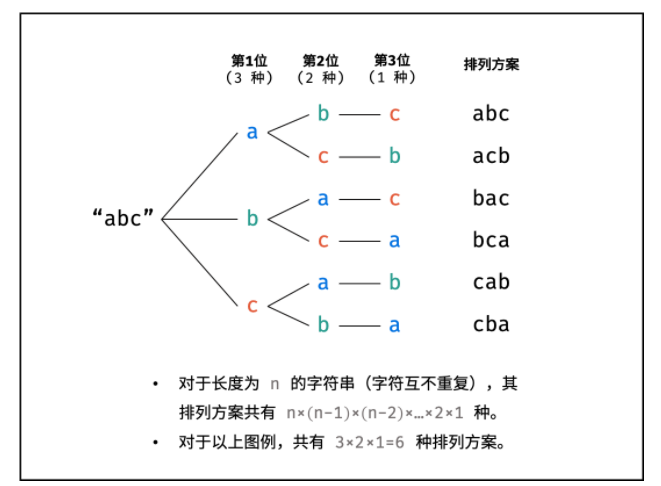

### 数组

#### [26. 删除有序数组中的重复项](https://leetcode-cn.com/problems/remove-duplicates-from-sorted-array/)

给你一个 升序排列 的数组 nums ，请你 原地 删除重复出现的元素，使每个元素 只出现一次 ，返回删除后数组的新长度。元素的 相对顺序 应该保持 一致 。

由于在某些语言中不能改变数组的长度，所以必须将结果放在数组nums的第一部分。更规范地说，如果在删除重复项之后有 k 个元素，那么 nums 的前 k 个元素应该保存最终结果。

将最终结果插入 nums 的前 k 个位置后返回 k 。

不要使用额外的空间，你必须在 原地 修改输入数组 并在使用 O(1) 额外空间的条件下完成。

判题标准:

系统会用下面的代码来测试你的题解:

> int[] nums = [...]; // 输入数组
> int[] expectedNums = [...]; // 长度正确的期望答案
>
> int k = removeDuplicates(nums); // 调用
>
> assert k == expectedNums.length;
> for (int i = 0; i < k; i++) {
>     assert nums[i] == expectedNums[i];
> }
>

如果所有断言都通过，那么您的题解将被 通过。 

示例 1：

> 输入：nums = [1,1,2]
> 输出：2, nums = [1,2,_]
> 解释：函数应该返回新的长度 2 ，并且原数组 nums 的前两个元素被修改为 1, 2 。不需要考虑数组中超出新长度后面的元素。

示例 2：

> 输入：nums = [0,0,1,1,1,2,2,3,3,4]
> 输出：5, nums = [0,1,2,3,4]
> 解释：函数应该返回新的长度 5 ， 并且原数组 nums 的前五个元素被修改为 0, 1, 2, 3, 4 。不需要考虑数组中超出新长度后面的元素。


提示：

* 0 <= nums.length <= 3 * 10^4^
* -10^4^ <= nums[i] <= 10^4^
* nums 已按 升序 排列

```java
class Solution {
    public int removeDuplicates(int[] nums) {
        if(nums.length == 0 ) return 0;
        int i = 1, j; //双指针
        for(j = 1 ; j < nums.length; j++ ) {
            if(nums[j] != nums[j-1]) {
                nums[i] = nums[j];
                i++;
            }
                
        }

        return i;
    }
}
```

#### [80. 删除有序数组中的重复项 II](https://leetcode-cn.com/problems/remove-duplicates-from-sorted-array-ii/)

给你一个有序数组 nums ，请你 原地 删除重复出现的元素，使每个元素 最多出现两次 ，返回删除后数组的新长度。

不要使用额外的数组空间，你必须在 原地 修改输入数组 并在使用 O(1) 额外空间的条件下完成。

说明：

为什么返回数值是整数，但输出的答案是数组呢？

请注意，输入数组是以「引用」方式传递的，这意味着在函数里修改输入数组对于调用者是可见的。

你可以想象内部操作如下:

> // nums 是以“引用”方式传递的。也就是说，不对实参做任何拷贝
> int len = removeDuplicates(nums);
>
> // 在函数里修改输入数组对于调用者是可见的。
> // 根据你的函数返回的长度, 它会打印出数组中 该长度范围内 的所有元素。
> for (int i = 0; i < len; i++) {
>  print(nums[i]);
> }


示例 1：

> 输入：nums = [1,1,1,2,2,3]
> 输出：5, nums = [1,1,2,2,3]
> 解释：函数应返回新长度 length = 5, 并且原数组的前五个元素被修改为 1, 1, 2, 2, 3 。 不需要考虑数组中超出新长度后面的元素。

示例 2：

> 输入：nums = [0,0,1,1,1,1,2,3,3]
> 输出：7, nums = [0,0,1,1,2,3,3]
> 解释：函数应返回新长度 length = 7, 并且原数组的前五个元素被修改为 0, 0, 1, 1, 2, 3, 3 。 不需要考虑数组中超出新长度后面的元素。


提示：

* 1 <= nums.length <= 3 * 10^4^
* -10^4^ <= nums[i] <= 10^4^
* nums 已按升序排列

```java
class Solution {
    public int removeDuplicates(int[] nums) {
         if(nums.length < 2 ) return nums.length;

        int i = 2,j;
        for(j = 2 ; j < nums.length; j++ ) {
            if(nums[j] != nums[i-2]) {
                nums[i] = nums[j];
                i++;
            }
            
        }

        return i;
    }
}
```

#### [33. 搜索旋转排序数组](https://leetcode-cn.com/problems/search-in-rotated-sorted-array/)

整数数组 nums 按升序排列，数组中的值 互不相同 。

在传递给函数之前，nums 在预先未知的某个下标 k（0 <= k < nums.length）上进行了 旋转，使数组变为 [nums[k], nums[k+1], ..., nums[n-1], nums[0], nums[1], ..., nums[k-1]]（下标 从 0 开始 计数）。例如， [0,1,2,4,5,6,7] 在下标 3 处经旋转后可能变为 [4,5,6,7,0,1,2] 。

给你 旋转后 的数组 nums 和一个整数 target ，如果 nums 中存在这个目标值 target ，则返回它的下标，否则返回 -1 。 

示例 1：

> 输入：nums = [4,5,6,7,0,1,2], target = 0
> 输出：4

示例 2：

> 输入：nums = [4,5,6,7,0,1,2], target = 3
> 输出：-1

示例 3：

> 输入：nums = [1], target = 0
> 输出：-1


提示：

* 1 <= nums.length <= 5000
* -10^4 <= nums[i] <= 10^4
* nums 中的每个值都 独一无二
* 题目数据保证 nums 在预先未知的某个下标上进行了旋转
* -10^4 <= target <= 10^4


进阶：你可以设计一个时间复杂度为 O(log n) 的解决方案吗？


**这道题的整体思路如下：**

​				如果mid在第一段的升序序列：

​							如果 target < mid，target可能在前半段，也可能在后半段；

​							否则，target只能在后半段。				

​             mid在第二段的升序序列：

​							如果target > mid，target可能在后半段也可能在前半段；

​							否则，target只能在前半段。

代码如下：

```java
class Solution {
    public int search(int[] nums, int target) {
        int l = 0,r = nums.length -1 ;

        while(l <= r){
            int mid = l + (r - l)/2;

            if(nums[mid] == target ) {
                return mid;
            }
            
            if(nums[l] <= nums[mid] ){ //mid在第一段升序部分
                if( target < nums[mid] ){ 
                   if(nums[l] <= target){ //target在左半部分
                         r = mid;
                   }
                   else {
                       l = mid + 1;
                   }
                }

                else{
                    l = mid + 1;
                }
                
            }else{
                if(target > nums[mid]){
                    if(nums[r] >= target){ //target在mid的右边
                        l = mid +1;
                    }
                    else{
                        r = mid;
                    }
                }
                else{
                    r = mid;
                }
            }
           
        }

        return -1;
    }
}
```

我们观察上面的代码块会发现，有很多的判断语句可以合并起来，使得代码看上去更加简洁。但是可读性将会变差，如下所示：

```java
class Solution {
    public int search(int[] nums, int target) {
        int l = 0,r = nums.length -1 ;

         while(l <= r){
            int mid = l + (r - l)/2;

            if(nums[mid] == target ) {
                return mid;
            }
            
            if(nums[l] <= nums[mid] ){ //mid在第一段升序部分
                if( target < nums[mid] && nums[l] <= target){ 
                    r = mid -1 ;
                }

                else{
                    l = mid + 1;
                }
                
            }else{
                if(target > nums[mid] && nums[r] >= target){            
                     l = mid +1;
                }
                else{
                    r = mid -1;
                }
            }
           
        }

        return -1;
    }
}
```

#### [81. 搜索旋转排序数组 II](https://leetcode-cn.com/problems/search-in-rotated-sorted-array-ii/)

已知存在一个按非降序排列的整数数组 nums ，数组中的值不必互不相同。

在传递给函数之前，nums 在预先未知的某个下标 k（0 <= k < nums.length）上进行了 旋转 ，使数组变为 [nums[k], nums[k+1], ..., nums[n-1], nums[0], nums[1], ..., nums[k-1]]（下标 从 0 开始 计数）。例如， [0,1,2,4,4,4,5,6,6,7] 在下标 5 处经旋转后可能变为 [4,5,6,6,7,0,1,2,4,4] 。

给你 旋转后 的数组 nums 和一个整数 target ，请你编写一个函数来判断给定的目标值是否存在于数组中。如果 nums 中存在这个目标值 target ，则返回 true ，否则返回 false 。

你必须尽可能减少整个操作步骤。

示例 1：

> 输入：nums = [2,5,6,0,0,1,2], target = 0
> 输出：true

示例 2：

> 输入：nums = [2,5,6,0,0,1,2], target = 3
> 输出：false

提示：

* 1 <= nums.length <= 5000
* -10^4 <= nums[i] <= 10^4
* 题目数据保证 nums 在预先未知的某个下标上进行了旋转
* -10^4 <= target <= 10^4


进阶：

* 这是 搜索旋转排序数组 的延伸题目，本题中的 nums  可能包含重复元素。
* 这会影响到程序的时间复杂度吗？会有怎样的影响，为什么？

在可能有重复值的情况下，如果nums[mid] >= nums[l],这时不能保证mid是处于前一段的，比如[1,3,1,1,1]。这时只需要把> =拆分成两种情况来考虑就可以了。

```java
class Solution {
    public boolean search(int[] nums, int target) {
       int l = 0,r = nums.length -1 ;

        while(l <= r){
            int mid = l + (r - l)/2;

            if(nums[mid] == target ) {
                return true;
            }
            
            if(nums[l] < nums[mid] ){ //mid在第一段升序部分
                if( target < nums[mid] && nums[l] <= target){ 
                    r = mid;
                }

                else{
                    l = mid + 1;
                }
                
            }else if(nums[l] > nums[mid]){
                if(target > nums[mid] && nums[r] >= target){            
                     l = mid +1;
                }
                else{
                    r = mid;
                }
            }else{
                l++;
            }
           
        }

        return false;
    }
}
```

#### [4. 寻找两个正序数组的中位数](https://leetcode-cn.com/problems/median-of-two-sorted-arrays/)

给定两个大小分别为 m 和 n 的正序（从小到大）数组 nums1 和 nums2。请你找出并返回这两个正序数组的 中位数 。

算法的时间复杂度应该为 O(log (m+n)) 。

示例 1：

> 输入：nums1 = [1,3], nums2 = [2]
> 输出：2.00000
> 解释：合并数组 = [1,2,3] ，中位数 2

示例 2：

> 输入：nums1 = [1,2], nums2 = [3,4]
> 输出：2.50000
> 解释：合并数组 = [1,2,3,4] ，中位数 (2 + 3) / 2 = 2.5


提示：

* nums1.length == m
* nums2.length == n
* 0 <= m <= 1000
* 0 <= n <= 1000
* 1 <= m + n <= 2000
* -10^6 <= nums1[i], nums2[i] <= 10^6

```

```

#### [128. 最长连续序列](https://leetcode-cn.com/problems/longest-consecutive-sequence/)

给定一个未排序的整数数组 nums ，找出数字连续的最长序列（不要求序列元素在原数组中连续）的长度。

请你设计并实现时间复杂度为 O(n) 的算法解决此问题。 

示例 1：

> 输入：nums = [100,4,200,1,3,2]
> 输出：4
> 解释：最长数字连续序列是 [1, 2, 3, 4]。它的长度为 4。

示例 2：

> 输入：nums = [0,3,7,2,5,8,4,6,0,1]
> 输出：9


提示：

* 0 <= nums.length <= 10^5^
* -10^9 <= nums[i] <= 10^9^

如果序列里的元素是无序的，时间复杂度要求是O(n)，首先考虑用哈希表。

```java
class Solution {
    public int longestConsecutive(int[] nums) {
        HashMap<Integer,Integer> map  = new HashMap<>();

        for(int i = 0 ; i < nums.length; i++ ){       
            map.put(nums[i],0);            
        }
        
        int res = 0;

        for(int i = 0 ; i < nums.length; i++ ){
            if(map.get(nums[i]) == 1) continue;

            map.put(nums[i],1);

            int j = nums[i] + 1,len = 1;
            while( map.getOrDefault(j,-1) != -1){
                map.put(j,1);
                len++;
                j++;
            }
            
            j = nums[i] -1;
            
            while(map.getOrDefault(j,-1) != -1){
                map.put(j,1);
                len++;
                j--;
            }

            res = Math.max(res,len);
        }

        return res;
    }
}
```

#### [1. 两数之和](https://leetcode-cn.com/problems/two-sum/)

给定一个整数数组 nums 和一个整数目标值 target，请你在该数组中找出 和为目标值 target  的那 两个 整数，并返回它们的数组下标。

你可以假设每种输入只会对应一个答案。但是，数组中同一个元素在答案里不能重复出现。

你可以按任意顺序返回答案。

示例 1：

> 输入：nums = [2,7,11,15], target = 9
> 输出：[0,1]
> 解释：因为 nums[0] + nums[1] == 9 ，返回 [0, 1] 。

示例 2：

> 输入：nums = [3,2,4], target = 6
> 输出：[1,2]

示例 3：

> 输入：nums = [3,3], target = 6
> 输出：[0,1]


提示：

* 2 <= nums.length <= 10^4
* -10^9 <= nums[i] <= 10^9
* -10^9 <= target <= 10^9
* 只会存在一个有效答案

进阶：你可以想出一个时间复杂度小于 O(n2) 的算法吗？

```java
class Solution {
    public int[] twoSum(int[] nums, int target) {
        HashMap<Integer,Integer> map = new HashMap<>();
        int[] res = new int[2];

        for( int i = 0 ; i < nums.length; i++ ) {
            map.put(nums[i],i);
        }

        for(int i = 0; i < nums.length; i++ ) {
            int num = target - nums[i];
       
            if( map.get(num) != null && map.get(num) > i ) {
                res[0] = i;
                res[1] = map.get(num);
                return res; 
            }

        }

        return res;
    }
}
```

#### [15. 三数之和](https://leetcode-cn.com/problems/3sum/)

给你一个包含 n 个整数的数组 nums，判断 nums 中是否存在三个元素 a，b，c ，使得 a + b + c = 0 ？请你找出所有和为 0 且不重复的三元组。

注意：答案中不可以包含重复的三元组。

示例 1：

> 输入：nums = [-1,0,1,2,-1,-4]
> 输出：[[-1,-1,2],[-1,0,1]]

示例 2：

> 输入：nums = []
> 输出：[]

示例 3：

> 输入：nums = [0]
> 输出：[]


提示：

* 0 <= nums.length <= 3000
* -10^5 <= nums[i] <= 10^5

```java
class Solution {
    public List<List<Integer>> threeSum(int[] nums) {
        Arrays.sort(nums);
        List<List<Integer>> res = new ArrayList<>();
        int l,r;

        for(int i = 0 ; i < nums.length; i++ ) {
            if(nums[i] > 0) break;
            if( i > 0 &&  nums[i] == nums[i-1] ) continue; //避免出现重复值
            l = i + 1;
            r = nums.length -1;
           
            while(l < nums.length -1 && l < r) {
                int sum = nums[i] + nums[l] + nums[r];

                if(sum == 0 ) {
                    List<Integer> list = new ArrayList<>();
                    list.add(nums[i]);
                    list.add(nums[l]);
                    list.add(nums[r]);
                    res.add(list);

                    while( l < r && nums[l] == nums[l + 1] )
                        l++;
                    while( l < r && nums[r] == nums[r - 1] )
                        r--;
                    l++;
                    r--;
                }else if(sum > 0){
                    r--;
                }else{
                    l++;
                }
            }
            
        }
        
        return res;
    }

}
```

#### [18. 四数之和](https://leetcode-cn.com/problems/4sum/)

给你一个由 n 个整数组成的数组 nums ，和一个目标值 target 。请你找出并返回满足下述全部条件且不重复的四元组 [nums[a], nums[b], nums[c], nums[d]] （若两个四元组元素一一对应，则认为两个四元组重复）：

* 0 <= a, b, c, d < n
* a、b、c 和 d 互不相同
* nums[a] + nums[b] + nums[c] + nums[d] == target
  你可以按 任意顺序 返回答案 。

示例 1：

> 输入：nums = [1,0,-1,0,-2,2], target = 0
> 输出：[[-2,-1,1,2],[-2,0,0,2],[-1,0,0,1]]

示例 2：

> 输入：nums = [2,2,2,2,2], target = 8
> 输出：[[2,2,2,2]]


提示：

* 1 <= nums.length <= 200
* -10^9 <= nums[i] <= 10^9
* -10^9 <= target <= 10^9

```java
class Solution {
    public List<List<Integer>> fourSum(int[] nums, int target) {
        Arrays.sort(nums);
        List<List<Integer>> res = new ArrayList<>();
        
        for(int i = 0 ; i < nums.length - 3; i++ ) {
            if( i > 0 &&  nums[i] == nums[i -1] ) continue;

            for( int j = i + 1; j < nums.length - 2; j++ ) {
                if( j > i + 1 && nums[j] == nums[j -1] ) continue;
                int l = j + 1; int r = nums.length -1;
               

                while( l < r ) {
                    int sum = nums[i] + nums[j] + nums[l] + nums[r];
                    
                    if(sum == target ) {
                       
                        List<Integer> arr = new ArrayList<>();
                        arr.add(nums[i]); 
                        arr.add(nums[j]);
                        arr.add(nums[l]);
                        arr.add(nums[r]);
                        res.add(arr);

                        while(l < r && nums[l] == nums[l + 1])
                            l++;
                        while(l < r && nums[r] == nums[r -1] )
                            r--;
                        l++;
                        r--;
                    }else if( sum > target ){
                         r--;
                    }else{
                        l++;
                    }
                }


            }
        }

        return res;
    }

}
```

#### [27. 移除元素](https://leetcode-cn.com/problems/remove-element/)

给你一个数组 nums 和一个值 val，你需要 原地 移除所有数值等于 val 的元素，并返回移除后数组的新长度。

不要使用额外的数组空间，你必须仅使用 O(1) 额外空间并 原地 修改输入数组。

元素的顺序可以改变。你不需要考虑数组中超出新长度后面的元素。

说明:

为什么返回数值是整数，但输出的答案是数组呢?

请注意，输入数组是以「引用」方式传递的，这意味着在函数里修改输入数组对于调用者是可见的。

你可以想象内部操作如下:

> // nums 是以“引用”方式传递的。也就是说，不对实参作任何拷贝
> int len = removeElement(nums, val);
>
> // 在函数里修改输入数组对于调用者是可见的。
> // 根据你的函数返回的长度, 它会打印出数组中 该长度范围内 的所有元素。
> for (int i = 0; i < len; i++) {
>     print(nums[i]);
> }


示例 1：

> 输入：nums = [3,2,2,3], val = 3
> 输出：2, nums = [2,2]
> 解释：函数应该返回新的长度 2, 并且 nums 中的前两个元素均为 2。你不需要考虑数组中超出新长度后面的元素。例如，函数返回的新长度为 2 ，而 nums = [2,2,3,3] 或 nums = [2,2,0,0]，也会被视作正确答案。

示例 2：

> 输入：nums = [0,1,2,2,3,0,4,2], val = 2
> 输出：5, nums = [0,1,4,0,3]
> 解释：函数应该返回新的长度 5, 并且 nums 中的前五个元素为 0, 1, 3, 0, 4。注意这五个元素可为任意顺序。你不需要考虑数组中超出新长度后面的元素。


提示：

* 0 <= nums.length <= 100
* 0 <= nums[i] <= 50
* 0 <= val <= 100

双指针

```java
class Solution {
    public int removeElement(int[] nums, int val) {
        if(nums.length == 0 ) return 0;
        int i = 0;
        int j = nums.length -1;

        while( i <= j ) { //这里一定是<=，如果是<，且刚好等于处应该删除，那j--就不会执行，最后返回会报错
            while(i <= j && nums[i] != val )
                i++;
            while( i <= j && nums[j] == val)
                j--;
     
            if(i < j) {
                nums[i] = nums[j];
                i++;
                j--;
            }
        }

        return j+1;

    }
}
```

顺序遍历：

```java
class Solution {
    public int removeElement(int[] nums, int val) {
        int index = 0;
        
        for (int i = 0; i < nums.length; ++i) {
            if (nums[i] != val) {
                nums[index++] = nums[i];
            }
        }
        return index;
    }
}
```

#### [31. 下一个排列](https://leetcode-cn.com/problems/next-permutation/)

整数数组的一个 排列  就是将其所有成员以序列或线性顺序排列。

* 例如，arr = [1,2,3] ，以下这些都可以视作 arr 的排列：[1,2,3]、[1,3,2]、[3,1,2]、[2,3,1] 。

整数数组的 下一个排列 是指其整数的下一个字典序更大的排列。更正式地，如果数组的所有排列根据其字典顺序从小到大排列在一个容器中，那么数组的 下一个排列 就是在这个有序容器中排在它后面的那个排列。如果不存在下一个更大的排列，那么这个数组必须重排为字典序最小的排列（即，其元素按升序排列）。

* 例如，arr = [1,2,3] 的下一个排列是 [1,3,2] 。
* 类似地，arr = [2,3,1] 的下一个排列是 [3,1,2] 。
* 而 arr = [3,2,1] 的下一个排列是 [1,2,3] ，因为 [3,2,1] 不存在一个字典序更大的排列。

给你一个整数数组 nums ，找出 nums 的下一个排列。

必须 原地 修改，只允许使用额外常数空间。

示例 1：

> 输入：nums = [1,2,3]
> 输出：[1,3,2]

示例 2：

> 输入：nums = [3,2,1]
> 输出：[1,2,3]

示例 3：

> 输入：nums = [1,1,5]
> 输出：[1,5,1]


提示：

* 1 <= nums.length <= 100
* 0 <= nums[i] <= 100

这个题目的意思就是说从一个深度优先的排列中找它的下一个排列，如下图所示：


对于一个深度优先的全排列来说，可以很明显的看到bac的下一个排列就是bca，而且满足关系bac < bca。

* 我们希望下一个数比当前数大，这样才满足“下一个排列”的定义。因此只需要将后面的「大数」与前面的「小数」交换，就能得到一个更大的数。
* 我们还希望下一个数增加的幅度尽可能的小，这样才满足“下一个排列与当前排列紧邻“的要求。为了满足这个要求，我们需要：
  * 在尽可能靠右的低位进行交换，需要从后向前查找
  * 将一个 尽可能小的「大数」 与前面的「小数」交换。比如 123465，下一个排列应该把 5 和 4 交换而不是把 6 和 4 交换
  * 将「大数」换到前面后，需要将「大数」后面的所有数重置为升序，升序排列就是最小的排列。以 123465 为例：首先按照上一步，交换 5 和 4，得到 123564；然后需要将 5 之后的数重置为升序，得到 123546。显然 123546 比 123564 更小，123546 就是 123465 的下一个排列。

以上的分析结合全排列的树形结构可以得到更清晰的理解。

具体地，我们这样描述该算法，对于长度为 nn 的排列 aa：

* 首先从后向前查找第一个顺序对 (i,i+1)(i,i+1)，满足 a[i] < a[i+1]a[i]<a[i+1]。这样「较小数」即为 a[i]a[i]。此时 [i+1,n)[i+1,n) 必然是下降序列。

* 如果找到了顺序对，那么在区间 [i+1,n)[i+1,n) 中从后向前查找第一个元素 jj 满足 a[i] < a[j]a[i]<a[j]。这样「较大数」即为 a[j]a[j]。

* 交换 a[i]a[i] 与 a[j]a[j]，此时可以证明区间 [i+1,n)[i+1,n) 必为降序。我们可以直接使用双指针反转区间 [i+1,n)[i+1,n) 使其变为升序，而无需对该区间进行排序。

题解来源：https://leetcode-cn.com/problems/next-permutation/solution/xia-yi-ge-pai-lie-by-leetcode-solution/
整体的时间复杂度是O(n)

```java
class Solution {
    public void nextPermutation(int[] nums) {
        int i = nums.length -2;

        while(i >= 0 && nums[i] >= nums[i+1])
            i--;
        if(i >= 0) {
            int j = nums.length -1;

            while( j >= 0 && nums[j] <= nums[i] )
                j--;                 
            swap(nums,i,j);
          
        }

        reverse(nums,i+1);
    }

    public void swap(int[] nums,int i, int j){
        int tmp = nums[i];
        nums[i] = nums[j];
        nums[j] = tmp; 
    }

    public void reverse(int[] nums, int l){
        int r = nums.length -1;

        while(l < r){
            swap(nums,l,r);
            l++;
            r--;
        }
    }
}
```

#### [60. 排列序列](https://leetcode-cn.com/problems/permutation-sequence/)

给出集合 [1,2,3,...,n]，其所有元素共有 n! 种排列。

按大小顺序列出所有排列情况，并一一标记，当 n = 3 时, 所有排列如下：

"123"
"132"
"213"
"231"
"312"
"321"
给定 n 和 k，返回第 k 个排列。

示例 1：

> 输入：n = 3, k = 3
> 输出："213"

示例 2：

> 输入：n = 4, k = 9
> 输出："2314"

示例 3：

> 输入：n = 3, k = 1
> 输出："123"


提示：

* 1 <= n <= 9
* 1 <= k <= n!

可以连续调用k-1次下一个排列的函数