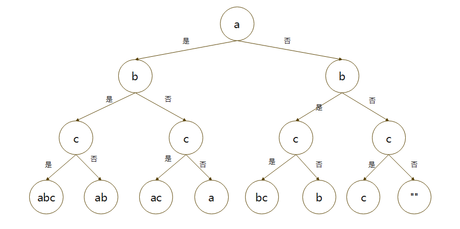

### 从左到右尝试递归

#### 打印字符串的全部子序列

字串和子序列：以"abcdef"为例，字串是要求必须连续的，如"bcd"，但是"abd"就不是子串。子序列则是要求顺序一致就可以，"bcd"，"abd"都属于子序列。

如果要打印全部字串，只需要进行两层循环，判断出起始位置和结尾的位置就行。

```java
String str = "abcdef";
for(int i = 0; i < str.length(); i++){
    for(int j = i ; j < str.length(); j++) {
        System.out.println(str.substring(i,j+1)); //这里j+1是因为substring是左闭右开区间
    }
}
```

因为子序列不要求连续，所以我们只需要判断第k（ 0 < k < str.length() ）个位置到底需不需要加进来，如下图：



这样就构成了一个二叉树，只需要用递归的方式实现这棵二叉树就可以了。

```java
  /**
     * 
     * @param str 输入的字符串
     * @param index 当前到哪一个下标处
     * @param list  将所有的子序列保存在list中
     * @param subSerial 从0开始记录的子序列
     */
    public static void subSerials(String str,int index, List<String> list, String subSerial) {
        if(index == str.length()){
            list.add(subSerial);
            return ;
        }

        subSerials(str,index+1,list,subSerial); //不加这一位
        subSerials(str,index+1,list,subSerial + str.charAt(index)); //加这一位
    }
```

#### 打印字符串的全部子序列,要求子序列的值不重复出现

这个相比较前一题来说只需要将得到的结果进行一次去重就可以了，这里用HashSet来去重。

```java
    public static void subSerials(String str, int index, HashSet<String> set, String subSerial) {
        if(index == str.length()){
            if(!set.contains(subSerial))
                set.add(subSerial);
            return ;
        }

        subSerials(str,index+1,set,subSerial); //不加这一位
        subSerials(str,index+1,set,subSerial + str.charAt(index)); //加这一位
    }
```

#### 打印一个字符串的全部排列

打印全部排列的一个常用方法就是把第k(0 <= k < str.length())位以后的每一个值轮流交换到第k位，最终递归的结果也是一棵树。

```java
 /**
     * 
     * @param arr 原字符串转成的数组
     * @param index 当前执行的下标位置
     * @param list list保存所有的排列
     */
    public static void arrange(char[] arr,int index, List<String> list) {
        if(index == arr.length) {
            list.add(String.valueOf(arr));
            return;
        }

        for(int j = index ; j < arr.length; j++ ) {
            swap(arr, index,j);
            arrange(arr,index +1,list);
            swap(arr,index,j);
        }

    }

    private static void swap(char[] arr, int i, int j) {
        char tmp = arr[i];
        arr[i] = arr[j];
        arr[j] = tmp;
    }

```

#### 打印一个字符串的全部排列，不要出现重复的排列

这个问题同样可以用之前的做法，先把所有的排列都找出来，然后去掉重复的排列。同样还有另外一种做法，就是利用分支界定法进行剪枝处理，可以减少计算的复杂度。

```java
    public static void arrange(char[] arr,int index, List<String> list) {
        if(index == arr.length) {
            list.add(String.valueOf(arr));
            return;
        }

        HashSet<Character> set = new HashSet<>();

        for(int j = index ; j < arr.length; j++ ) {
            if(set.contains(arr[j])) continue; // 重复，因此剪枝
            set.add(arr[j]);

            swap(arr, index,j);
            arrange(arr,index +1,list);
            swap(arr,index,j);
        }

    }
```

#### [剑指 Offer 46. 把数字翻译成字符串](https://leetcode-cn.com/problems/ba-shu-zi-fan-yi-cheng-zi-fu-chuan-lcof/)

给定一个数字，我们按照如下规则把它翻译为字符串：0 翻译成 “a” ，1 翻译成 “b”，……，11 翻译成 “l”，……，25 翻译成 “z”。一个数字可能有多个翻译。请编程实现一个函数，用来计算一个数字有多少种不同的翻译方法。

 **示例 1:**

> 输入: 12258
> 输出: 5
> 解释: 12258有5种不同的翻译，分别是"bccfi", "bwfi", "bczi", "mcfi"和"mzi"

**提示：**

* 0 <= num < 231

```java
class Solution {
    char[] arr;
    public int translateNum(int num) {
        arr = String.valueOf(num).toCharArray();
        return recur(arr,0);
    }

     public int recur(char[] arr,int i){

        if(i == arr.length) return 1;
        if(i > arr.length) return 0; //无效的方案，这种情况的假设必不可少

        int count = 0;
        if(arr[i] == '1'){
            count += recur(arr,i+1);  //考虑自己作为单独的一部分，后续有多少种方法
            count += recur(arr, i + 2);
        }else if(arr[i] == '2'){
            if(i+1 < arr.length && arr[i+1] -'5' <= 0){
                count += recur(arr,i+1);  //考虑自己作为单独的一部分，后续有多少种方法
                count += recur(arr, i + 2);
            }else{
                count += recur(arr,i+1);  //只能考虑自己
            }
        }else{
            count += recur(arr,i+1);  //只能考虑自己
        }

        return count;
    }
}
```

#### 0-1背包问题

现有n个物品，每个物品的重量和价值分别保存在数组weights和value中，求在不超过背包的承重范围之内可以装的物品的最大价值是多少。

```java
/**
     * 
     * @param w 物品的重量
     * @param v 物品的价值
     * @param i 第i个物品
     * @param alreadyW 已经放入背包的重量
     * @param bag 背包所能承受的最大重量
     * @return 最大价值
     */
    
    public static int recur(int[] w,int[] v,int i,int alreadyW,int bag){
        if(alreadyW > bag || i >= w.length) return 0; //背包超重或者没有物品可以装

        int totalVal1 = 0,totalVal2 = 0;
        totalVal1 = recur(w,v,i+1,alreadyW,bag);  //第i个物品不放入背包
        if(alreadyW+ w[i] <= bag)
            totalVal2 = recur(w,v,i+1,alreadyW+ w[i],bag) + v[i]; //第i个物品放入背包

        return Math.max(totalVal1,totalVal2);
    }
```

或者用背包的剩余容量来表达

```java
    public static int recur(int[] w,int[] v,int i,int bag){
        if(bag < 0 || i >= w.length) return 0; //背包超重或者没有物品可以装

        int totalVal1 = 0,totalVal2 = 0;
        totalVal1 = recur(w,v,i+1,bag);  //第i个物品不放入背包
        if(bag >= w[i])
            totalVal2 = recur(w,v,i+1,bag - w[i]) + v[i]; //第i个物品放入背包

        return Math.max(totalVal1,totalVal2);
    }
```

### 范围上尝试的模型

#### 拿纸牌问题

给定一个整形数组arr,代表数值不同的纸牌，瓦加A和玩家B一次拿走每张纸牌。规定玩家A先拿，玩家B后拿，但是每个玩家只能拿走最左或最右的纸牌，玩家A和玩家B都绝顶聪明。请返回最后获胜者的分数。

```java
public class Chess {
    public int chess(int[] arr){
        if(arr == null || arr.length == 0) return 0;

        return Math.max(firstPerson(arr,0,arr.length -1),
                secondPerson(arr,0,arr.length-1));
    }

    private int firstPerson(int[] arr, int l, int r) {
        if(l == r){ // 只有一张牌，A又是先手，直接由A拿走
            return arr[l];
        }

        //返回A从左边拿或者右边拿的最大值，因为A是拿牌的那一个
        //所以A会选择使自己获利最大的情况，arr[l] + secondPerson(arr,l+1,r)表示
        //A拿了左边的，然后轮到后手拿牌，已经将所有的结果遍历完了
        return Math.max(arr[l] + secondPerson(arr,l+1,r),
                arr[r] + secondPerson(arr,l,r-1));
    }

    private int secondPerson(int[] arr, int l, int r) {
       if(l == r ) { //只有一张牌，后手就不用拿了，直接返回0
           return 0;
       }

       //否则后手的得分就是在先手拿了l或者r之后选择让先手后续能拿到最少的分数的那一种选择
       return Math.min(firstPerson(arr,l+1,r),firstPerson(arr,l,r-1));
    }


}

```

#### [51. N 皇后](https://leetcode-cn.com/problems/n-queens/)

**n 皇后问题** 研究的是如何将 `n` 个皇后放置在 `n×n` 的棋盘上，并且使皇后彼此之间不能相互攻击。

给你一个整数 `n` ，返回所有不同的 **n 皇后问题** 的解决方案。

每一种解法包含一个不同的 **n 皇后问题** 的棋子放置方案，该方案中 `'Q'` 和 `'.'` 分别代表了皇后和空位。

**示例 1：**


> 输入：n = 4
> 输出：[[".Q..","...Q","Q...","..Q."],["..Q.","Q...","...Q",".Q.."]]
> 解释：如上图所示，4 皇后问题存在两个不同的解法。

**示例 2：**

> 输入：n = 1
> 输出：[["Q"]]

**提示：**

- `1 <= n <= 9`
- 皇后彼此不能相互攻击，也就是说：任何两个皇后都不能处于同一条横行、纵行或斜线上。

```java
class Solution {

    List<List<String>> res = new ArrayList<>();

    /* 输入棋盘的边长n，返回所有合法的放置 */
    public List<List<String>> solveNQueens(int n) {
        // "." 表示空，"Q"表示皇后，初始化棋盘
        char[][] board = new char[n][n];
        for (char[] c : board) {
            Arrays.fill(c, '.');
        }
        backtrack(board, 0);
        return res;
    }

    public void backtrack(char[][] board, int row) {
        // 每一行都成功放置了皇后，记录结果
        if (row == board.length) {
            List<String> list = new ArrayList<>();

            for (char[] c : board) {
                list.add(String.copyValueOf(c));
            }

            res.add(list);  
            return;
        }

        int n = board[row].length;
        // 在当前行的每一列都可能放置皇后
        for (int col = 0; col < n; col++) {
       
            if (isValid(board, row, col)) {               
                board[row][col] = 'Q';               
                backtrack(board, row + 1);
                board[row][col] = '.';
            }
           
        }
    }

    /* 判断是否可以在 board[row][col] 放置皇后 */
    public boolean isValid(char[][] board, int row, int col) {
        int n = board.length;
        // 检查列是否有皇后冲突
        for (int i = 0; i < n; i++) {
            if (board[i][col] == 'Q') {
                return false;
            }
        }

        // 检查右上方是否有皇后冲突
        for (int i = row - 1, j = col + 1; i >=0 && j < n; i--, j++) {
            if (board[i][j] == 'Q') {
                return false;
            }
        }

        // 检查左上方是否有皇后冲突
        for (int i = row - 1, j = col - 1; i >= 0 && j >= 0; i--, j--) {
            if (board[i][j] == 'Q') {
                return false;
            }
        }
        return true;
    }

}
```

#### [52. N皇后 II](https://leetcode-cn.com/problems/n-queens-ii/)

**n 皇后问题** 研究的是如何将 `n` 个皇后放置在 `n×n` 的棋盘上，并且使皇后彼此之间不能相互攻击。

给你一个整数 `n` ，返回 **n 皇后问题** 不同的解决方案的数量。

**示例 1：**


> 输入：n = 4
> 输出：2
> 解释：如上图所示，4 皇后问题存在两个不同的解法。

**示例 2：**

> 输入：n = 1
> 输出：1

**提示：**

- `1 <= n <= 9`
- 皇后彼此不能相互攻击，也就是说：任何两个皇后都不能处于同一条横行、纵行或斜线上。

```java
class Solution {
    int res = 0;
    public int totalNQueens(int n) {
       
        int[][] board = new int[n][n];
      
        backtrack(board, 0);
        return res;
    }

    public void backtrack(int[][] board,int row){
        if(row == board.length){ //一直到第row +1行，说明前row行都是满足条件的，可以直接返回了
            res++;
            return ;
        }

        for(int i = 0 ; i < board[row].length; i++){
           
            if(isValid(board,row,i)){
                board[row][i] = 1;
                backtrack(board,row + 1);
                board[row][i] = 0;
            }
        }
    }

    /* 判断是否可以在 board[row][col] 放置皇后 */
    public boolean isValid(int[][] board, int row, int col) {
        int n = board.length;
        // 检查列是否有皇后冲突
        for (int i = 0; i < n; i++) {
            if (board[i][col] == 1) {
                return false;
            }
        }

        // 检查右上方是否有皇后冲突
        for (int i = row - 1, j = col + 1; i >=0 && j < n; i--, j++) {
            if (board[i][j] == 1) {
                return false;
            }
        }

        // 检查左上方是否有皇后冲突
        for (int i = row - 1, j = col - 1; i >= 0 && j >= 0; i--, j--) {
            if (board[i][j] == 1) {
                return false;
            }
        }
        return true;
    }
}
```

